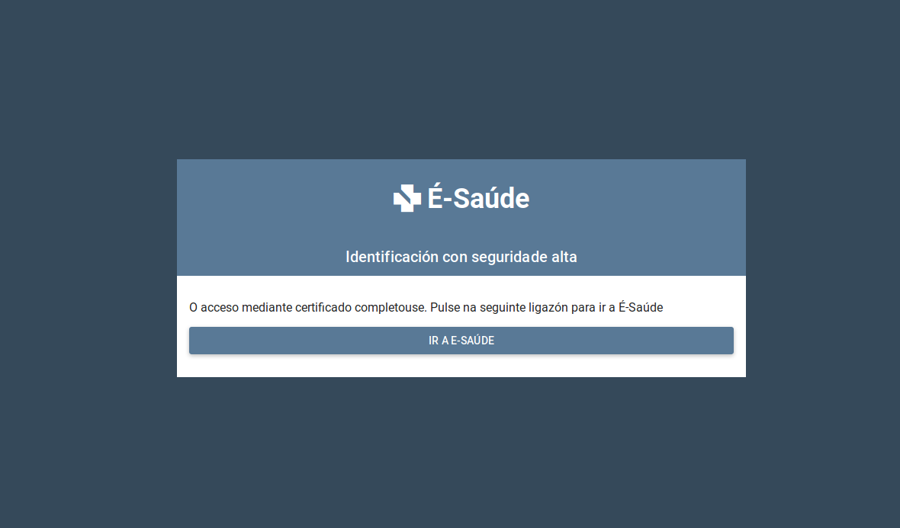
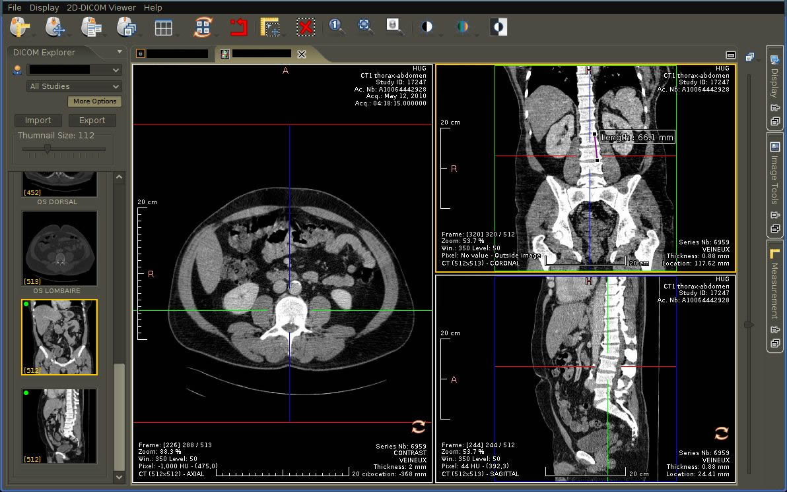

Debido mi ya no tan
[reciente enfermedad]()
, y dedicado tiempo a acceder a la página web del [Sergas](https://www.sergas.es/) (Servizo Galego de Saúde) para usar un servicio que fue [presentado en 2016](https://www.farodevigo.es/gran-vigo/2016/05/11/sergas-lanza-app-consultar-tratamientos/1458511.html), y que desde [finales de 2018](https://www.lavozdegalicia.es/noticia/galicia/2018/12/17/puede-consultar-pruebas-medicas-internet/0003_201812G17P49913.htm) permite acceder a la función, que yo creo que útil, de descarga de las pruebas diagnosticas de imagen: TACs, resonancias, radiografías, ecografías, etc...

Para acceder a esta herramienta es necesario disponer de eDNI, Chave365 o de un certificado digital, pero en este último caso es necesario pasar antes por el Centro de Salud para autorizar a dicho certificado a darnos acceso a nuestros datos de Salud, un paso que no entiendo del todo, puesto que para obtener un certificado de la FNMT, debemos verificar nuestra identidad. 

Como usuario de Linux que soy, por desgracia siempre encuentro alguna pequeña (o no tan pequeña) pega para acceder a sitios web y herramientas de la administración. He de decir en su descargo que esto sucede cada vez menos.

En el caso de usar eDNI, en primer lugar debemos tener un lector y [tenerlo configurado](https://www.vidaxp.com/tecnologia/como-configurar-dnie-ubuntu-chrome-firefox/).

Accedemos al portal *eSsaude* ya sea desde el banner en la web del Sergas o directamente en 
https://esaude.sergas.es/

Nos logueamos haciendo uso del eDni y ya podremos acceder al portal, y a lo que más nos interesa: La historia clínica: Prueba diagnosticas de imagen e Informes (tambíen hay otras opciones que por el momento no he usado).

 
 
En primer lugar tenemos los Informes que es una lista de documentos en formato PDF, aquí encontraremos desde Informes de Alta hospitalaria, Análisis de Sangre, Informes de radiología (de TACs, escáneres, PETs, etc), Informes de cirugía, y seguramente otros tipos que en mi caso no hay información.

El acceso a estos informes no suponen ningún reto para un usuario de linux, ya que son documentos en formato PDF, un formato estándar y pueden ser leídos con cualquier visor, como el que trae por defecto tu distro.

El problema llega en el apartado de "Pruebas diagnósticas de imagen", aquí aparece una lista de las pruebas, no aparecen todas, pero no he logrado saber el criterio, en mi caso
[los PETs]()
no aparecen.

En esta página si queremos acceder a las imágenes de una de las pruebas, debemos solicitar la descarga, que pasado cierto tiempo (nos avisan a nuestro email) podremos descargar.

Una vez descargado el archivo ZIP debemos descomprimirlo, en mi caso (Ubuntu 18.04.2) el gestor de archivos comprimidos de Gnome no funcionaba correctamente puesto que no respetaba la estructura de carpetas interna al descomprimir, por lo que tuve que hacerlo usando la línea de comandos: `unzip [normbreDelArchivo.zip]` y listo.

Y aquí nos encontramos con una aplicación para *Windows* que nos da acceso a las imágenes de la prueba, no hay archivos JPG, ni nada similar a los que acceder.

En un primer intento traté de ejecutar el visor con [Wine](https://www.winehq.org/), pero, tras dedicarle unas horas sin resultados, decidí atacar por otro lado.

Viendo los archivos que componían el descargable se hacía referencia a algo llamado DICOM, que de entrada pensé que se trataba del nombre del propio visor, pero que no tarde en descubrir que es un [estándar para el intercambio de imágenes médicas](https://es.wikipedia.org/wiki/DICOM). En este estándar se incluye el propio formato de los archivos, así como el protocolo de comunicación para intercambiar datos. Es decir en el formato hay mucha más información que solo las imágenes, están por ejemplo los datos del paciente, número de historia clínica, datos del aparato que realiza la imagen, etc.

Sabiendo esto último, me lancé a buscar alguna herramienta de software libre con soporte para linux que me sirviese para abrir y visualizar las pruebas. 

Tras probar varias, la que más me gusto, por funcionalidades y facilidad de uso de entrada fue: 
[WEASIS](https://nroduit.github.io/en/), con su [repo en Github](https://github.com/nroduit/Weasis). Está escrita en Java, y es compatible con Linux, OSX y Windows.

La aplicación parece bastante completa, pero se escapa a mi conocimiento el saber si es potente para un especialista, pero tiene una funcionalidad que me llamo mucho la atención:

Un TAC se almacena como multiples imágenes (400-500) que representan cada uno de los cortes transversales del cuerpo que realiza el TAC (cortes de imagen, obviamente), esta aplicación, permite, a partir de esos cortes en un eje, genera los cortes en los otros 2, generando 3 vistas del interior del cuerpo, tal y como muestra la imagen extraída de la página web de Weasis, donde hay [muchas más imágenes de ejemplo](https://nroduit.github.io/en/)

_Imagen de un TAC extraida de la web de Weasis_

Obviamente no soy medico, ni radiólogo, ni nada que se le parezca, pero lo que si soy es curioso y estas herramientas me permiten visualizar las pruebas e intentar hacerme una imagen mental de lo que me va contando el médico.

