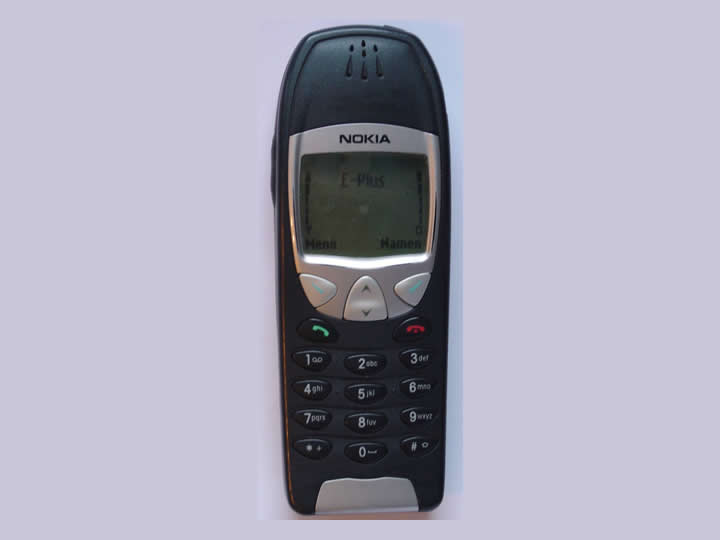
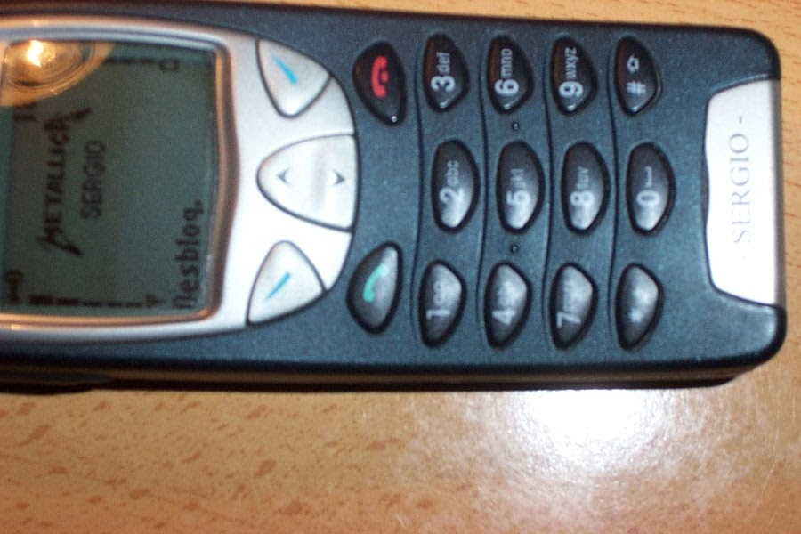
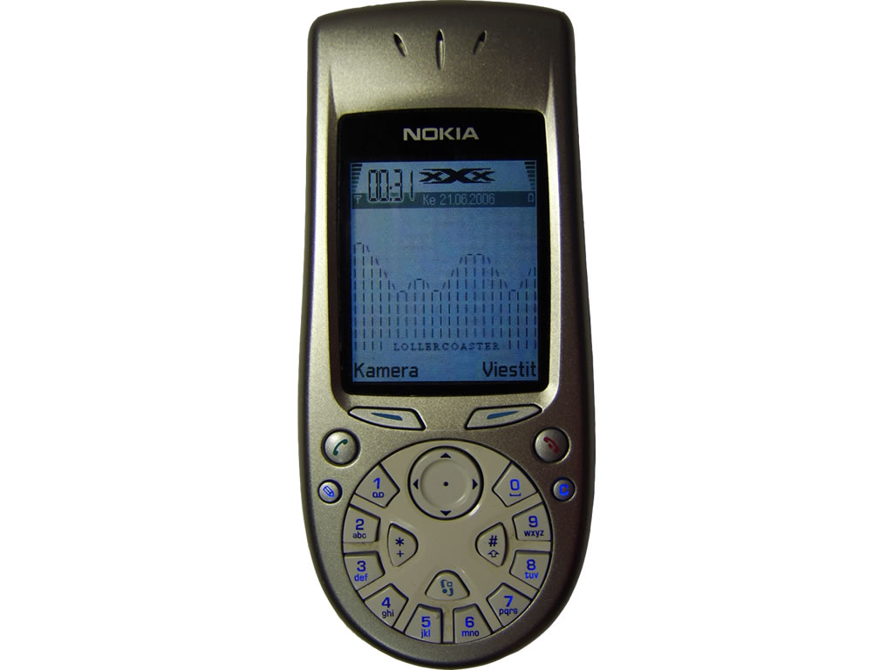
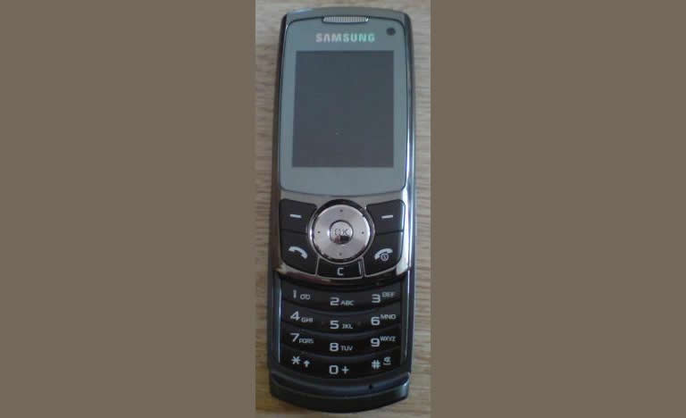
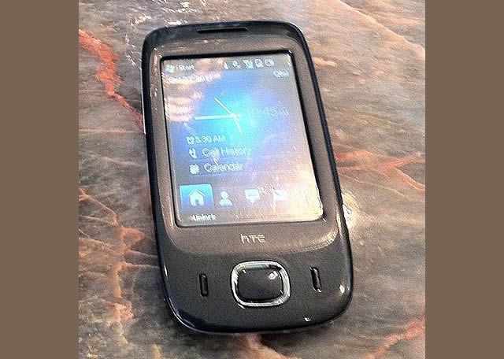
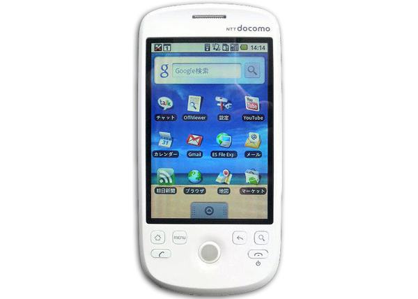
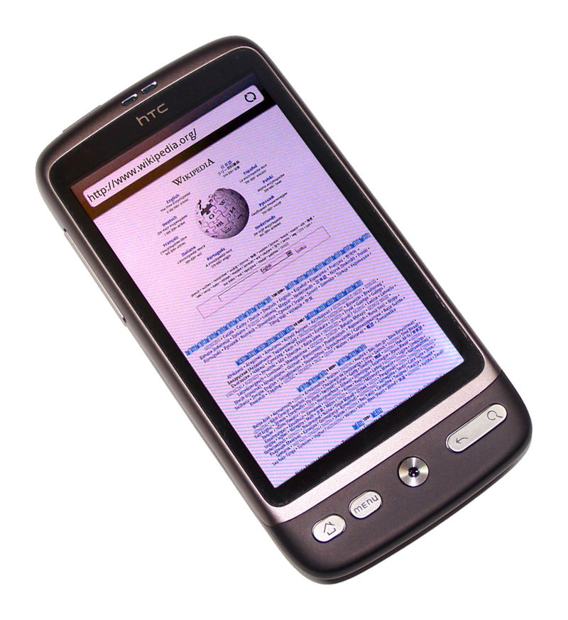
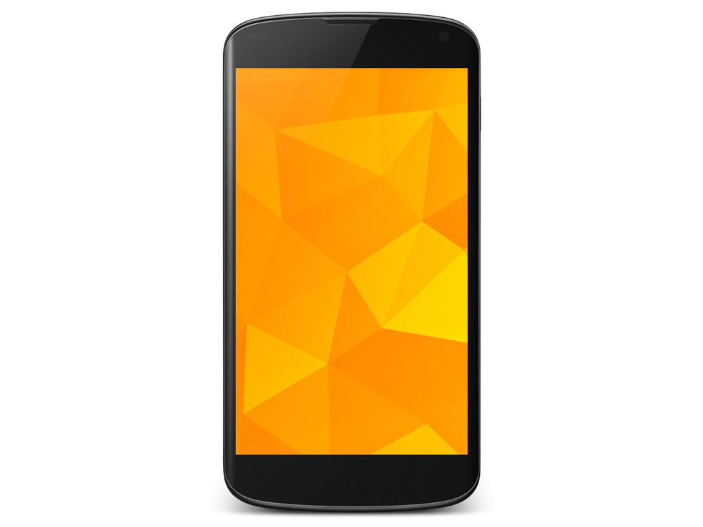
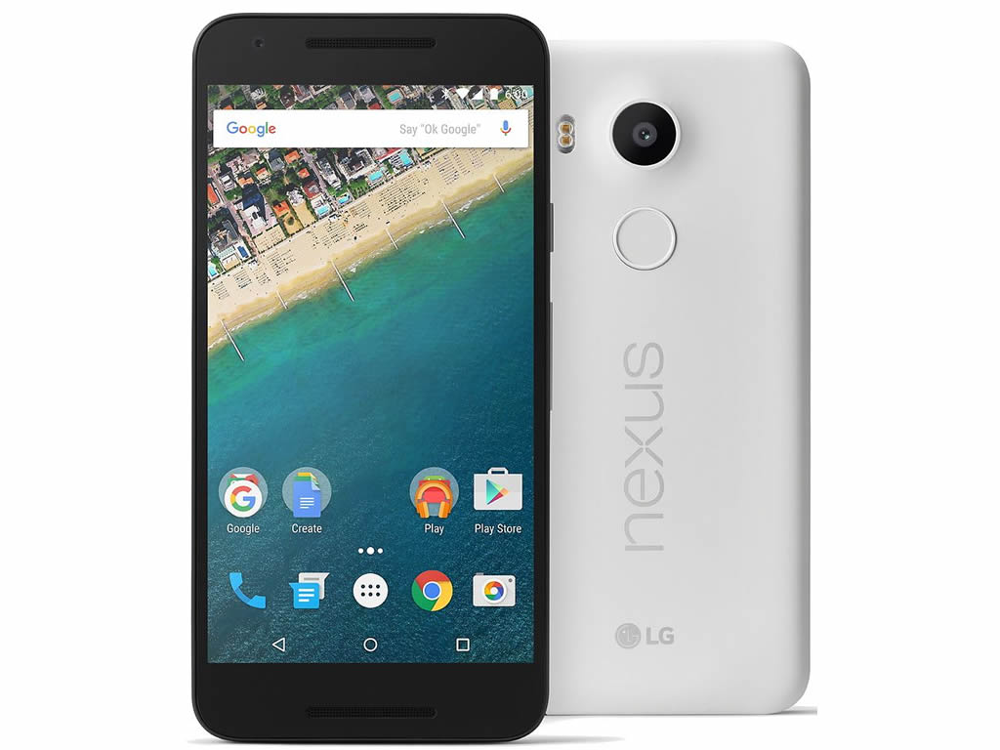
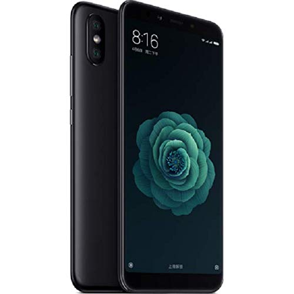

Esta semana he decidido "jubilar" mi teléfono móvil y reemplazalo por uno más nuevo, lo que me ha hecho pensar en todos los teléfonos que he tenido y en el tiempo que me "duraban" lo me llevado a escribir este _post_

> He de hacer notar lo "señor mayor" que me ha hecho sentir recordar conceptos ya olvidados, como el _prepago_, los _sms_, los tonos, etc.

# El primer móvil

(Foto: [Wikimedia](https://commons.wikimedia.org/wiki/File:CSIRO_ScienceImage_2936_Nokia_mobile_phone.jpg))

Mi primer teléfono móvil llegó allá por *1999*, un flamante [Nokia 5510](https://es.wikipedia.org/wiki/Nokia_5110), un teléfono cuya principal característica eran las carcasas intercambiables.

Fue muy recordado en su momento el anuncio de dos chicos intercambiando las carcasas usando un tendal de ropa (Todo muy noventero en el anuncio).



Desgraciadamente este teléfono, que era de segunda mano poco duró conmigo ya que solo soportaba la banda de 900MHz y en cuanto el operador que tenia por entonces, [Amena](https://es.wikipedia.org/wiki/Amena) (la Amena original), empezó a dar servicio en la banda de 1800Mhz el teléfono dejo de ser útil.

Muy "señor mayor" me ha hecho recordar la vergüenza que nos daba cuando sonaba el móvil en un sitio público, lo normal que era que todos sonasen igual "Ring Ring" y nadie supiese de quien era el que sonaba (en aquella época la vibración no era para nada algo de serie en un móvil)

# [Motorola M3688](https://www.moviles.com/motorola/m3688/caracteristicas-detalle)
(Foto: https://www.milanuncios.com/moviles-motorola/motorola-m3688-296180854.htm)

De este recuerdo especialmente la tapa, y pero que aún así era necesario bloquear el teclado (se hacía pulsando durante 2-3s una tecla) para evitar llamadas por error.

Hay que hacer notar que en ese momento una llamada podía costar cerca de un 1€ el minuto + establecimiento. :scream:

 
# [Erisson A1018s](https://www.gsmarena.com/ericsson_a1018s-114.php)
Foto: https://www.milanuncios.com/otros-moviles/movil-antiguo-247647249.htm

Creo que fue allá por el año 2000-2001 cuando compré este móvil.

El que tuve era justo como el de la imagen, con la "carcasa" serigrafiada con la mascota de Amena, aunque traía otra más azul si no recuerdo mal.

De esta compra me acuerdo muy bien, era un pack llamado "Dúo" (una oferta del operador) en el que te "daban" dos teléfonos iguales con dos número de teléfono consecutivos. De este es el número que aún conservo actualmente

Recuerdo también que era especialmente resistente, ya que me cayó bastantes veces y lo único que le pasaba era que se desmontaba en 3 piezas: La carcasa, la batería y el cuerpo del teléfono. Solo había que volver a montarlo y a funcionar.

# [Nokia 3210](https://es.wikipedia.org/wiki/Nokia_3210)

(Foto: [Wikimedia](https://commons.wikimedia.org/wiki/File:CSIRO_ScienceImage_2935_Nokia_mobile_phone.jpg))

Sí amigos, tuve uno de esos teléfonos que los memes recuerdan como un teléfono indestructible, y la verdad es que lo era. 

Tenia cosas avanzadas para su época, como la gestión de la agenda, el poder conectarlo a un ordenador (mediante cable) y cambiar el logo de la operadora, lo "politonos"

# [Alcatel One Touch Easy](https://hipertextual.com/archivo/2013/05/alcatel-one-touch-easy/)

(Foto: [Wikimedia](https://commons.wikimedia.org/wiki/File:Alcatel04.jpg))

Este ha sido uno de los peores teléfonos que he tenido, sin duda, lo recuerdo muy lento, se colgaba y no te notificaba las llamadas, recuerdo que a veces al sentarme se movía la batería y se apagaba, era un quiero y no puedo.

# [Nokia 6210](https://en.wikipedia.org/wiki/Nokia_6210)

(Foto: [Wikimedia](https://commons.wikimedia.org/wiki/File:Nokia_6210.jpg))

Año 2002. Este fue el caso contrario, uno de los mejores teléfonos que he tenido. Era de la gama "profesional" de Nokia. Tenia una gestión de la agenda espectacular para su época, permitía tener varios teléfonos en el mismo contacto, algo que en la mayoría de teléfonos de la época ni soñaban, la pantalla era grande en su momento, la batería duraba casi una semana (usándolo).

Tenia puerto de infrarrojos para cargarle politonos, gestionar la agenda (y hacer backup de ella), y como se ve en la siguiente imagen (de mi propio teléfono), cargar imágenes como logotipo de operador.

Me dio mucha pena haberlo vendido para adquirir el siguiente teléfono, me hubiese gustado conservarlo, por que además como se ve en la imagen la chapita inferior se podía personalizar y de hecho lo estaba :joy:.

# [Nokia 6610](https://es.gsmchoice.com/es/catalogo/nokia/6610/Nokia-6610.html)

(Foto: [Wikimedia](https://commons.wikimedia.org/wiki/File:Nokia_6610i_silver.jpg))

Año 2003 Mi primer teléfono en color y con *cámara*, eso si la cámara era un [periférico externo](https://mobile-review.com/review/nokia-hsc1-en.shtml) :joy: y tenia una resolución de 640x480px, es decir 0,3 Mega píxeles. En la siguiente foto, ya se puede observar que la calidad no era especialmente buena.

# [Nokia 3650](https://es.wikipedia.org/wiki/Nokia_3650)

(Foto: [Wikimedia](https://commons.wikimedia.org/wiki/File:Nokia3650cutout.png))
Año 2003-2004. Este curioso teléfono al que llamaba cariñosamente "la lavadora" por la forma del teclado, que a pesar de lo que pudiese parecer era fácil y rápido de manejar, fue mi primer _smartphone_.

Era un teléfono con [Symbian OS](https://es.wikipedia.org/wiki/Symbian), en concreto la versión 6.1, que permitía instalar aplicaciones, juegos, comunicación con una suite muy potente de gestión del teléfono mediante el PC. Ya tenia cámara integrada. Todo muy primitivo comparado con los móviles que llegar. La velocidad era bastante rápida para lo que había en su momento eso si, marcó la tendencia que seguiría después, la duración de la batería era con suerte de 1 día de uso.

 # [Qtek S100](https://en.wikipedia.org/wiki/HTC_Magician)

(Foto: [Wikimedia](https://commons.wikimedia.org/wiki/File:Qtek-S100.jpg))

Año 2005. Este _Smartphone_ o mejor dicho PDA con móvil, que realmente era una HTC Magician, fue otro salto al disponer de pantalla táctil (resistiva) manejada con lápiz, aunque si te acostumbrabas podías llegar a manejarla con los dedos. Fue también mi primer teléfono con wifi, pero nunca lo llegué a usar demasiado

A pesar de ser un buen aparato en global, el sistema operativo Window Mobile 2003, era terrible, continuos cuelgues, errores de apps, me llevaron a dar un paso atrás e irme a un teléfono lo más sencillo posible.

# [Samsung L760v](https://pl.wikipedia.org/wiki/Samsung_SGH-L760)

(Foto: [Wikimedia](https://commons.wikimedia.org/wiki/File:Samsung.JPG))

Año 2006.Esté fue un paso atrás en cuanto a "smart", pero fue un paso adelante en cuanto a duración de la batería, ligereza, rapidez, y comodidad para llevar en el bolsillo.

Un teléfono que aún conservo y cuya batería apagado se mantuvo durante varios años.

# [HTC Touch 3g](https://en.wikipedia.org/wiki/HTC_Touch_3G)

(Foto: [Wikimedia](https://commons.wikimedia.org/wiki/File:HTC_Windows_device_and_iPod.1owner.Egypt.jpg))

Este ya en el año 2007 fue una vuelta a los _smartphones_ de nuevo con Window Mobile, pero con una capa de HTC (muy chula, por cierto) que permitía menejarla fácilmente con la mano (sin necesidad del puntero)

Con este teléfono aprovechando contraté mi primera tarifa de datos, entendiendo que era la forma más lógica de usar un _smartphone_.

# [HTC Magic](https://en.wikipedia.org/wiki/HTC_Magic)

(Foto: [Wikimedia](https://commons.wikimedia.org/wiki/File:NTT_docomo_HT-03A_front.jpg))

Hace 10 años ya (2009) de este teléfono, fue mi primera incursión en el mundo Android. Con una versión Android 1.5 (luego actualizada a 1.6, pro cierto haciendo que el teléfono funcionase terriblemente lento) era un paso adelante respecto a los anteriores _smartphones_ que había tenido: Multitarea, pensado completamente para el manejo con dedos, tienda de aplicaciones incluida, navegador web decente.

Me gustaba mucho la "bolita", que además de servir como luz de notificación era un trackball, lo que permitía mover el cursor por el texto de una forma muy cómoda.

# [HTC Desire](https://es.wikipedia.org/wiki/HTC_Desire)

(Foto: [Wikimedia](https://commons.wikimedia.org/wiki/File:Htc-desire-2.jpg))

Año 2012. Fue un salto en rendimiento respecto al HTC Magic, un buen procesador y memoria para su época, una buena cámara, capaz de grabar video en 720p.

Mantenía el manejo del cursor mediante un "trackball" óptico, para mi gusto no tan bueno en cuanto a control como la bola física.

Con este teléfono, cuando HTC dejó de lanzar actualizaciones, fue con el que me introduje en el mundo del _Rooteo_, _flaseado_ e instalación de Custom ROMs, usando principalmente [CyanogenMod](https://es.wikipedia.org/wiki/CyanogenMod)

# [Nexus 4](https://es.wikipedia.org/wiki/Nexus_4)

(Foto: [Wikimedia](https://commons.wikimedia.org/wiki/File:Nexus_4.png))

Año 2013. Estaba ya cansado de leer que muchos fabricantes faltaban a sus promesas de actualizar la versión de Android (que ellos personalizaban), y de ver la de la cantidad de _bloatware_ que instalaban, así que me decante por este teléfono fabricado por LG, pero vendido y mantenido por Google.

Todo un acierto, un teléfono de gran calidad de acabado, con bastantes novedades tecnológicas, como el NFC, y que terminé cambiando por el desgaste de la batería, pero que aún siguió usando una amiga 2 años más sin problemas.

# [Nexus 5X](https://es.wikipedia.org/wiki/Nexus_5X)

(Foto: [Wikimedia](https://commons.wikimedia.org/wiki/File:Nexus_5X_(White).jpg))

Año 2016. Y este es el teléfono que tengo actualmente (hasta que me llegue el nuevo).
*Un gran teléfono con un gran defecto de diseño*. Al año de tenerlo un día se reinicio y ya no arrancaba, se reiniciaba durante el propio proceso de reinicio. Leyendo y buscando información encontré que era un defecto de diseño/fabricación, que la composición de las soldaduras que unían el procesador a la placa, son el tiempo (dependiendo sobre todo del calor), se agrietaban y dejan de hacer contacto ciertas patillas, provocando estos reinicios constantes.

Llamé al soporte de Google y el trato fue muy bueno, en unos días tenia otra unidad del teléfono (refurbished) en casa.

Esto me volvió a suceder casi otro año después, lo que hizo que me volvieran a cambiar el teléfono, de esto hace algo más de un año, por lo que la garantía ya no lo cubriría, y es un poco el motivo que me ha llevado a decidir cambiar de móvil.

# [¿Y ahora qué?](https://amzn.to/2VxbUqF)

Pues, ahora me he decantado (tras mucho valorar opciones) por un [Xiaomi A2](https://amzn.to/2VxbUqF), básicamente por que tiene prácticamente todo lo que necesito o puedo usar, por precio, por que sigue llevando Android One, que debería hacer que reciba las actualizaciones del sistema de forma rápida y por que mucha gente que lo tiene me lo ha recomendado.

Si me dura 2 años me daré con un canto en los dientes.

> Personalmente respecto a los móviles estoy en un momento como en 2006, en el que di un paso atrás por que veía el mercado estancado, y veo que ahora, como es lógico, no hay funcionalidades rompedoras que te inviten a cambiar de teléfono.

 

