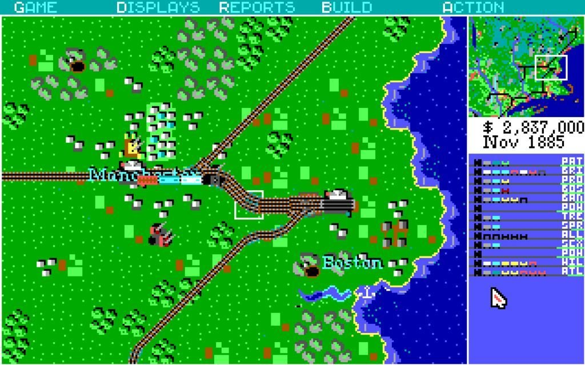
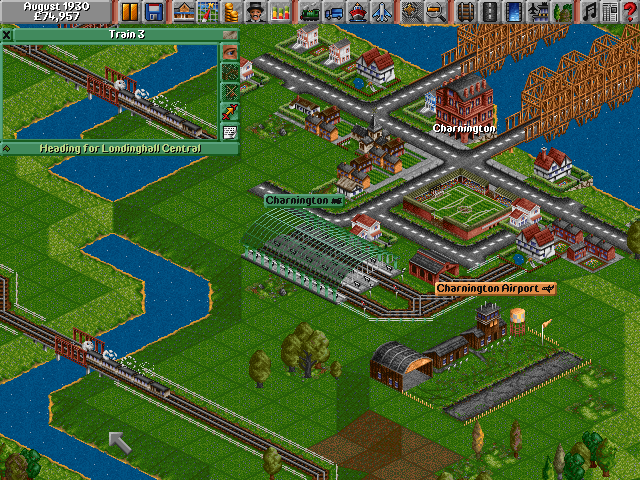
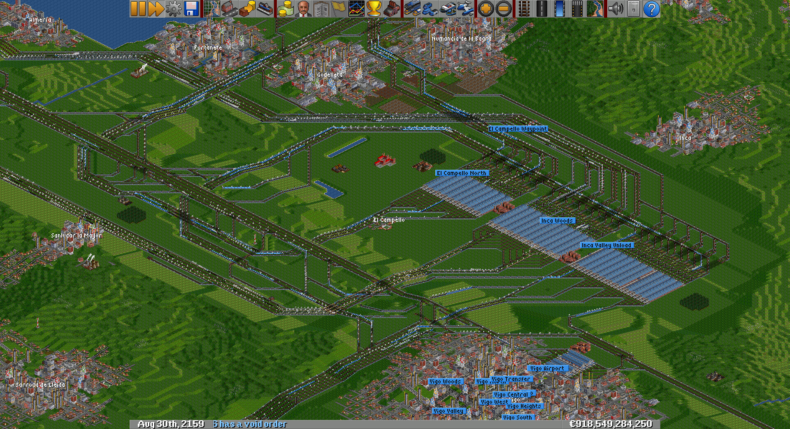

No todo es siempre trabajar, los momentos de ocio tambíen son importantes.

De pequeño tuve un maqueta funcional de un tren eléctrico, que desgraciadamente, por lo que más la recuerdo es por que nunca llegó a funcionar correctamente, problemas con los engranajes de transmisión, que por más que se pidieron recambios nunca se resolvieron.

Con los años y con el desarrollo lúdico de la informática, fueron apareciendo juegos "de trenes" que suplieron, con creces, ese trauma infantil. 

## Railroad Tycoon

Un poco más mayor, llegó a mi un juego de MS-DOS llamado [Railroad Tycoon](https://es.wikipedia.org/wiki/Railroad_Tycoon), que yo creo que fue uno de los primeros "Tycoon". Este juego consistía en crear una red de ferrocarril (poniendo los raíles, estaciones, depósitos, etc sobre un escenario 2D), crear y programar los trenes, etc...

A este juego se puede [jugar on line](https://archive.org/details/railroad_tycoon_1990) en archive.org usando chrome.

## Transport Tycoon

Allá por 1994 se publicó un que para mi lo cambio todo bastante, este juego fue [Transport Tycoon](https://es.wikipedia.org/wiki/Transport_Tycoon), una de las principales diferencias con Railroad Tycoon, es que el escenario es una perspectiva isométrica 3D, dividida en "cuadrados" en los que es posible colocar las vías, carreteras, etc, por que si este juego no se centra solo en los trenes, permite gestionar flotas de vehículos de carretera, aviones y barcos además de trenes.

El nivel de control de la red es muy potente, pudiendo diseñar las vías al detalle, con semáforos, túneles, puentes, etc.

En 1995 aparece una revisión de este juego llamada _Transport Tycoon Deluxe_ o *TTD*, que entre otras cosas, permitía crear señales unidireccionales para gestionar de forma más eficiente la red.

Tal fue el éxito de ese juego que la comunidad se interesó en mejorarlo y aportar nuevas funcionalidades creando _TTDPatch_ que entre otras cosas añadía compatibilidad con Window XP al juego original.

## OpenTTD

En 2003 un programador comienza a programar un clon de TTD escrito en C (a partir del desensamblado del juego original) y en 2004 lo libera bajo licencia _GPL_ y desde ese momento el juego ha seguido creciendo con nuevas funcionalidades de todo tipo, nueva generación de terreno, distintos tipos de señales, mejoras en la usabilidad y gestión de la flota.

Además incorpora un gestor de plugins llamado newGRF que van desde nuevos tipos de vehículos, de flotas (por ejemplo tranvías), gráficos para el juego, músicas, etc... 

El juego se puede descargar en https://www.openttd.org/ para Windows, OSX, Linux y otras plataformas.

Este juego es mi _juego favorito de trenes_. Sé que hay juegos más nuevos con gráficos en 3D "real", pero además de la nostalgia (esos gráficos de 8-bits me enamoran), me gusta por que me permite hacer algo que no tiene otros juegos, que es el pensar en la optimización de las lineas de transporte, diseño de mejores cruces (para hacerlos más óptimos y rápidos), mejores entradas y salidas en las estaciones, etc.

Dejo una de mis últimas partidas, la que cree cuando estuve hospitalizado 45 días, y que me permitió hacerlos un poco más llevaderos.

[Descargar partida](https://my.pcloud.com/publink/show?code=XZN9pO7Z54UfL4jVEqQTX2zE3C5M34nqRohy)

[Descargar partida extreme](https://my.pcloud.com/publink/show?code=XZUnpO7Z3fq41Cw61RYslUUnXB2PORyCXNOV)

