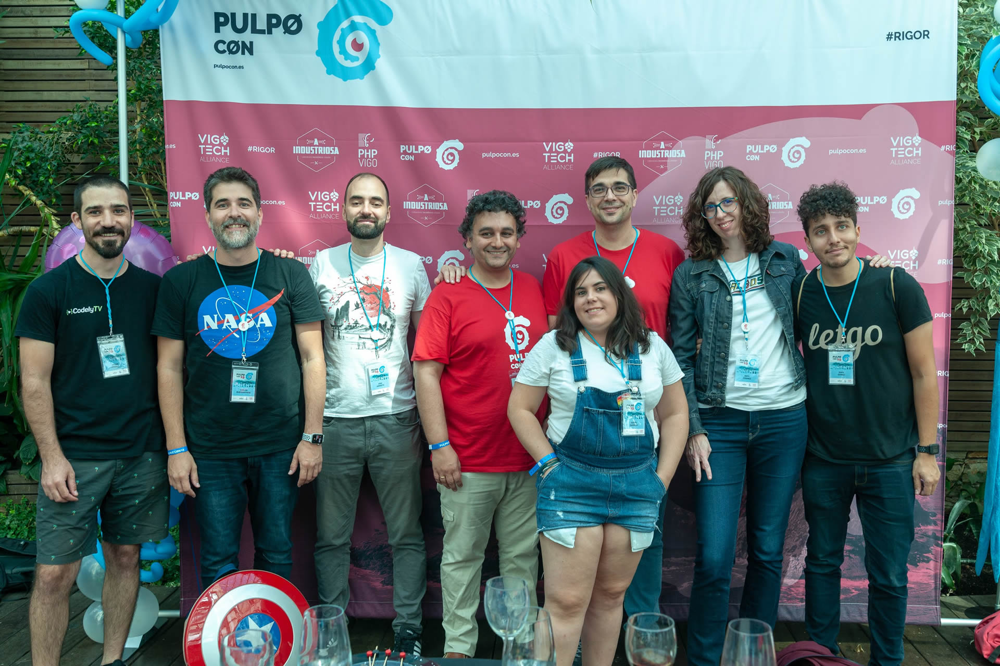
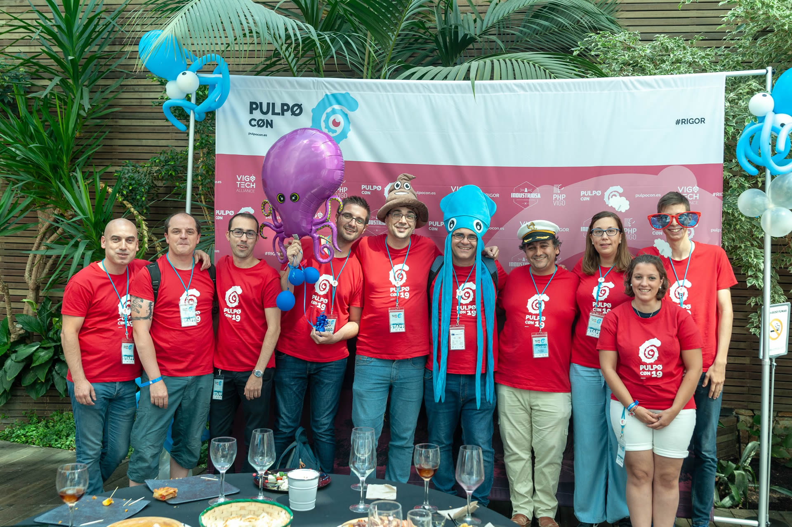
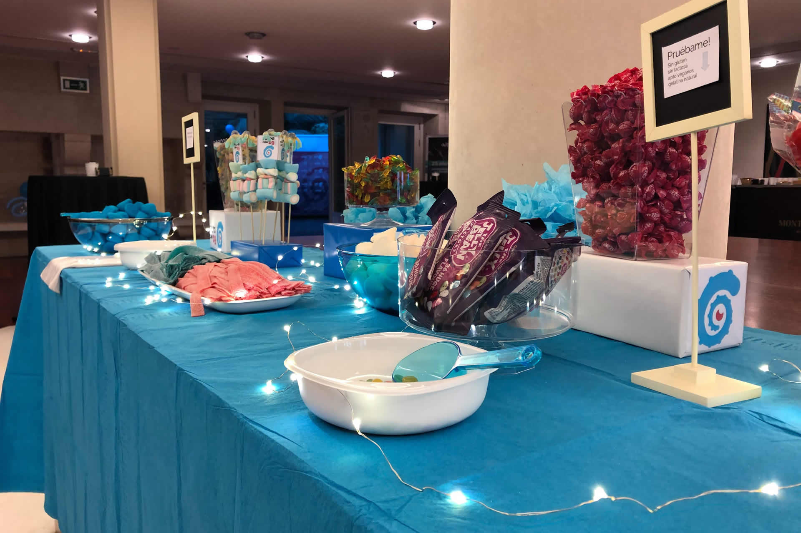
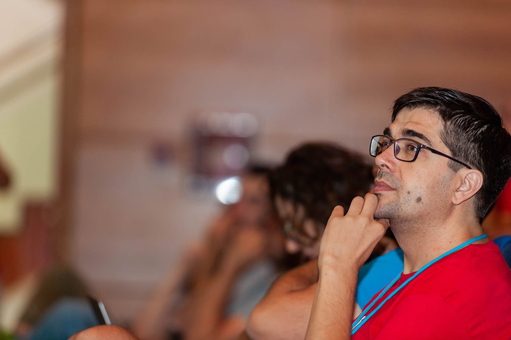

El pasado 7 de septiembre, se celebró la primera [PulpoCon](https://2019.pulpocon.es) una conferencia para programadores que he tenido el honor de ayudar a organizar.

Poco puedo añadir a la historia de como se forjó el evento a lo descrito en este *estupendo* post de Rolando Caldas, que os recomiendo encarecidamente leer ⬇️⬇️⬇️⬇️⬇️

> [La batalla de organizar la pulpoCon](https://www.linkedin.com/pulse/la-batalla-de-organizar-pulpocon-rolando-caldas-s%C3%A1nchez/)

Sólo puedo corroborar todo lo ahí dicho y ahondar aún más en los agradecimientos a todas las personas que nos han ayudado a montar esto.

Por añadir algo, me gustaría contar un poco de mi experiencia a nivel personal de lo que ha significado la *PulpoCon19*.

Los que me conocen saben que no estoy pasando por un buen momento, ha sido un año especialmente complicado en lo que respecta a salud.

Cuando a principios de año surgió la idea organizar un evento en Vigo para traer a grandes de este mundillo, yo estaba
[recuperándome de un linfoma]()
y no sabia como me iba a encontrar para poder participar en "todo esto", pero tenia claro que intentaría hacer lo que estuviese en mi mano.

Y así fue: lo poco que pudo estar en mi mano lo fui más o menos haciendo, todo ello siendo consciente, y es **algo que quiero decir alto y claro**, de que la *PulpoCon19* no sería posible sin el trabajo de [Félix Gómez](https://twitter.com/felixgomezlopez) y [Rolando Caldas](https://twitter.com/rolando_caldas?lang=es), también co-organizadores de PHPVigo.

Así fueron pasando las semanas y los meses preparando cosas (lo que cuenta Rolando de forma magistral en su post)

Legó julio y yo "exploté" a nivel mental con varias crisis de ansiedad, lo que no me permitía ser capaz de sobrellevar cualquier tensión o tarea que implicase tensión.

Cuento esto para poder **agradecer de nuevo a Félix y Rolando que me permitiesen continuar "dentro" de esto**, a pesar de la poca ayuda que yo podía aportar en esos momentos.

Esto me lleva a lo que me lleva a lo siguiente, a que el hecho de poder seguir organizando el evento es ese momento de "bajón" me hizo vivir una edificante experiencia desde el punto de vista personal, que de otra forma me hubiese perdido.

A pesar de lo intensos que fueron los días previos, llevando cajas de un lado para otro, preparando los _welcome packs_ (recuerdo el salón de mi casa lleno de cajas, camisetas, bolsas, etc), yendo de un lado para otro, casi con la lengua fuera, el recuerdo que guardaré es fantástico.

Como decía en el título, la experiencia ha sido muy edificante, he podido aprender muchas cosas: como se organiza un evento de este tipo, de lo que cuesta cuadrar las cuentas, conseguir patrocinios, de como la comunidad se vuelca y ayuda más de lo imaginable, de la colaboración desinteresada de otras comunidades.

Tengo que mencionar aquí a mi mujer, **Patricia**, que se encargó de decorar la sala de recepciones y el jardín, que aunque eso era parte del patrocinio de la empresa en la que trabaja **PartyFiesta**, su esfuerzo y dedicación con el evento fue mucho más allá de lo normal, dandonos ideas como usar uno de los globo-pulpo para recibir a los ponentes en el aeropuerto en lugar de el típico cartel, o usar el photocall como donde hacer fotos divertidas. 

Pero guardo como una lección el ejemplo que han sido para mí los ponentes, *personas que han dedicado un fin de semana de sus vidas a compartir sus conocimientos de forma desinteresada con todos nosotros*

Por que si lo piensas fríamente, ¿qué necesidad tiene cualquiera de estar personas, que son referentes en sus empresas y en la profesión, de venir hasta Vigo a compartir su conocimiento y experiencia profesional? Bueno, podréis decirme que el pulpo :octopus: y ese desde luego es un gran motivo :joy:, para mí ese esfuerzo es algo que valoro mucho.

Mencionar lo cercanos que han sido todos, su interés por conocer la ciudad, las pequeñas diferencias culturales que hay entre todos los lugares, etc.

Aunque la mayoría ya había oído hablar de nuestro _amado lider_, les hemos contado un poco más, y lo más importante **se han podido hacer fotos con el _Dinoseto_** :joy:

Yo espero que a todos ellos les gustase la ciudad, por que era parte de nuestros objetivos dar a conocer la ciudad en todo su contexto, a nivel de comunidad tecnológica, tejido empresarial, turismo y gastronomía, que eso en Galicia no puede faltar.

Me llevo muchos pequeños recuerdos y sensaciones: Como cuando llevé a Javier y Rafa (CodelyTV) y a Jose Armesto en coche a la cena de ponentes y al oirlos hablar parecía que estaba en uno de sus videos. También las risas que nos echamos a cuenta del gorro pulpo y de todos los complementos para hacernos fotos divertidas en el photocall.

Creo que con el tiempo podré valorar **aún más** el haber sido participe de la primera **PulpoCon**

Muchas gracias a todos: ponentes, voluntarios, asistentes, patrocinadores, personal del recinto, personal del catering, a todos los que participasen de alguna forma en el evento.

  
 

