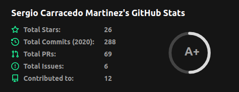

2020 is almost complete, and it was a year that we will remember for a long time. I don't want to be dramatic, but 2020 left a deep mark on all of us. 

# Profesional
In the professional terrain, in January I started a new job as a pure frontend guy in a big company. This job gives to me a big opportunity of work with amazing people. This job forces me to speak in English most of the time, this is the reason why I started to write this blog in English. It was a challenge and still being, but I'm always very happy to be challenged. In November, I moved to a new job an awesome professional opportunity, but a great opportunity to be part of a project whose goal is to help others and to make a better and more equitable world.

# Community
This year was a bad year for the developer groups. On February 27th, we did our last face-to-face event in PHPVigo, and we had to make the tough (but right) decision to cancel the PulpoCon 2020, but after crazy months we started to work hard to make it possible to do online events, inaugurating the PHPVigo's Twitch channel. I also began to help a little bit in other groups.

# Talks
Despite the bad year for the face-to-face meetings I was able to do a few talks:

* New features in ES2020 in https://www.youtube.com/watch?v=ziZO5KQM_KU&t=5248s
* Creating your own Vue UI components library: From scratch to NPM: https://www.youtube.com/watch?v=z_K5iuSjCDo

Both in Spanish. I also did two internal talks in my old company (in Spanish too).
One of my goals for the near future was to do a talk in English, and I achieved this on December, in an company internal talk. I'm very proud of that because one year ago I almost didn't speak English.

# Open source
This year I created 2 new open-source projects.

* [OBS stream widgets](https://github.com/sergiocarracedo/obs-stream-widgets), When we started to do online talks, we and other groups needed to show information on the screen (labels, titles, countdown, etc), and run the final contest to give participants some free licenses and other goodies. This project wrote in JS, is a set of tools to do that.
* [Gandi-ddns-node](https://github.com/sergiocarracedo/gandi-ddns-node) I needed to update a subdomain with my local (dynamic IP), this is the reason why I wrote this script which uses Gandi.net API to update a domain or subdomain if your local IP changes.

I also did a few PR to opensource projects, fixing bugs, or adding new features, my little contribution to the open-source world.

# Personal
I learned a lot of things this year: new frameworks, tools, etc. I also started programming in a new language with a different paradigm to the other languages I knew: GoLang.

I also made new teammates, friends, and colleges, I fly for the second time in my life :sweat_smile:    

I'm sure I forget a lot of things in this 2020's summary but in general terms, regardless of the pandemic, this was a good year.

I wish 2021 will be the year we will forget the pandemic thanks to the vaccines, science, and great health professionals.

Happy 2021!
