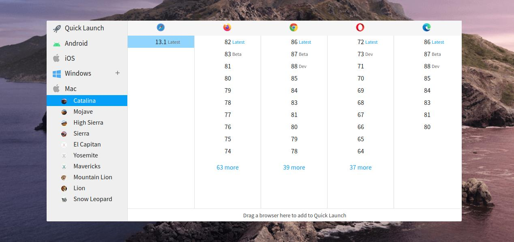
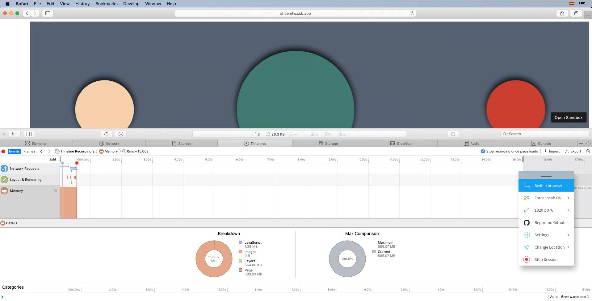
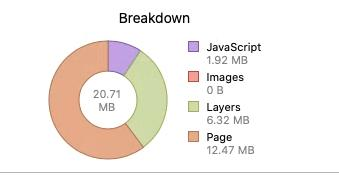

## The context
A few weeks ago I was developing a website using [NuxtJs](https://nuxtjs.org/) (which is not important for the problem but the is the context :wink: ). That was a website that needs to use a few images as building blocks, the typical section separator with a shape different to a simple line, in this case, the section's separator had 2 colors and a shadow.

I decided to use SVG images for several reasons, for example the images had to adapt to different screen widths, and the images were simple (more complex than a line but simple, They were similar to 2 waves with 2 colors). The SVG files are very useful in these use case, because the file size is small, and you can scale them infinitely without lost definition.   
One important thing in this issue as we'll see later is that this image had a shadow.

## The problem

Well, I was almost done templating the website, and we started to test the website in different browsers and platforms, and everything was fine, except because Safari users complain about the browser displays a notice:

> This webpage is using significant memory. Closing it may improve the responsiveness of your Mac.

As side effect, the website animations were not fluid.


## Reproducing the problem and fixing it

I needed to test the website by myself to find the reason of this issue. I don't own a Mac computer, but I have a [BrowserStack](https://www.browserstack.com/) account.

[BrowserStack](https://www.browserstack.com/) is a SaaS that allows you to connect, using your browser, to remote devices with other browsers / OS. You can even select old browser versions, a mobile device (like iPhones, etc)


 


> **Off-Topic**: BrowserStack supports my open source project [SirenoGrid](https://sirenogrid.com/)

So, with my BrowserStack account, I could try to reproduce the problem. I open a Safari 13.1 (lastest version) instance in MacOS Catalina, and opened the website, and using the devtools got info about memory usage, and **it was over 1.4 GB!!!!** 
And if you reloaded the website memory usage grows until the system got unresponsive.

The first thing I thought is that the problem was the animations. I remove them: *Nothing changes*.

I remove javascript: *Nothing* :confused:

I continue removing things and trying other things to understand the problem. *No results* :open_mouth:

After a long time, I was already a little desperate I disabled all website content blocks, and I realized that when it was a block with an SVG image in the screen, the memory usage was high.

I tried the same for a block with a png image and memory still normal.

WTF?? It should be SVG images.

Then, I replaced all SVG images with PNG versions and website works with reasonable memory usage :tada:


## Isolating the issue

After fixing the problem and with more time I wanted to know because SVG files were causing this high memory usage.

I searched on Google information for issues in Safari and SVG and I didn't find anything that fit my issue, some diffuse references.

I created a sandbox to isolate the issue, I will not go into detail, but after some test and fail iterations I realized that the issue was related to SVG Filters.
 
With this information, I repeated the Google search, and I found information relative to Safari, SVG and filters issues [1](https://bugs.webkit.org/show_bug.cgi?id=78814), [2](https://bugs.chromium.org/p/chromium/issues/detail?id=583471) (Some of them are very old), and the most similar: https://github.com/mapbox/mapbox-gl-js/issues/7476
 
 
## The bug

If you open in Safari a normal webpage, for example: https://apple.com which is a webpage with images, javascript, animations, video, etc. The Safari Timeline inspector says the memory usage is around 205MB


I prepared a bug demo codesandbox, just with 2 simple svg images: 
 
> https://5emtw.csb.app :heavy_exclamation_mark: Open with responsibility in Safari :heavy_exclamation_mark:

And in the first load that is the memory usage is around 600 MB!!!! :exploding_head: That's crazy



And if you reload the page a few times the situations will be worse


After 3 reloads the memory usage is 1.26 GB, absolutely crazy.

The same page, and the same images, but without filters

> https://5emtw.csb.app/nofilters.html

The memory usage is only 21 MB, that it's a very normal memory usage




Even with a simple filter, like:

```<feFlood flood-opacity="1" result="BackgroundImageFix"/>```

The memory starts to go high, I'm not sure what cause the problem, but in my opinion is something related to composition, I guess the browser keeps in memory the raw result of applying a filter and after making all the compositions layers      .

I reported that bug in the Webkit Bugzilla page: https://bugs.webkit.org/show_bug.cgi?id=218422
I hope they fix it soon.
