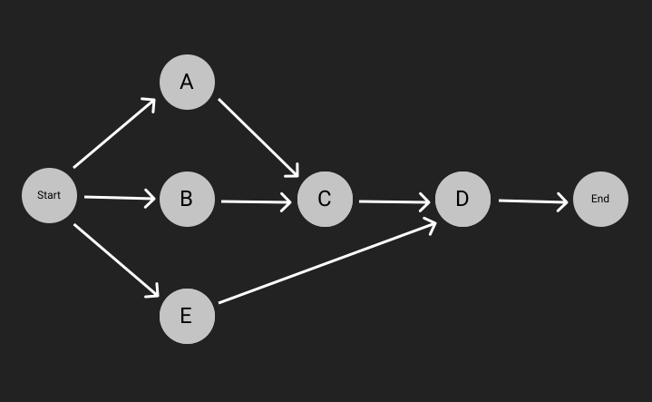
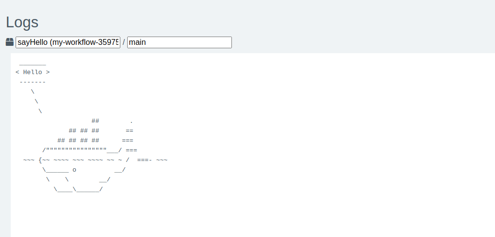

Simplifying it, a workflow is a list of tasks to run in some order and/or fulfilling some dependencies, for example, if we have 5 tasks to run: `A`, `B`, `C`, `D`, `E`. 
Task `C` depends on finishing tasks `A` and `B`, task `D` depends on finishing `C` and `E` 

Something like this:



There are several tools to orchestrate that, but we'll focus on *[Argo Workflows](https://argoproj.github.io/argo-workflows/)*

_Argo Workflows is an open-source container-native workflow engine for orchestrating parallel jobs on *Kubernetes*._

Running over Kubernetes is one of the most characteristic things of Argo differentiating it from others.

Every task you define will run in a container or using other words, you must create a container to run the tasks, and all of it will run in your Kubernetes cluster

## Install Argo Workflows
Installing Argo Workflows is very easy, you only need to apply a manifest in your cluster to configure Argo's services in the cluster:

For example https://raw.githubusercontent.com/argoproj/argo-workflows/master/manifests/quick-start-postgres.yaml

<small>More info: https://argoproj.github.io/argo-workflows/quick-start/</small>

Argo Workflows also provides a URL to access a UI to manage Workflows, Events, Reports, Users, Docs, etc...

To keep track of the workflows, etc. Argo needs persistence for example: Postgres, MySQL, etc...

As is indicated in the official documentation is highly recommended create a namespace (ex. argo) in the cluster to "install" into it all Argo's services.

## Workflows

There are two types of workflows: *Regular workflows* and *Cron Workflows*

Both are basically the same, but a *cron workflow* creates a *Regular workflow* automatically when should be executed according to the cron syntax, ex. */3 * * * * *. Note it can create more than one workflow 

Workflows are defined as Kubernetes manifest that should be applied to the same namespace as Argo services.

This manifest defines all the tasks and their dependencies

```yaml
apiVersion: argoproj.io/v1alpha1
kind: Workflow
metadata:
  name: my-workflow 
apiVersion: argoproj.io/v1alpha1
kind: Workflow
metadata:
  generateName: my-workflow
spec:
  entrypoint: tasksDependencies # This is the name of the template to run first
  templates:
    - name: exampleTask
      inputs:
        parameters:
          - name: msg
      container:
        image: docker/whalesay
        command: [cowsay]
        args: [{{ inputs.parameters.msg }}]
    - name: tasksDependencies
      dag:
        tasks:
          - name: sayHello
            template: exampleTask
            arguments:
              parameters:
                - name: text
                  value: "Hello"
          - name: sayNiceJob
            template: exampleTask
            dependencies: [ sayHello ]
            arguments:
              parameters:
                - name: text
                  value: "Nice Job"
          - name: sayRunning
            template: exampleTask
            dependencies: [ sayHello ]
            arguments:
              parameters:
                - name: text
                  value: "Running"
          - name: sayFinished
            template: exampleTask
            dependencies: [ sayRunning, sayNiceJob]
            arguments:
              parameters:
                - name: text
                  value: "It's over"
spec:
  entrypoint: exampleTask # This is the name of the template to run first
  templates:
    - name: exampleTask
      inputs:
        parameters:
          - name: msg
      container:
        image: docker/whalesay
        command: [cowsay]
        args: ["{{ inputs.parameters.msg }}"]
    - name: tasksDependencies
      dag:
        tasks:
          - name: sayHello
            template: exampleTask
            arguments:
              parameters:
                - name: msg
                  value: "Hello"
          - name: sayNiceJob
            template: exampleTask
            dependencies: [ sayHello ]
            arguments:
              parameters:
                - name: msg
                  value: "Nice Job"
          - name: sayRunning
            template: exampleTask
            dependencies: [ sayHello ]
            arguments:
              parameters:
                - name: msg
                  value: "Running"
          - name: sayFinished
            template: exapleTask
            dependencies: [ sayRunning, sayNiceJob]
            arguments:
              parameters:
                - name: msg
                  value: "It's over"
```

Let's explain this example, but in the first view you can see the power of Argo

A template defines a job to be done, can be a [container](https://argoproj.github.io/argo-workflows/workflow-concepts/#container) (as in our example), a [script](https://argoproj.github.io/argo-workflows/workflow-concepts/#script), a [resource](https://argoproj.github.io/argo-workflows/workflow-concepts/#resource) (to do operations on the cluster's resources directly from the workflow) and [suspend](https://argoproj.github.io/argo-workflows/workflow-concepts/#suspend) that is just to wait the time defined.

In our example, we defined a template called `exampleTask` (this name must be unique and can be used to refer to this template).

For the task, we define one input parameter, a msg to print. This value can be referenced later.

This task uses a container with the image `docker/whalesay` from docker registry, but you can use your own and private registry, Argo runs the command `[cowsay]` and uses the input values defined previously as command arguments `[{{inputs.parameters.text}}]`


Templates also can define [Template Invocators](https://argoproj.github.io/argo-workflows/workflow-concepts/#template-invocators), that are used to call other templates and do execution control, in our example we are using DAG ((Directed Acyclic Graph)[https://airflow.apache.org/docs/apache-airflow/1.10.12/concepts.html#:~:text=In%20Airflow%2C%20a%20DAG%20%E2%80%93%20or,and%20their%20dependencies)%20as%20code.]), but we can use also steps, but that allows us to create better dependencies

In our case we are defining 3 tasks, all use the same template with different params (but we can use different templates for different tasks), the entry point is `sayHello` and `sayNiceJob` and `sayRunning` after that, and finally `sayFinished` only will run after `sayNiceJob` and `sayRunning`.

An after applying the manifest: `kubectl -n argo -f workflow.yml` Argo runs it
This is how the workflow looks after running it


Clicking over a task we can get information about the run: the summary, the input and outputs, the container involved in the run, and the logs or the run



To summarizing, if you have a Kubernetes cluster and need to run workflows, Argo is a very good option.

I will write more blog post in the future about Argo, for example how to configure the access security.


