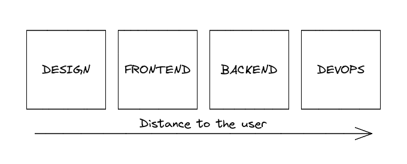
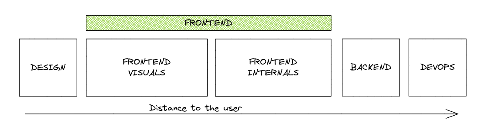
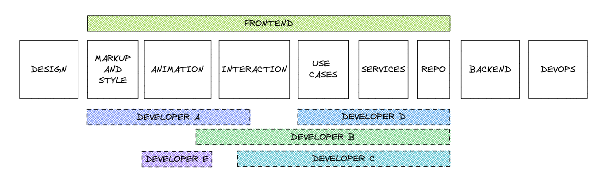
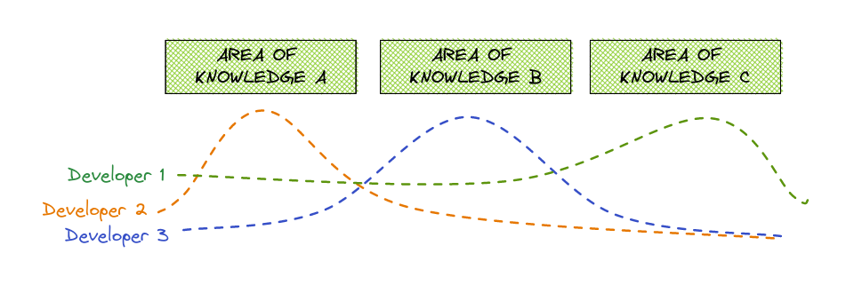

15-20 years ago, web application developers had the knowledge and the technical skills necessary to create an application: HTML, CSS, JS, PHP/Python/ASP, Web Server management, MySQL/Postgres, etc. 

With time the web applications became more complex with bigger requirements. New technologies, frameworks, and paradigms bounce into the development and pushed developers to specialize in some areas arising new roles from this specialization.

Nowadays, the equivalent common roles for a web application that cover the exposed tasks/skills and the typical requirements are: Designer, Frontend developer, Backend developer, DevOps and in a data-oriented company: Data engineer, Data scientist, etc. 

I want to focus this post in the first three roles: **Designer**, **Frontend developer**, **Backend developer**

You can think I made a mistake because the title of the post says _tech roles_, and I added the designer's role, well, for me, it's a technical role, maybe it's diffuse, but they are the nearest role to the application's user, and they are a bridge between the users (and product) and the frontend team(s). 

Let me represent the roles or the teams by the distance to the application user (This representation can vary depending on the application, but it covers a lot of cases).

Let me do **some simplifications** to explain this order: **design team** takes care of the first thing the user sees on an application: the visuals, **frontend team** is in charge of implementing those visuals and the user interaction, **backend** manages the user interactions with the data and implements the business logic, and **devops** creates the context (servers, databases, networking) for everything to work.

# Frontend role interfaces and borders
To define the frontend role (or team) responsibilities, let's start defining the borders, I'm going to do it on the right side of the chart: the backend. The natural interface between the frontend and the backend is a contract: an API. It could be a REST HTTP API, gRPC API, GraphQL API, etc. but commonly, in a web app the border is the network. This border seems a hard border, but we'll see that it's not as hard as you might think.

After defining the right border, let's do the same with the left border, the one with the design. This is typically a static design of the elements, layouts, and screens of the application, a Figma document, or something similar.

> This still being a simplification, I'm aware there are other tools, ways to define the visual and functional requirements, etc.

# Frontend responsibilities
Knowing the borders, let's define the high-level responsibilities of in the frontend team:

* Convert design to HTML/CSS
  * App layouts
  * Create and maintain app's components
* Add and maintain animations to the components and transitions
* Handle use interaction
* Load and send data to API
* Form/entities validation
* Implement and maintain business logic
* Implement and maintain UI logic

These responsibilities (and more) are quite different and require different skills, as I mentioned before, in the past was very common for a single developer to get all these and solve the related tasks without thinking about this separation, the same happened long before with the backend and frontend separation, that didn't exist. Nowadays, we can have more specialized roles for each responsibility, we can group again into 2 subgroups: **Frontend visuals and interactions** and **Frontend internals** (I like to call this _the backend of the frontend_)

The frontend **visuals and interactions** takes the responsibility of converting the designs to a code the browser can understand (HTML and CSS), implements the animations, the layouts, the user interaction (ex. emit an event on user click), render the data passed to the component, **this group requires more knowledge in HTML, CSS (SCSS), SVG, browsers events**. And the **Frontend internals** takes the responsibilities nearer to the backend: connect to the backend get the data, prepare it for a view, validate the forms, implement the business requirements related to the data flow, constraints, etc. **This group requires more knowledge in Typescript, browser's API, HTTP, async**

We could go even further and create more specialized groups inside the _frontend visuals_ and inside _frontend internals_ groups, but the logic behind I exposing is the same. It's important to say that the borders are not hard, and that is good as permits mobility, spread, and improvement.

## Roles segmentation, granularity, and overlapping
Going back to the _simple_ scenario, we had a single role: _frontend developer_, but now, considering the previous grouping, we can define different roles in our frontend team, roles that cover the skills and responsibilities of multiple groups.

This role segmentation **makes it easy to find people that fit better on a role**. As wider is the role as harder to find a person to cover the role with all the skills necessary for the position, and it's not about reducing the position's requirements, it's that the same position (ex: Frontend developer), today usually requires more knowledge than 5 years ago. 

For example, if the company needs and specialist in css/svg animation, I think makes no sense to require knowledge in GraphQL for this position, if the person knows it, then perfect, but if not she/he can learn it.

It's important that she/he fit in the position in the beginning and start to share the knowledge about animation, she/he can expand her/his knowledge to the next areas later, making the on-boarding and adaptation process smoother.

Just another example, usually (not a general rule) the people that came from a frontend boot camp have more skills and feel more comfortable in the visual roles than in the roles nearer to the backend. **Should we discard that talent just because it doesn't cover all the _frontend skills_?** I don't think so, as they get more experience, they will spread the knowledge areas and get tasks from other roles.

## Mobility between roles
An advantage of not having hard borders between these roles makes easy mobility. The developers can start to be involved in new roles, increasing their knowledge organically, for example, a _visual's role_ developer could need to change a use case, solve a bug fix, or implement a small feature, but still be in its comfort bubble, just increasing it a bit at a time and after some time can start to do more and more tasks on the internals and the opposite, a developer in the internals group can do a task in the visuals. 

Another advantage is that the areas of overlapping make it easy to understand and empathize with others' tasks and understanding what I could do to make the other's work easy.

## Overlapping roles
In this situation of narrow and diffuse role definitions, to have developer skills that overlap with another one's skills it's not an issue it's an advantage, they can split the tasks, work together and share knowledge in the areas they don't overlap.   

# Breaking the borders
But, we still have hard borders, **why don't break them?**

All I mentioned before about mobility, overlapping, and specialization apply to the borders with the design and the backend, obviously we can do this deep looking and segmentation in the roles for design and the backend.

Who does not know a designer that learned HTML, CSS, and JS, maybe just curiosity, to make her/his design real, or looking for a better job opportunity, why ignore this design skills? Let she/he to collaborate with the design team or just help them to understand the technical possibilities of the frontend.

"Crossing" the right border is more common, we call them full-stack, but following the previous, there are different types of full stack developers, depending where they put their knowledge areas limits on left and right. In my opinion let frontend developers, the ones whose roles or knowledge areas are more on right, to "cross the border" and participate in the backend's tasks, at least in the ones more related the frontend it's always productive and increment the communication and collaboration between teams, this developer don't need to know all the details and internals, of the backend, for example, if the backend uses hexagonal architecture, this person could implement or maintain controllers and application uses cases, using already implemented services and entities.

And the opposite, a backend developer could implement the frontend repository that reads from the API and converts the data in domain entities without needing to know how the frontend framework works in deep.

# Getting strengths of the team members

This segmentation a wrote about is not about to segment or divide the teams to create more or about to create more structs in the organization, **it's about identify the strengths of the team members and take advantage of that**, empowering the work empathy with other teams and team members thought a better understanding of other areas of knowledge and their needs and at the same time minimizing the knowledge silos via overlapping this areas.

I believe that in the upcoming years the knowledge necessary to create a big web applications will be bigger and probably we will see some kind of split between the frontend visuals team and frontend pure development, but I'm strongly believe, this is an arbitrary division, and people with specialization but that can get other roles will be very productive for any organization.
