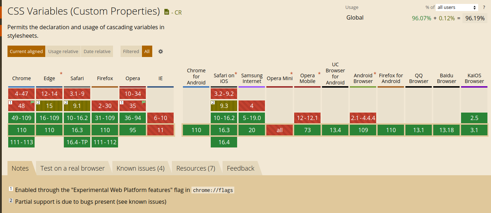

The real name of the _CSS variables_ is **CSS Custom Properties** is a draft standard (yes when I wrote these lines is on [Candidate Recommendation Snapshot](https://www.w3.org/standards/history/css-variables-1)), but is widely supported by modern browsers.



CSS variables allow us, like another kind of variable in another programming language to store a value we can reuse across our document.

For example, if we define a CSS variable for the primary color doing: `--primary-color: #f00;`, then we can use it in any component like:

```css
.my-component {
  color: var(--primary-color);
}
```

Usually you "attach" your variable to `:root`, which means the variable will be available in all the document
```css
:root {
  color: var(--primary-color);
}
```
In this example `:root` is the variable scope.

# Using together SCSS

If you want to assign values from SCSS variables to CSS variables, you can not do the "normal" notation:

```scss
// ❌ This doesn't work
$scss-var: #f00;
--my-var: $scss-var;
```

In the example, the value of `--my-var` is literally `$scss-var`, not the value of `$scss-var`, this behavior was done to provide the maximum compatibility with the plain CSS https://sass-lang.com/documentation/breaking-changes/css-vars

To make it work you need to use the [Sass interpolation](https://sass-lang.com/documentation/interpolation) syntax: `#{my scss script code}`:

```scss
// ✅ This works
$scss-var: #f00;
--my-var: #{$scss-var};
```

# Scope

The variables are only available in the element where is defined and its children, that is the scope of the variable. Outside there the variable doesn't exist. 

If you try to access to use a variable that is not in the scope you will not get an error, but the property that is using the not existing variable will be ignored.

## Hoisting

Like the JS variables, the CSS variables are moved to the top, so you can use them before defining.
```css
.my-element {
  color: var(--primary-color);
}
:root {
  --primary-color: #f00;
}
```

## Override

As I mentioned before the variables has a scope where the variable exists, but: what happens if a variable with the same name is defined in 2 scopes: It happens the same as in a JS variable, the near local scope overrides other values:

```css
:root {
  --color: #0f0;
}
    
.my-element {
  --color: #0ff;
  color: var(--color);
}
```

This behavior is very convenient when we work with UI components which have different styles depending on modifiers.

# CSS Variables in UI components

Imagine we have a simple button component, like that

```html
<button class="ui-button">
  Button content
</button>
```
```css
.ui-button {
  background: #333;
  color: #fff;
  font-size: 12px;
  padding: 4px 10px;
}
```

This button has different variants by color (default, red and green) and size (default, small and big), using BEM, we can add a modifier class like `.ui-button--green` or `.ui-button--big` and use that to overwrite the styles, for example:

```scss
.ui-button {
  background: #333;
  color: #fff;
  font-size: 12px;
  padding: 4px 10px;
  
  &--green {
    background: #1F715F; 
  }

  &--big {
    font-size: 16px;
    padding: 6px 20px;
  }
}
```

This way works perfectly, but we need to know which properties to overwrite, and need to do it explicitly for each modifier, so it's easy to forget something, or if we need to add a new property affected by the modifiers, add it in all of them

If we rewrite the styles using CSS variables, parameterizing the component styles, we can override the CSS variable values for each modifier, without changing the CSS styles itself for the modifiers, only changing the value of the variables:

```scss
.ui-button {
  --bg-color: #333;
  --text-color: #fff;
  --font-size: 12px;
  --padding: 4px 10px;
  
  background: var(--bg-color);
  color: var(--text-color);
  font-size: var(--font-size);
  padding: var(--padding);

  &--green {
    --bg-color: #1F715F;
  }

  &--red {
    --bg-color: #0ff;
  }

  &--big {
    --font-size: 16px;
    --padding: 6px 20px;
  }

  &--small {
    --font-size: 10px;
    --padding: 3px 5px;
  }
}
```
You can see a working example at: https://codesandbox.io/s/autumn-bush-4i4iem?file=/index.html

## Variable scope priority

In CSS the elements can use more than a class, so that means the element's CSS variables have multiple scopes at the same level, for example if we apply the green and red modifiers at the same time

```html
<button class="ui-button ui-button--green ui-button--red">
  Green + red
</button>
```

Both `ui-button--green'  and `ui-button--red` define the same `--bg-color` variable, What value will be applied to the element?

In cases like that the class order is the priority, so the last class applied overrides the value last and its value is applied, on the example the button will be red, but for `<button class="ui-button ui-button--red ui-button--green">` the button will be green


# Summarizing

The use of CSS variables and scopes is a powerful tool when you are developing components in general, but more if your components have modifiers, it requires an extra work in the beginning to parameterize the component, but after that makes it simpler to create variants and modifiers.
