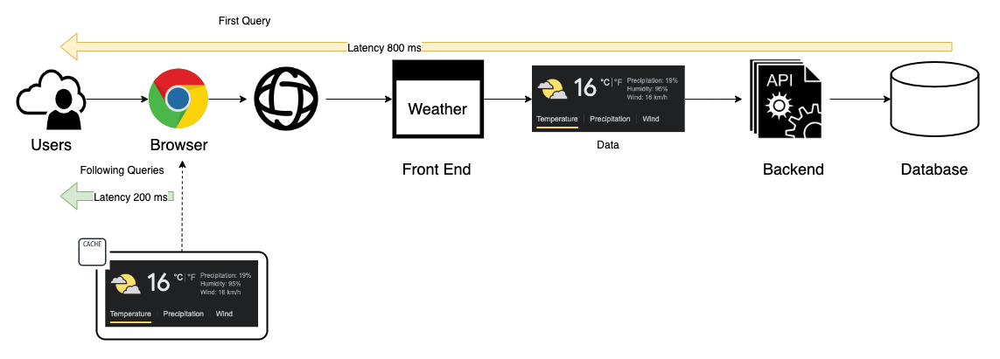
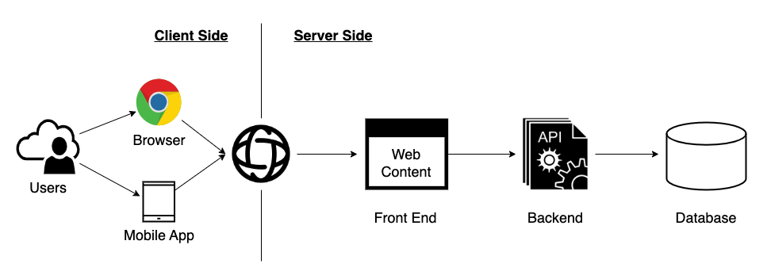
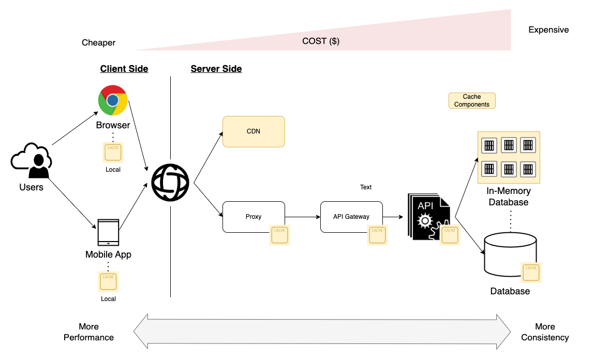
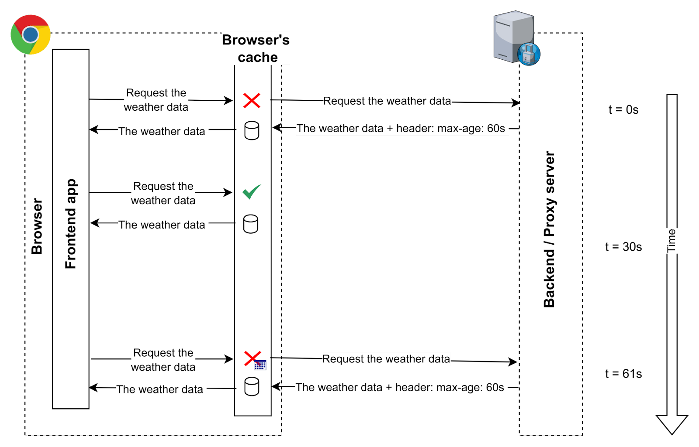
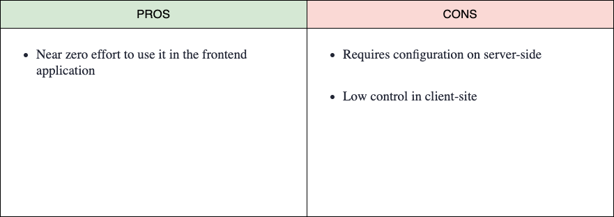
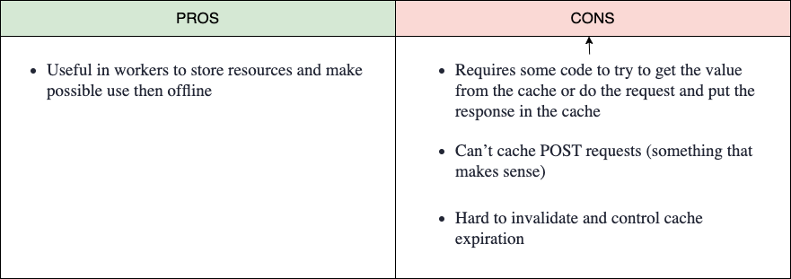
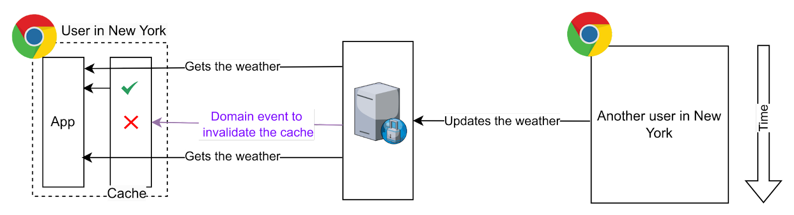
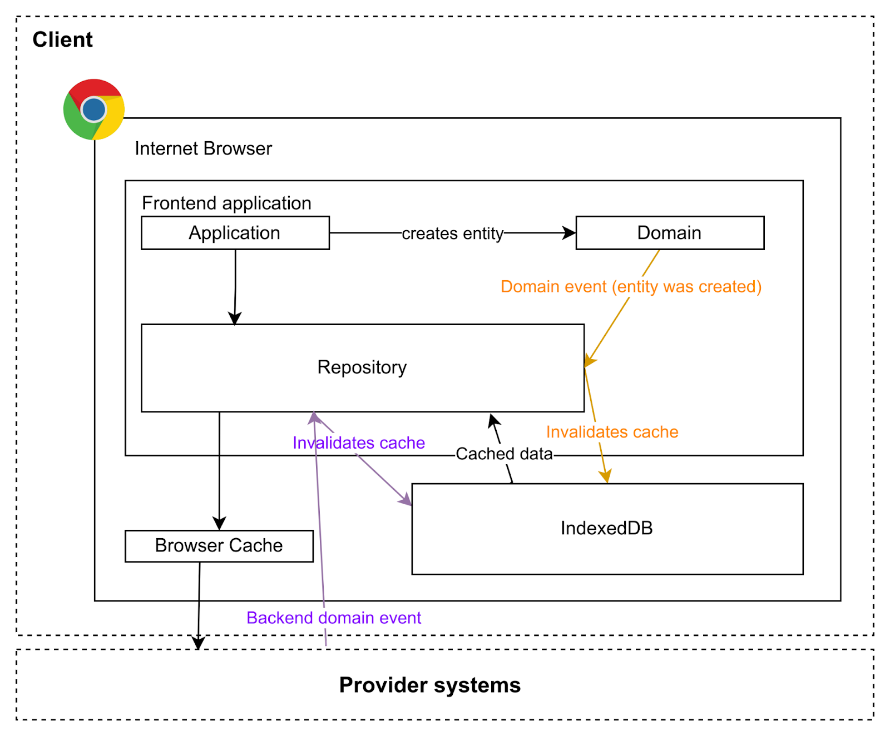
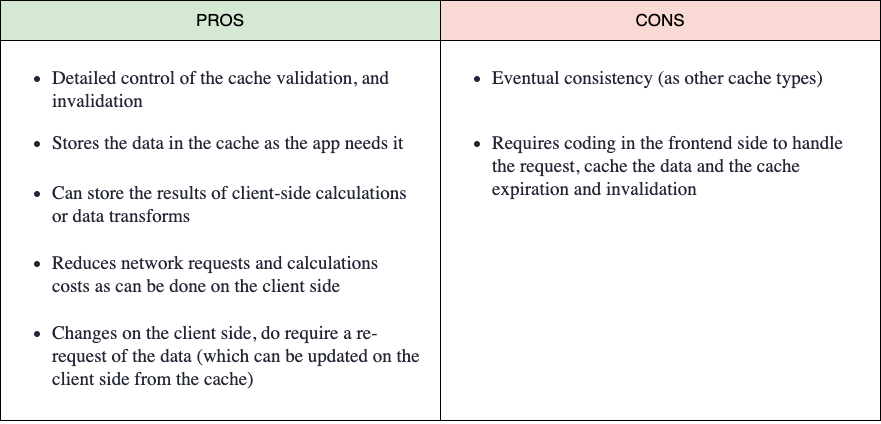

> This article was published originally in [DZone](https://dzone.com/articles/front-end-cache-strategies-you-should-know).
> I wrote it with [Miguel García](https://www.linkedin.com/in/mgarlorenzo/)

[Caches](https://dzone.com/articles/introducing-amp-assimilating-caching-quick-read-fo) are very useful software components that all engineers must know. It is a transversal component that applies to all the tech areas and architecture layers such as operating systems, data platforms, backend, frontend, and other components. In this article, we are going to describe what is a cache and explain specific use cases focusing on the frontend and [client side](https://dzone.com/articles/web-caching-client-side).

# What Is a Cache?
A cache can be defined in a basic way as **an intermediate memory between the data consumer and the data producer** that stores and provides the data that will be accessed many times by the same/different consumers. 

**It is a transparent layer for the data consumer in terms of user usability except to improve performance**. Usually, the reusability of data provided by the data producer is the key to taking advantage of the benefits of a cache. Performance is the other reason to use a cache system such as in-memory databases to provide a high-performance solution with low latency, high throughput, and concurrency.

For example, how many people query the weather on a daily basis and how many times do they repeat the same query? Let's suppose that there are 1,000 people in New York consulting the weather and 50% repeat the same query twice per day. In this scenario, if we can store the first query as close as possible to the user's device, we achieve two benefits increase the user experience because the data is provided faster and reduce the number of queries to the data producer/server side. The output is a better user experience and a solution that will support more concurrent users using the platform.




At a high level, there are two caching strategies that we can apply in a complementary way:

* **Client/Consumer Side**: The data cached is stored on the consumer or user side, usually in the browser's memory when we are talking about web solutions (also called private cache).
* **[Server/Producer Side](https://dzone.com/articles/web-resource-caching-server-side)**: The data cached is stored in the components of the data producer architecture.

* 

Caches like any other solution have a series of advantages that we are going to summarize:

* **Application performance**: Provide faster response times because can serve data more quickly.
* **Reduce load on the server side**: When we apply caches to the previous system and reuse a piece of data, we are avoiding queries/requests to the following layer.
* **Scalability and cost improvement**: As data caching gets closer to the consumer, we increase the scalability and performance of the solution at a lower cost.

* Components closer to the client side are more scalable and cheaper because three main reasons:

* These components are **focused on performance** and **availability** but **have poor consistency**.
* They have only part of the information: the data used more by the users.
* In the case of the browser's local cache, there is no cost for the data producer.



**The big challenges of cache are data consistency and data freshness**, which means how the data is synchronized and up-to-date across the organization. Depending on the use case, we will have more or fewer requirements restrictions because it is so different from caching images than the inventory stock or sales behavior.

# Client-Side Caches
Speaking about the client-side cache, we can have different types of cache that we are going to analyze a little bit in this article:

* **HTTP Caching**: This caching type is an intermediate cache system, as it depends partially on the server.
* **Cache API**: This is a browser API(s) that allows us to cache requests in the browser.
* **Custom Local Cache**: The front-end app controls the cache storage, expiration, invalidation, and update.

## HTTP Caching
It caches the HTTP requests for any resource (CSS, HTML, images, video, etc.) in the browsers, and it manages all related to storage, expiration, validation, fetch, etc., from the front end. The application’s point of view is almost transparent as it makes a request in a regular way and the browser does all the “magic."



The **way of controlling the caching is by using** [HTTP Headers](https://dzone.com/articles/web-performance-101-http-headers), in the server side, it adds cache-specific headers to the HTTP response, for example: "Expires: Tue, 30 Jul 2023 05:30:22 GMT," then the browser knows this resource can be cached, and the next time the client (application) requests the same resource if the request time is before the expiration date the request will not be done, the browser will return the local copy of the resource.

It allows you to set the way the responses are disguised, as the same URL can generate different responses (and their cache should be handled in a different way). For example, in an API endpoint that returns some data (i.e., http://example.com/my-data) we could use the request header `Content-type` to specify if we want the response in JSON or CSV, etc. Therefore, the cache should be stored with the response depending on the request header(s). For that, the server should set the response header `Vary: Accept-Language` to let the browser know the cache depends on that value. There are a lot of different headers to control the cache flow and behavior, but it is not the goal of this article to go deep into it. It will probably be addressed in another article.

As we mentioned before, this caching type needs the server to set the resources expiration, validation, etc. So this is not a pure frontend caching method or type, but it’s one of the simplest ways to cache the resources the front-end application uses, and it is complementary to the other way we will mention down below.

Related to this cache type, as it is an intermediate cache, we can even delegate it in a “piece” between the client and the server; for example, a CDN, a reverse proxy (for example Varnish), etc.



## Cache API
It is quite **similar to the HTTP caching method**, but in this case, **we control which requests are stored or extracted from the cache. We have to manage the cache expiration** (and it’s not easy, because those caches were thought to live “forever”). Even if these APIs are available in the windowed contexts are very oriented to their usage in a worker context.

This cache is very oriented to use for offline applications. On the first request, we can get and cache all the resources need it (images, CSS, JS, etc.), allowing the application to work offline. It is very useful in mobile applications, for example with the use of maps for our GPS systems in addition to weather data. This allows us to have all the information for our hiking route even if we have no connection to the server.

One example of how it works in a windowed context:
```js
const url = ‘https://catfact.ninja/breeds’
caches.open('v1').then((cache) => {
    cache.match((url).then((res) => {
        if (res) {
            console.log('it is in cache')
            console.log(res.json())
        } else {
            console.log('it is NOT in cache')
            fetch(url) .then(res => {
                cache.put('test', res.clone())
            })
        }
    })
})
```



## Custom Local Cache
In some cases, **we will need more control over the cached data and the invalidation** (not just expiration). **Cache invalidation** is more than just checking the `max-age` of a cache entry.

Imagine the weather app we mentioned above. This app allows the users to update the weather to reflect the real weather in a place. The app needs to do a request per city and transform the temperature values from F to ºC (this is a simple example: calculations can be more expensive in other use cases).



To avoid doing requests to the server (even if it’s cached), we can do all the requests the first time, put all the data together in a data structure convenient for us, and store it in, for example in the browser’s IndexedDB, in the LocalStorage, SessionStorage or even in memory (not recommended). The next time we want to show the data, we can get it from the cache, not just the resource data (even the computation we did), saving network and computation time.

We can control the expiration of the caches by adding the issue time next to the API, and we can also control the cache invalidation. Imagine now that the user adds a new cat in its browser. We can just invalidate the cache and do the requests and calculations next time, or go further, updating our local cache with the new data. Or, another user can change the value, and the server will send an event to notify the change to all clients. For example, using [WebSockets](https://dzone.com/articles/what-the-heck-are-websockets), our front-end application can hear these events and invalidate the cache or just update the cache.



This kind of cache requires work on our side to check the caches and handle events that can invalidate or update it, etc., but fits very well in a hexagonal architecture where the data is consumed from the API using a port adaptor (repository) that can hear domain events to react to the changes and invalidate or update some caches.



This is not a cache generic solution. We need to think if it fits our use case as it requires work on the front-end application side to invalidate the caches or to emit and handle data change events. In most cases, the HTTP caching is enough.

# Conclusion

**Having a cache solution** and good strategy **should be a must in any software architecture, but our solution will be incomplete and probably not optimized**. Caches are our best friends mostly in high-performance scenarios. It seems that the technical invalidation cache process is the challenge, but **the biggest challenge is to understand the business scenarios and uses cases to identify what are the requirements in terms of data freshness and consistency** that allow us to design and choose the best strategy.
