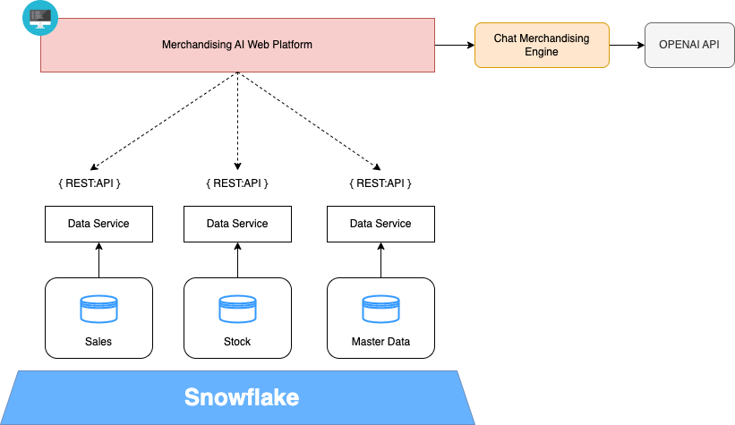
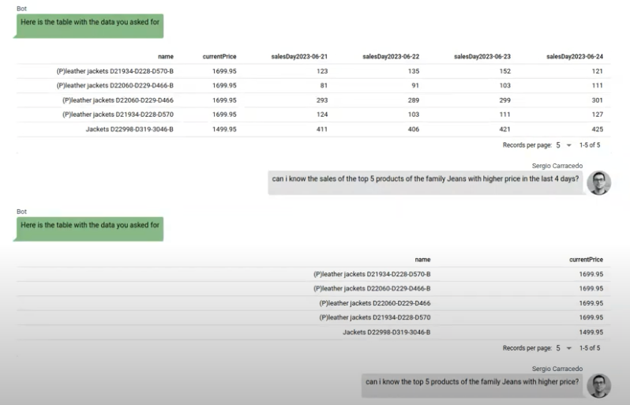
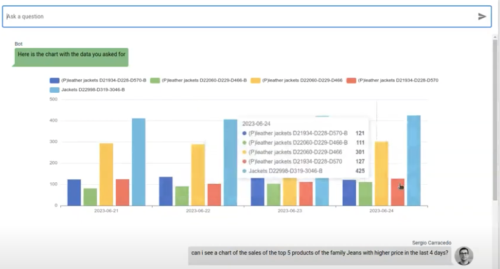
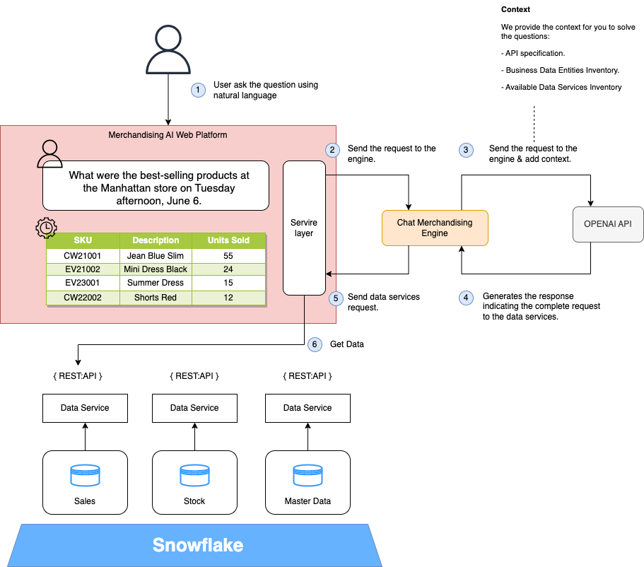

> This article was published originally in [DZone](https://dzone.com/articles/chatgpt-boosting-merchandising-user-experience).
> I wrote it in collaboration with [Miguel García](https://www.linkedin.com/in/mgarlorenzo/)

In this article, we will explain how using the new Generative AI Models ([LLM](https://en.wikipedia.org/wiki/Large_language_model)) can improve the experience of business users on our [analytical platform](https://dzone.com/articles/business-analytics-tools-amp-use-cases). Let's say we provide our retail merchandising managers with a web application or a mobile application where they can analyze sales and stock behavior in real-time using natural language.

These applications usually have a series of restrictions that mainly show a generic type of analysis, which users can filter or segment based on some filters and provide information such as:

* Sales behavior
* Sell-through
* Stockouts
* Stock behavior

All these data, with greater or lesser granularity, answer questions that someone has previously determined. The problem is that not all users have the same questions, and sometimes the level of customization is so high that it turns the solution into a big whale. Most of the time, the information is available, but there is no time to include it in the web application.

In the last few years, there have been low code solutions on the market that try to speed up the development of applications precisely to respond as quickly as possible to the needs of this type of user. All these platforms require some technical knowledge. LLM models allow us to interact in natural language with our users and translate their questions into code and calls to the APIs in our platform that will be able to provide valuable information to them in an agile way.

## Generative AI Merchandising Platform Use Cases
To enhance our merchandising platform, we can include two use cases:

### 1. Iterative Business Analytical Questions
Allow business users to ask iterative questions about the data we have in our data platform with the following capabilities:

* Being able to ask questions in natural languageIt can be interactive, but it must also allow the user to save his personalized questions.
* The answers will be based on the updated data.

### 2. Story Telling
When you provide data to the business user about the sharing of the sale, a fundamental part is storytelling. this enhances comprehension and converts data into valuable information. It would be great if we can give the user the ability to get this explanation in natural language instead of the user having to interpret the metrics.


## Practical Example: Designing Chat Merchandising

### Overview

It is a very simple idea to implement, and with a lot of business value for users, we are going to train our LLM model to be able to give a question, to know which data service provides the information. To do this, our architecture must meet three requirements:

* All data is exposed via APIs.
* All data entities are defined and documented.
* We have a standardized API layer.
* 
The following diagram shows the architecture of this high-level solution:




* **Merchandising AI Web Platform**: Web channel based on Vue through users using chat merchandising.
* **Data Service**: It provides an API Rest to consume the business data entities available in the data platform.
* **Chat Merchandising Engine**: Python backend service that performs the integration between the front and the LLM service; in this case, we are using the Open AI API.
* **Open AI**: It provides a Rest API to access Generative AI models.
* **Business Data Domain and Data Repository**: A new generation data warehouse, such as Snowflake, modeled on data domains in which business entities are available.
* 
In this PoC, we have used the OpenAI service, but you could use any other SaaS or deploy your LLM; another important point is that in this use case, **we do not send any business data to the OpenAI service because all the LLM model does is translate the request made by the user in natural language into requests to our data services.**



### Merchandising AI Web Platform
With the LLM and generative UI, the frontend acquires a new relevance, a way user interacts with it, and how the frontend responds to the interactions; now we have a new actor, the Generative AI, that needs to interact with the front end to manage the user request.

The front end needs to provide context to the user messages and be able to show the response in the way the user wants. In this PoC, we will have different types of responses from the model:

**An array of data to display in a table:**




**An array of data to display in a chart:**




The front end needs to know how the model or what the user wants to see in the response to act as required; for example, if the user asks for a chart, the front end needs to render a chart; if it asks for a table, the frontend should render a table, if it's just tested, then show the text (and even if there is an error we should show it in a different way).

We type the Chat Merchandise Engine response (in both the back end and front end) in consequence:

```ts
export interface TextChatResponse {
  type: 'text'
  text: string
}

export interface TableDataChatResponse {
  type: 'table-data'
  data: TableData
}

export interface ChartChatResponse {
  type: 'chart'
  options: EChartOptions
}

export interface ErrorChatResponse {
  type: 'error'
  error: string
}

export type ChatResponse = TextChatResponse | TableDataChatResponse | ErrorChatResponse | ChartChatResponse
```
And this is how we decide which component show.

```vue
<div class="chat-messages">
  <template v-for="(message, index) in messages" :key="index">          
	<q-chat-message
      v-if="message.type === 'text'"
      :avatar="message.avatar"
      :name="message.name"
      :sent="message.sent"
      :text="message.text"
    />    
    <div class="chart" v-if="message.type === 'chart'">
      <v-chart :option="message.options" autoresize class="chart"/>
    </div>
    <div class="table-wrapper"  v-if="message.type === 'table-data'">
	  <q-table :columns="getTableCols(message.data)" :rows="message.data" dense></q-table>
    </div>
  </template>
</div>
```
With this approach, the frontend can receive the messages in a structured way and know how to display the data: as text, as a table, as a chart, or anything you can think of, and also is very useful for the backend as it can get data for side channels.

Regarding charts, you configure all relative to the chart in a JS object (for any type of chart), so in the next iteration of the PoC, you could ask the model for this object, and it can tell us how to render the chart, even the chart type that fits better the data, etc.


### Chat Merchandising Engine

The logic we have in the engine is very simple: its responsibility is only to act as a gateway between the front end, the Open AI service, and our data services. It is only necessary because the Open AI model is not trained in the context of our services. Our engine is responsible for providing that context. If the model were trained, the little logic we include in this engine would be in the front-end services layer.




We have implemented this service with Python since [Open AI](https://platform.openai.com/docs/api-reference/chat) provides a library to facilitate integration with its APIs. We are using [chat completion API](https://platform.openai.com/docs/api-reference/chat) (model gpt-3.5-turbo), but we could use the new feature [function-calling](https://platform.openai.com/docs/guides/gpt/function-calling) (model gpt-3.5-turbo-0613).

```python
# Initial context
messages=[
            {"role": "system", "content": API_description_context},
            {"role": "system", "content": load_openapi_specification_from_yaml_to_string()},
            {"role": "system", "content": entities},
        ]

# Add User Query to messages array
messages.append({"role": "user", "content": user_input})

# Call Open AI API
response = openai.ChatCompletion.create(
  model="gpt-3.5-turbo",
  messages=messages,
  temperature=0
)

# Get messages

generated_texts = [
            choice.message["content"].strip() for choice in response["choices"]
        ]
```

We have composed the context in a natural language description that includes some examples, the API specification, and the definition of the APIs.

```
Merchandasing Data Service is an information query API, based on OPEN API 3, 
this is an example of URL http://{business_domain}.retail.co/data/api/v1/{{entity}}.
  
Following parameters are included in the API: "fields" to specify the attributes of the entity that we want to get; 
"filter" to specify the conditions that must satisfy the search;

For example to answer the question of retrieving the products that are not equal to the JEANS family a value 
would be  products that are not equal to the JEANS family a value would be filter=familyName%%20ne%%20JEANS
```

We parse the response and obtain the generated URL using a regular expression, although we could opt for another strategy using some special quotes.

```python
def find_urls(model_message_response):
    # Patrón para encontrar URLs
    url_pattern = re.compile(r'http[s]?://(?:[a-zA-Z]|[0-9]|[$-_@.&+]|[!*\\(\\),]|(?:%[0-9a-fA-F][0-9a-fA-F]))+')
    urls = re.findall(url_pattern, model_message_response)
    return urls
```

We also asked the model to add a fragment (for example, #chart) to the URL allowing us to know what the user expects to see in the frontend

This solution is much better than searching for a string in the user input because the user can ask for a chart without using the chart word, which is the model, that “understand” the question of who decides to use the chart representation.

Finally, we send this answer back to the front because the call to the data services is made from the front end itself, and this allows us to consume the data services using the user's own JWT tokens.

## Conclusions

During the last years, many organizations and teams have worked on having an agile architecture, good data governance, and an API strategy that allows them to adapt to changes in an agile way. Generative AI models can provide great business value, and it takes very little effort to start delivering value.

We develop this PoC you can see in the video, in a few hours, using Vue3, Quasar Ui for the basic components and the table, and Echarts to render the charts and Open AI. There is no doubt that algorithms are the new trend and will also be the key to the data-driven strategy; organizations that start from a standardized and agile architecture have a head start in this challenge. 
