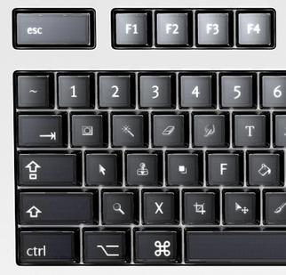
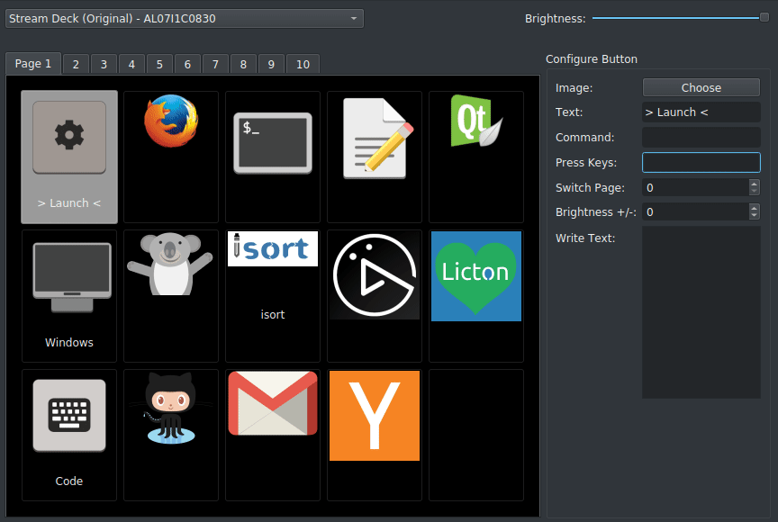
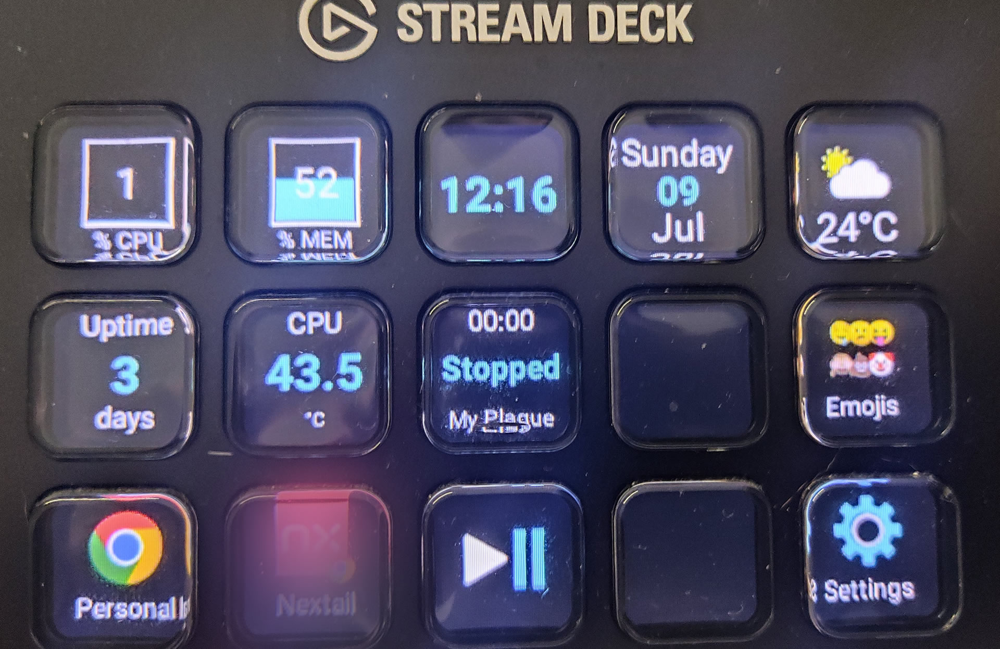
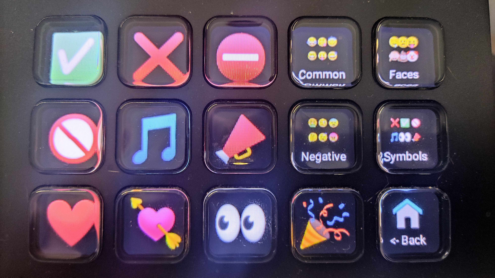
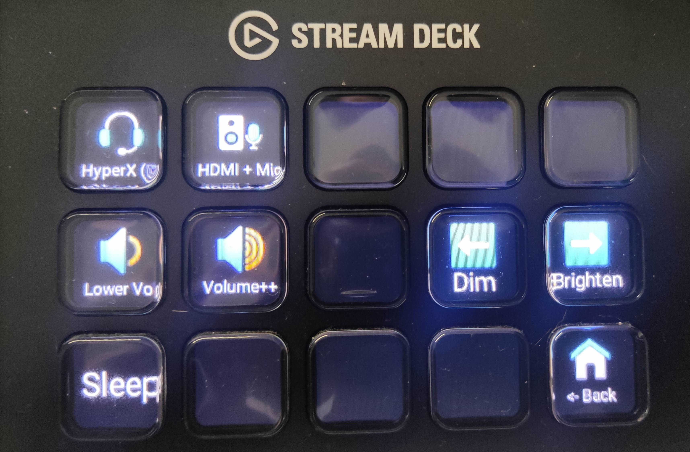

Last Christmas I got a [Elgato Stream Deck](https://www.elgato.com/en/gaming/stream-deck) as a present. My very beginning thoughts were: "I don't need this, I don't know a real use case for that". But I decided to keep it and try to use it for something.

# What is a _Stream Deck_?
The _Stream Deck_ is a device with 15 buttons (in my case), each button has a small screen that can show an icon or a text. The device is connected to your computer via USB and it has software that allows you to configure each button and the action to do when you press it. I think it's called "stream" because one of the typical use cases is to change the [OBS](https://obsproject.com/) scenes when you are streaming, but in general terms, you can control anything you want. You can think on it as a macro keyboard with customizable buttons, both action and key visualization.

## Optimus keyboard the "father" of _Stream Deck_?
The first thing I thought when I saw the _Stream Deck_ was: "This is very similar to something I saw before", and I remembered the [Optimus keyboard](https://en.wikipedia.org/wiki/Optimus_Maximus_keyboard), a keyboard project born in 2007 with a screen on each key, that allows you to change the key visualization and even the key function. This was a big vaporware and as far as I know not how many units were produced. But you can see the similarities

# How _Stream Deck_ works
The _Stream Deck_ is a USB device, when you plug it into your computer a software controls the visualization of each key and the action to do when you press it. The official software is available for Windows and Mac, but not for Linux.

I was curious about _Stream Deck_ internals, and how it works. I started to search for information about it, and I found a lot of interesting things.

* **It depends on the computer**: The _Stream Deck_ is just a USB device, it doesn't have any kind of processor or memory, and all the logic is done by the computer. The _Stream Deck_ software is responsible to control the visualization of each key and the action to do when you press it. If you unplug the _Stream Deck_, the keys will be blank, and if you plug it into another computer, the keys will be blank too. That means no configuration is stored in the device, and the software is responsible to control the device.

* **Multiple page is an artifact**: You can use multiple layouts in the _Stream Deck_, like button pages, but this is related to the previous, the device does nothing about it, the software just changes the image and the actions when you navigate to another page.  

* **Just one screen**: As you can see in the video below, the _Stream Deck_ it's just a big screen with a mask to emulate multiple small screens (and buttons). 



# Using in linux?

The first issue was there is no official support for Linux, I started to search for community and opensource projects related to the _Stream Deck_ and I found [Streamdeck UI](https://timothycrosley.github.io/streamdeck-ui/)

## Streamdeck UI
It's a graphical interface (GUI) application written in Python, that allows you to configure each steam deck button, setting the icon, the label, and the action to do on key press. The action can be a CLI command, key press emulation, for example: emulate some key combination or keystrokes, or even write a text for you.

Tha application is nice, and easy to use.

## Streamdeck golang library and Deckmaster
Trying to find other applications, and how to interact programmatically with the _Stream Deck_ I found this nice go library: https://github.com/muesli/streamdeck 

This library allows to detect the Stream Decks connected to the computer and interact with it programmatically or via the CLi tool it provides.

The library it's very interesting because you can understand how the device works, for example, how it [reads keystrokes](https://github.com/muesli/streamdeck/blob/c719a8002f7a9ac63b1798c4a8308f6d3643fc7b/streamdeck.go#L255) using the HID library to interact with the device: or how it [sends button images to the device](https://github.com/muesli/streamdeck/blob/c719a8002f7a9ac63b1798c4a8308f6d3643fc7b/streamdeck.go#L422)

The author of this library also provides a full-featured application to configure the _Stream Deck_: [Deckmaster](https://github.com/muesli/deckmaster)

This is a CLI application that allows you to configure the _Stream Deck_ using _.toml_ files, something that allows you to easily add version control to the configuration. You can even have different layouts (decks) and navigate between them using the _Stream Deck_ buttons like the original deck pages.

This application also provides "special" widgets for the buttons, for example, to display the CPU usage, the memory usage, the time, weather, etc.

One of the widgets (this is how it calls to each button) I use a lot is the one can display the output of a command in a _Stream Deck_ button, for example, I have a button that displays the current song playing in the system if it's paused or playing, and the time of the song. Another is to display the cpu temperature, etc.

It's a nice application, and it's released with an open-source license, which means you can modify it and adapt it to your needs.

# Finding useful use cases for the _Stream Deck_
Joining deckmaster with the power of linux to execute actions and tasks using the command line I think, now I couldn't live without my _Stream Deck_. I use it for a lot of things, for example:
* **Change between the personal Chrome and the work Chrome instances**. I can bring to the top of the windows the instance I want with just one button.
* **Play/pause the music**: My keyboard doesn't have media keys, so I use the _Stream Deck_ to play/pause the music.
* **Insert emojis**: I have multiple decks to insert emojis in my text, It works like direct access to some emojis.
* **Volume control**: I have a deck to control the volume and another to mute/unmute the microphone.
* **Audio devices chooser**: I usually use headphones and its microphone, but sometimes I want to use the camera mic, and speakers, instead to go to the audio settings and changing both input and output devices, I have 2 buttons that do both changes in one key press.
* **Display some system info**: For example, the CPU and memory usage, the time, the uptime, the CPU tempo, etc

Following pictures are a couple of my decks: 

# Conclusion
I think the _Stream Deck_ is a nice device, and it's very useful to provide information and do actions that can need multiple clicks or keystrokes. My feeling its I'm using it at 20% of its potential.

