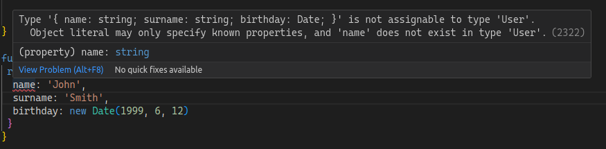

When you introduce Typescript in a legacy project, or you are using a library doesn't provide types, you might be tempted to use `any` for the types you will need. But this is not a good idea, because you are losing all the benefits of Typescript. **`any` it's something you must remove from code, and from your mind**. 

## Type a shape progressively

It's very common to have an object with a lot of properties, and trying to type all the shape (that is the final goal) of an object you don't completely understand can be a overwhelming task.

But you can start creating the type from the consumer point of view. In this approach you type the elements of the object you need

This strategy gives you an starting point to define a struct with simplicity and avoiding the `any` type.


Let's show you with an example:

Imagine your legacy app provides you a function (that doesn't have the typescript definition) that get a list of users from the API, and you need to write a function to calculate the age a user.

```javascript

function getUser(id) {
  return {
    birthday: new Date('1980-01-01'),
    name: 'John',
    surname: 'Smith',
    role: 'user',
    accounts: ...
    ...
  }
}
```

The data structure the function returns is big, and complex, and some users have different fields, for example you realize for the users with the role `admin` you have a field `level` for other haven't. 

You also realize all the users have the `birthdate` field. That is the important field for you. With these requirements your function don't need another data from the user, so you can start to type your user structure

```ts
export interface User {
  birthday: Date;
}

function userAge(user: User): number {
  const diffMs = Date.now() - user.birthday.getTime();
  const ageDt = new Date(diffMs);
  return Math.abs(ageDt.getUTCFullYear() - 1970);   
}
```

Ok, but now you want to type the return of the function that returns the user. But doing `function getUser(id): User` you will get a type error as the function returns more fields than birthday field:



You need to let know typescript you only know the user have the field `birthday` and more field but you don't know them. Writing that in typescript: 

```ts
interface User {
  [x: string]: unknown
  birthday: Date
}
```

Well, it's still a kind of any, but more restricted, for example `const user2 = { name: 'Mike'}` doesn't fit the type user as the field `birthday` is missing.

Again, this is the starting point to type the user object without understand the full object and with the minimum efford, this is much better than just `any` as when you know completely the object you don't need to change the `userAge` function.

If you or a teammate add a new function or methods that provide por knowledge of the object you can just continue completing the interface, for example if you discovered a function in the legacy code to get the full name of the user, and the function let you know (for example with the check it does)
the name is always present, but not the surname, so you can complete the type with:
```ts
interface User {
  [x: string]: unknown
  name: string
  surname?: string
  birthday: Date
}
```

With the time you will get a complete type for the user object, and you will be able to remove the `[x: string]: unknown` part.




## Type the function, consts, etc you need

Nowadays, most of the js libraries includes the type definition, the library can expose it or via an external packages like [DefinitelyTyped](https://github.com/DefinitelyTyped/DefinitelyTyped).
But sometimes the types are not available, maybe becuse the library is old and/or because the library is not popular enough to have a type definition, or just because the library is private and only available in your company (a.k.a. legacy library).

The goal is to type (or declare in this case) completely the library, but you can just type the function, const, etc you will need. 
To let typescript know you are [declaring you module or library](https://www.typescriptlang.org/docs/handbook/modules.html#working-with-other-javascript-libraries) you need to use the `declare` keyword and the module (library) name, for example:

```ts
declare module 'my-library' {
  export function theFunctionIUse(a: number, b: number): number;
  export const libraryConst: number;
  ...
}
```
This can be in any file of your project and only applies to it. if you want to share the declaration with other files you can create package with the type definition ([Check an example on DefinitelyTyped](https://github.com/DefinitelyTyped/DefinitelyTyped/tree/master/types/chromecast-api)) and publish it in npm or in your company registry.

## Summary

The goal is to type completely the legacy code, the libraries, but step by step. You can apply this strategy improve the type "on demand" and avoid the `any` type, bearing in mind this is not the correct solution, it's a path to the correct solution.
