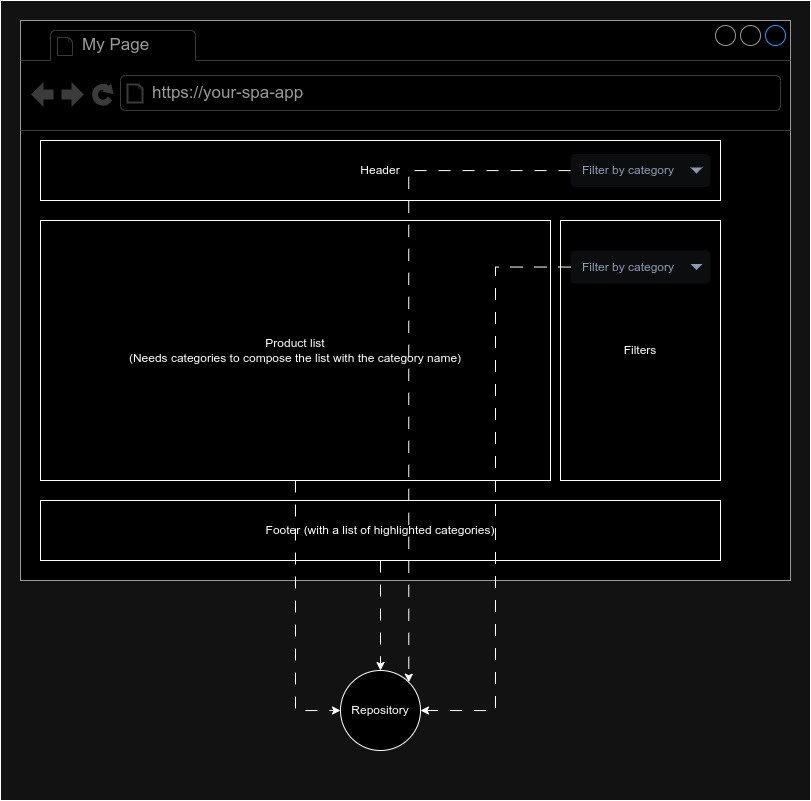
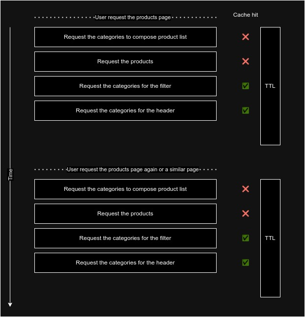

We can agree decoupling is a good practice that simplifies the code and the maintainability of the project. 

A common way of decoupling the code is to divide the responsibilities into different layers, a very common division is: 

- **view layer**: in charge of render HTML and interacting with the user
- **domain layer**: in charge of the business logic
- **infra layer**: in charge of getting the data from the backend and returning it to the domain layer(here is very common to use the repository pattern, which is just a contract to get the data. The contract is unique but you can have multiple implementations, for example, one for a REST API and another for a GraphQL API, you should be able to change the implementation without changing other pieces in the code)

Let's see a couple of examples use cases where it is very typical to put the performance over the decoupling. (Spoiler: we can have both)

Imagine, you have an endpoint that returns the list of products, and one of the fields is the `category_id`, the response can be something like this (I removed other fields to make a simple example)

```json
[
  { id: 1, name: "Product 1", category_id: 1 }, 
  { id: 2, name: "Product 2", category_id: 2 },
  ...
]
```

We need to show the category name in the frontend (not the id), so we need to call another endpoint to get the category name, that endpoint returns something like

```json
[
  { id: 1, name: "Mobile" }, 
  { id: 2, name: "TVs" },
  { id: 3, name: "Keyboards" },
  ...
]
```

> You can think the backend should do the join, and return all-in-one requests, but that is not always possible

We can do the join in the frontend, in the function or method in charge of recovering the products, we can do both requests and join the information. Example

```typescript
async function getProductList(): Promise<Product[]> {
  const products = await fetchProducts();
  const categories = await fetchCategories();
  return products.map(product => {
    const category = categories.find(category => category.id === product.category_id);
    return { ...product, category_name: category.name };
  });
}
```

Our application doesn't need to know anything about we need 2 calls to recover the information, and we can use the `category_name` in the frontend without any problem.

Now imagine you need to show the list of categories, for example in a dropdown. You can reuse the `fetchCategories` function, as it does exactly what you need. 

In your view the code is something like this:
```vue
<template>
    <dropdown :options="categories" />
    <product-list :products="products" />
</template>
<script lang="ts" setup>
import { fetchCategories, getProductList } from '@/repositories';

const categories = await fetchCategories();
const products = await getProductList();
</script>
```

And in that point, you realize you are doing 2 calls to the same endpoint to recover the same data, data you recovered to compose the product list, and that is not good in terms of performance, network load, backend load, etc.

At this moment, you start to think about how to reduce the number of calls to the backend, in this case, to just reuse the category list. You can have the temptation of moving the calls to the view and doing the join of the products and the categories.

```vue
// ❌❌❌ Not nice solution 
<template>
    <dropdown :options="categories" />
    <product-list :products="products" />
</template>
<script lang="ts" setup>
import { fetchCategories, fetchProducts } from '@/repositories';

const categories = await fetchCategories();
const products =  await fetchProducts().map(product => {
  const category = categories.find(category => category.id === product.category_id);
  return { ...product, category_name: category.name };
});
</script>
```
With that, you resolved the performance problems, but you added another BIG problem: **infra, view and domain coupling**. Now your view knows the shape of the data in the infra (backend), and makes it hard to reuse the code. We can go deep on this and do things even worse, what happens, if your head bar (is in another component that needs the list of categories), you need to think about the application in a global way.

Imagine something more complex, a scenario where you need the categories in the header, product list, filters, and the footer 



With the previous approach, your app layer (Vue, react, etc) needs to think about how to get the data to minimize the requests. And that is not good, as the app layer should be focused on the view, not on the infra.

## Using a global store
One solution to this problem is to use a global store (vuex, pinia, redux, etc) to delegate the requests and just use the store in the view. The store only should load the data if is not loaded yet, and the view should not care about how the data is loaded. **This sounds like cache, right?** We solve the performance issue, but we're still having infra and view coupled.

## Infra cache to the rescue
To decouple as much as possible the infra and the view, we should move the cache to the infra layer (the layer in charge of getting the data from the backend). Doing that we can call the infra methods at any time doing just a single request to the backend, but the important concept is that the domain, the application, and the view know nothing about the cache, about the network speed, the number of requests, etc.

The infra layer is just a layer to get the data with a contract (how to ask for the data and how the data is returned), following the decoupling principles we should be able to change the infra layer implementation without changing the domain, application or view layers. For example, we can replace the backend that uses REST by a backend that uses GraphQL, and we can get the product with the category names without doing 2 requests. But again, **this is something the infra layer should care about, not the view.**

There are [different strategies you can follow to implement the cache]() in the infra layer: HTTP cache (Proxy or Browser internal cache), but in these cases for better flexibility invalidating the caches in the frontend it's better our application (infra layer again) manage the cache.

If you are using axios you can use [Axios Cache Interceptor](https://axios-cache-interceptor.js.org/) to manage the cache in the infra layer. This library makes caching very simple:

```typescript
// Example from axios cache interceptor page
import Axios from 'axios';
import { setupCache } from 'axios-cache-interceptor';

// same object, but with updated typings.
const axios = setupCache(Axios); 

const req1 = axios.get('https://api.example.com/'); 
const req2 = axios.get('https://api.example.com/'); 

const [res1, res2] = await Promise.all([req1, req2]);

res1.cached; // false 
res2.cached; // true
```
You only need to wrap the axios instance with the cache interceptor, and the library will take care of the rest.

## TTL
[TTL](https://en.wikipedia.org/wiki/Time_to_live) is the time the cache will be valid, after that time the cache will be invalidated and the next request will be done to the backend. The TTL is a very important concept, as it defines how fresh the data is. 

When you are caching data a challenging problem is data inconsistency. In our example, we can think of a shopping cart. If it's cached and the user adds a new product if you apps a request to get the updated version of the cart it will get the cached version, and the user will not see the new product. There are strategies to invalidate the cache and solve this problem, but that is out of the scope of this post, but you need to know that is not a trivial problem: Different uses cases need different strategies. 

As longer the TTL is, bigger the data inconsistency problem is, as more events can happen in that time. 

But for the goal we are looking for (allowing to decouple the code easily), a very low TTL (ex. 10 seconds) is enough to remove the data inconsistency problem. 

### Why a low TTL is enough?
Think about how the user interacts with the application:

- The user will ask for a url (it can be part of a SPA or a SSR page)
- The application will create the layout of the page, mounting the independent components: the header, the footer, the filters, and the content (product list in the example)
- Each component asks for the data it needs to do
- The application will render the page with the data recovered and send it to the browser (SSR) or inject/update it in the DOM (SPA)



All those processes are repeated in each page change (maybe partially in a SPA) and the most important thing, are executed in a short period of time (maybe milliseconds). So with a low TTL we can be pretty sure we will do only a request to the backend, and we will not have data inconsistency problems as in the next page change or user interaction the cached expired and we will get the fresh data. 


## Summarizing

This caching strategy in low TTL is a very good solution to decouple the infra and the view:
 
- Developers doesn't need to think about how to get the data to minimize the requests in the view layer. If you need the list of the categories in a sub-component you ask for it, don't need to about if another component is requesting the same data.
- Avoids maintaining a global app state (stores)
- Makes more natural to do multiple requests follow the contract in a repository pattern to get the data you need in the repository layer, and do the join in the infra layer.
- In general terms simplifies the code complexity.
- No cache invalidation challenged (as the TTL is very low) (Maybe for some very specific use cases)


 


