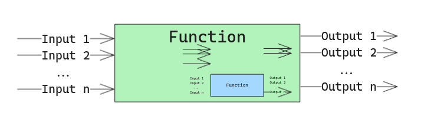
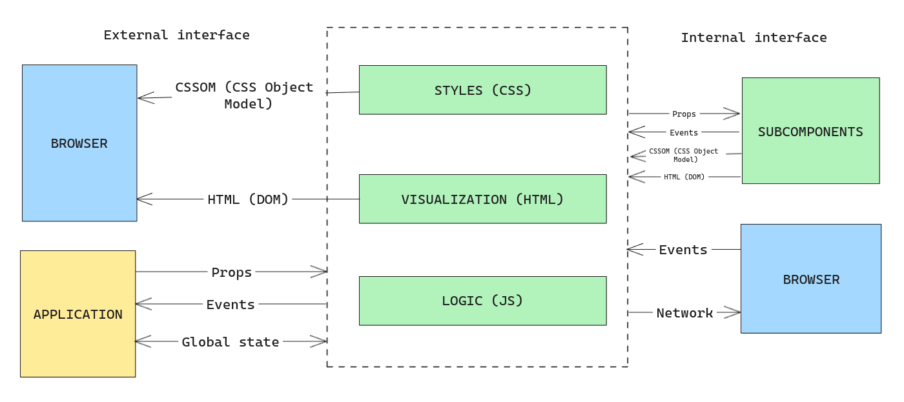

> This is the second post of a series about why and how to create a UI components library. I'm going to focus on the code examples in Vue.js, but the concepts are valid for any other framework like React, Angular, LitElements, etc.
>
> [Chapter I: Introduction]()

Before creating a components library, it's important to understand the anatomy of a component, its interfaces, and how to create a good "API" for the components.

## Anatomy of a component

A component is a reusable piece of software that encapsulates some parts of the user interface.

A component it's similar to a function, or an object. All of them get some input and return some output. The function (if it is not pure) or the object will use other values like the internal state and the environment to execute the action changing the output, but basically, we can think of a function like a black box that gets some inputs and produced some outputs and it can change the internal state.

If we take a look inside the black box, probably that function will use other functions to do part of the work.

The same happens with a component. A component is a black box that gets some inputs and produces some outputs.

The inputs can be pure **data**, for example, the data to render in a table, or **modifiers**, which change the components **behavior** (define if the table to render is sortable), change the **visualization** (define the color of the table header), modify the **output** (define the number of rows to render) or modify the **interaction** (define the behavior when the user clicks in a row).

The outputs can be the rendered HTML, the events emitted by the component, the values stored in a global store, etc.

Inside the component, we can have other components, and the component can maintain an internal state and/or could use values from the environment (like the global state store, the router, etc).

At this point, we can define the component's interfaces or the surfaces of the *black box*. I usually like to divide those interfaces into two categories, depending on the developer's point of view:

### External interface
It's the interface the developer can use to interact with the *black box* (component) and to get the results. The interface could not be the same for all the frameworks, but the concepts are similar.

* **Props**: The values the component can receive from the parent to modify the behavior. You can think of the props like the function's arguments.
* **Events**: The events **emitted** by the component.
* **HTML & CSS**: The goal of a component: is to render HTML and CSS. The component returns the HTML and CSS to be rendered in the browser.
* **Store state**: The component can get values from a global store (Pinia, Vuex, Redux, etc) to modify the behavior. (This is not recommended as is hard to track, but sometimes is necessary)
* **[Slots](https://vuejs.org/guide/components/slots.html)**: In some frameworks like Vue, the component can receive content from the parent to render a fragment. Are similar to props but allow to pass random content instead of values.

### Internal interface
This is the interface that the component uses internally to interact with the subcomponents, the browser (get events, access to browser API like network), etc. The developer can't interact with this interface directly when is using the component. In this category we can find:

* **Browser events**: The component captures browser events like clicking, mouseover, etc.
* **Subcomponents**: The component can use other components to do part of the work. The subcomponents are like the functions the component uses to do the work. The component interacts with the external interface. This is like a matrioska.
* **Browser API**: The component can use the browser API to do some work. For example, to get the current location, the current time, etc
* **Network**: The component do a network request to get or set data. (We will talk about this in another post).

It's important to mention that the internal interface is transparent from outside the component, and the developer can't interact with it directly. This interface can change anytime without notice, and the developer should not rely on it. For example, the component can change the subcomponents, the browser events, etc, but the external interface should be stable.

Now we can understand the anatomy of a component and that will be useful to categorize them depending on how they interact with the external and internal interfaces (for example if the component has access to the network or the global store). But this is a topic to discuss in deep in the next chapter.
