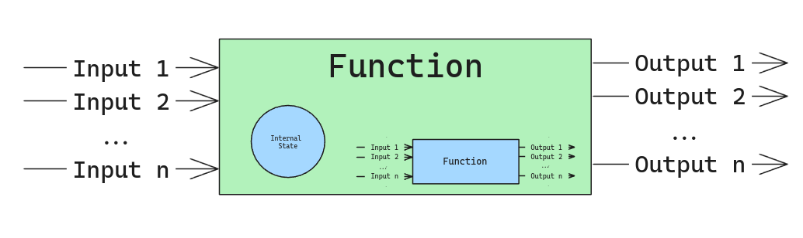

> This is the second post of a series about why and how to create a UI components library. I'm going to focus on the code examples in Vue.js, but the concepts are valid for any other framework like React, Angular, LitElements, etc.
> 
> [Chapter I: Introduction]()

Before to create a components library, it's important to understand the anatomy of a component, its interfaces and how to create a good "API" for the components.  

## Anatomy of a component

A component is a reusable piece of software that encapsulates some parts of the user interface. 

A component it's similar to a function, or an object. All of them get some input and returns some output. The function (if it is not pure) or the object it will use another values like the internal state and the environment to execute the action changing the output, but basically we can think in a function black box that gets some inputs and produced some outputs. 

If we take a look inside the black box, probably that function will use another functions to do part of the work.

The same happens with a component. A component is a black box that gets some inputs (props, events) and produced some outputs (rendered HTML, events, etc). Inside the component, we can have another components, and the component can maintain an internal state and/or could use values from the environment (like the global state store, the router, etc).

