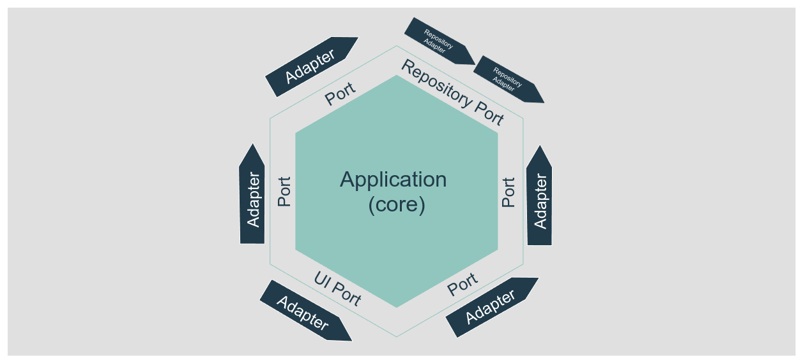
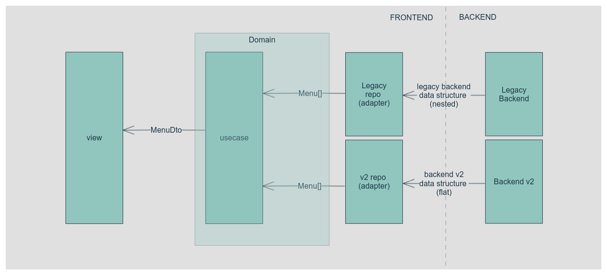

Hexagonal architecture is a software design pattern based in the separation of responsibilities. The goal is to decouple the business logic (domain) and the application from other external interfaces.

Simplifying in hexagonal architecture we communicate the core of the app (domain + application) using ports and adapters. A **port** lives in the core, it is the interface any external code must use to interact with the core (or the core with the external code), the **adapter** is the external piece of code that follows the port interface and execute the tasks, get the data, etc.



The key point here is the core doesn't know anything about how the external software internals. 

We will use together hexagonal the [repository pattern](https://medium.com/@pererikbergman/repository-design-pattern-e28c0f3e4a30) that fits very well with hexagonal as defines a centralized and abstract way of accessing data.

And the [dependency injection principle](https://en.wikipedia.org/wiki/Dependency_injection) that allow us to create decoupled (or loosely coupled) software. Simplifying again, it allows us to replace an adapter with another one that follows the same port interface.

Let's see it with a small (ant typical) example:
Your domain (core) needs to get a list of users with a name, so you define the port that is a repository. The port defined a method to do that: `getUsersByName(name:string): User[]` In English, defines that the adapter mush provide a methods called `getUsersByName' that gets a name and should return the list of the users that match that name.

> If you want to go further in those patters, there is a lot of documentation on internet. I want to focus the post in a real case 

## The real case

### The previous situation
We have a single web application (frontend) works for different clients (tenants) that application uses a backend that provides the application menu. The backend returns something like this when the frontend do a request to the `tenant.company.com/get_menu` endpoint

```json
{
  "title": "Main Menu",
  "description": "",
  "id": "main",
  "is_staff": false,
  "items": [
    {
      "title": "Home",
      "description": "",
      "icon": "",
      "url": "/",
      "is_staff": false
    },
    {
      "title": "Dashboards",
      "icon": "dashboards",
      "description": "This is the dashboard",
      "id": "dashboards",
      "is_staff": false,
      "items": [
        {
          "title": "Home",
          "icon": "dashboards-home",
          "url": "/dashboads",
          "is_staff": false
        },
        {
          "title": "Config 🚫",
          "icon": "dashboards-confiog",
          "url": "/dashboards-config",
          "is_staff": true
        },
        {
          "title": "Advanced Reports",
          "icon": "",
          "description": "",
          "id": "advanced_reports",
          "is_staff": false,
          "items": [
            {
              "title": "Sales Analysis",
              "icon": "",
              "url": "/sales_analysis",
              "is_staff": false
            },
            ...
          ]
        }
      ]
    }
  ]
}
```
The frontend implemented partially the repository pattern as is just return the data the backend provides without more manipulation that remove the first level in the tree (the main menu item). The view execute the repository call using a service, that again just returns the same information that it gets from the repository. 


### The issues
This "architecture" works, but have some issues that can create serious problems in the future

* **The data structure is absolutely coupled to the backend data**: If the backend changes just the name of a property we need to follow the data flow in our code until the view and changes it in all the places.
* **The title string includes an emoji to allow users to visualize when a menu item is only for staff users**: That information is also provided in the `is_staff` property, if we want to expose a menu item to the regular users we need to change it in 2 places, and that is never a good idea.
* **Visuals are defined in the backend**: The name of the icon to use is defined in the backend. Unless icon is an app (backend + frontend(S)) global domain concept it is not a good idea to pass that value front the backend.
* **No domain**: there is no domain, or at least no explicit one. Logic is applied in the view (that it is not bad *per se*, but if the logic is related to the application, it must live in the domain)

### The problem
The current backend is not able to support the expected new features (at least without a big effort), so the company is creating a new backend, this will not be retro-compatible with the legacy one but It will be represent the same entities.

The menu endpoint will return the same menu (but it will provide more features) but the new endpoint response structure is completely different:

```json
[
    {
        "menuStateId": 3,
        "menuPosition": 1,
        "menuName": "Dashboards",
        "menuItemDescription": "Home",
        "menuItemId": 9,
        "menuItemTitle": "Home",
        "menuItemPosition": 1,
        "menuItemLink": "/dashboards",
        "menuItemStateId": 3,
        "menuInternalName": "dashboard",
        "menuId": 12,
        "menuParentId": 1,
        "menuItemInternalName": "dashboard.home"
    },
    {
        "menuStateId": 3,
        "menuPosition": 1,
        "menuName": "Dashboards",
        "menuItemId": 9,
        "menuItemTitle": "Sales analysis",
        "menuItemPosition": 1,
        "menuItemLink": "/sales_analysis",
        "menuItemStateId": 3,
        "menuInternalName": "dashboard",
        "menuId": 12,
        "menuParentId": 1,
        "menuItemInternalName": "dashboard.sales_analysis"
    },
    {
        "menuStateId": 3,
        "menuPosition": 1,
        "menuName": "Dashboards",
        "menuItemId": 9,
        "menuItemTitle": "Config",
        "menuItemPosition": 1,
        "menuItemLink": "/dashboards-config",
        "menuItemStateId": 1,
        "menuInternalName": "dashboard",
        "menuId": 12,
        "menuParentId": 1,
        "menuItemInternalName": "dashboard.sales_analysis"
    },
    {
        "menuStateId": 3,
        "menuPosition": 1,
        "menuName": "Dashboards",
        "menuItemId": 9,
        "menuItemTitle": "Sales analysis",
        "menuItemPosition": 1,
        "menuItemLink": "/sales_analysis",
        "menuItemStateId": 3,
        "menuInternalName": "dashboard",
        "menuId": 12,
        "menuParentId": 1,
        "menuItemInternalName": "dashboard.sales_analysis"
    },
    {
        "menuStateId": 3,
        "menuPosition": 1,
        "menuName": "Main",
        "menuItemId": 11,
        "menuItemTitle": "Home",
        "menuItemPosition": 5,
        "menuItemLink": "/",
        "menuItemStateId": 3,
        "menuInternalName": "home",
        "menuId": 1,
        "menuParentId": 1,
        "menuItemInternalName": "home"
    },
    ...
]
```
The new menu is returning the menu items and its parent menu in the same row, and the structure is flat, no more nested items. Another difference is the `is_staff`, still there but it's a number `menuItemStateId`, no icon information, but now we have an internal id as string that is semantic.

#### The things can become harder

The new backend will not replace the legacy one in one step, clients will be migrated slowly to the new backend. That means we will have both backend working at the same time for months. 

As the data returned is very different seems tough to use the same frontend code to render the menu for all the clients, right?    

You can think a possible solution is to create a different menu related components, code, etc depending on the backend version. It can work, but do that means duplicating a lot of code, for example the views, the services, etc

### Domain to the resque

Let's forget for a while how is the data the backend(s) returns, what we want to represent from the point of view or our application. We want to represent a menu that can have items with children (and no link) and items with links a no children. The let create a model of that in our domain as entities

```ts
type State = 'disabled' | 'only_for_staff' | 'open'
class Menu {
  readonly id: number = 0
  readonly internalName: string = ''
  readonly title: string = ''
  readonly icon: string = ''
  readonly image: URL | undefined
  readonly state: State = 'open'
  readonly description: string = ''
  readonly position: number = 0
  readonly children: (Menu | MenuItem)[] = []

  constructor(values: MenuDto) {
    this.id = values.id
    this.internalName = values.internalName
    //...
    this.children = values.children
  }

  get onlyForStaff(): boolean {
    return this.state === 'only_for_staff'
  }
}

class MenuItem {
  readonly id: number = 0
  readonly internalName: string = ''
  readonly title: string = ''
  readonly icon: string = ''
  readonly url: string = ''
  readonly state: State = 'open'
  readonly position: number = 0
  readonly menuId: number = 0

  private constructor(values: MenuItemDto) {
    // hydrate the entity
    this.id = values.id
    //....
  }

  get isStaff(): boolean {
    return this.state === 'hidden'
  }

  public get external(): boolean {
    return (this.url.includes('http://')
  }
}

```

This is a simplified version of the entities, but you can see the idea. We have a `Menu` entity that can have children that can be `Menu` or `MenuItem` entities. The `MenuItem` entity has a `url` property that can be used to know if the item is a link or not.

Now we have the domain modeled and our application layer and views can access to it.

The key is we modeled our menu independently of our backends' data structures, we can use any backend that represents that entity to get the data independently of the structure.

### The port

Now we should create the port that will allow us to get the menu data from the backend. 

```ts
interface MenuRepo {
  getMainMenu(states: State[]): Promise<(MenuItem | Menu)[]>
}
```

The port defines how the repository should looks like. In this case we want a method that will return the main menu, and we need to pass the states (`'disabled' | 'only_for_staff' | 'open'`) we want to get.

### The adapter. The repositories will do the magic

Now we need to create the adapters that will get the data from the backend and transform it to our domain entities. The adapter, also called **repository implementation** is not just one, we can have multiple adapters that get the data from different backends (even mocked data, stubs for testing, etc).

Remember, **the repository implementation (adapter) is the one know all the external internals**
* How to get the data at infrastructure level: REST, Graphql, localstorage, etc
* How to request the data: for example for a XHR request: headers, query params, url, etc
* The returned data structure and how to transform it to the domain entities
* How to handle errors, retries, etc
* How to cache the data

But the domain NEVER should not about that, for example the domain **should not know** that if I want to get the staff items I need to pass the `menuItemStateId` as `1` (or whatever). `menuItemStateId` is an implementation detail, only makes sense in repository implementation, not in the domain, the domain should know about the `onlyForStaff` meaning and the adapter should know how to get that information from the backend. In this case (for backend v2) means we need to pass a query param called `menuItemStateId` with the value `1` to get the staff only items.

From the point of view of the layers on the right side the port's line does not matter how the data is retrieved, the only thing that matters is the data is returned in the format the domain expects (the entity)

```ts
// menu.legacy.repo.ts
type Response = {
  // This type defines the shape of the data the backend returns. I not include it here to put the focus in the data transformation to entities
}
class LegacyMenuRepo implements MenuRepo {
  async getMainMenu(states: State[]): Promise<(MenuItem | Menu)[]> { // 1️⃣ 
    const data = await fetch<Response>('tenant.company.com/get_menu')
    const backendMenu = await data.json()
  
    return backendMenu.map(item => responseToEntity(backendMenu))  
  }
  
  private responseToEntity(response: Response): (MenuItem | Menu) {
    // transform the response to the domain entities
    if ('items' in response) {
      return new Menu({
        id: response.id,
        internalName: response.id,
        title: response.title,
        icon: mapIcon(response.id), // 2️⃣
        image: mapImage(response.image),  // 2️⃣
        state: mapState(response.state),  // 3️⃣
        children: response.items.map(item => responseToEntity(item))
      })
    } else {
        return new MenuItem({
            id: response.id,
            internalName: response.id,
            title: response.title,
            icon: mapIcon(response.id), // 2️⃣
            url: response.url,
            state: mapState(response.state),  // 3️⃣
            menuId: response.menuId
        })
    }
  }
}
```
Things to put the focus:
* 1️⃣: the method received the states argument is not used in the code: This is because the backend does not accept any filter, the legacy backend does the filtering  using the backend context. But it ensures will only return the items the user can have access.
* 2️⃣: Those map functions are in charge of provide the correct icon and image, now the backend does not provide that information, so our repository implementation should provide it. Remember **the repository implementation (adapter) is the one know all the external internals** and for the images the adapter know that if the id is "x" should return the image "y" and the icon "z"
* 3️⃣: The `mapState` function behavior is similar to 2️⃣ but in this case the backend returns a number that represents the state, the adapter should know how to map that number to the domain state, and that function can be reversed to know with state should be sent to the backend.


We need to implement the adapter for the "new" backend:

```ts
// menu.v2.repo.ts
type Response = {
  // This type defines the shape of the data the backend v2 returns. I not include it here to put the focus in the data transformation to entities
}

const stateMappings: Record<number, State> = {
  0: 'disabled',
  1: 'only-for-staff',
  2: 'open'
}

const stateMappingsReverse: Record<number, State> = {
  'disabled': 0,
  'only-for-staff': 1,
  'open': 2
}

class V2MenuRepo implements MenuRepo {
  async getMainMenu(states: State[]): Promise<(MenuItem | Menu)[]> {
    const data = await fetch<Response>('menu.company.com/company/get', { // 1️⃣ 
      params: {
        menuItemStateId: states.map(state => stateMappingsReverse[state]) // 2️⃣
      }
    })
    const backendMenu = await data.json()
  
    return backendMenu.map(item => responseToEntity(backendMenu))  
  }
  
  private responseToEntity(response: Response): (MenuItem | Menu) {
    // here the transformations from flat to nested is more complex (requires more code lines) so I'm going to ignore it in the example. Let's imagine it is done after this line
    // transform the response to the domain entities
    if ('items' in response) {
      return new Menu({
        id: response.id,
        internalName: response.internalName,
        title: response.title,
        icon: mapIcon(response.internalName), // 3️⃣
        image: mapImage(response.internalName),  // 3️⃣
        state: stateMappings[response.menuStateId], // 4️⃣
        children: response.items.map(item => responseToEntity(item))
      })
    } else {
        return new MenuItem({
            id: response.id,
            internalName: response.id,
            title: response.title,
            icon: mapIcon(response.internalName), // 3️⃣
            url: response.url,
            state: stateMappings[response.menuItemStateId], // 4️⃣
            menuId: response.menuId
        })
    }
  }
}
```
Things to put the focus in the backend v2 repo implementation:
* 1️⃣: The endpoint (even the domain) is different to the other repo.
* 2️⃣: Get need to convert the meaning of the filters to the backend meaning. The adapter knows that the backend expects a query param called `menuItemStateId` with the values `0`, `1`, or `2` to get the items with the state `disabled`, `only-for-staff`, or `open` 
* 3️⃣: We have mapping functions for the icons and images, but is function is different from the legacy one.
* 4️⃣: we convert the `menuItemStateId` and `menuStateId` to the domain state using the mappings.

#### Sumarizing the ports

After the changes, the architecture looks like this:



As you can see, the different pieces are the backends and the adapters for each backend, but after convert the data to the domain entities the flow is the same, the domain does not know how the data is retrieved, only knows how to use it.

This gives us a lot of flexibility, we can change the backend without changing the domain and the application or the views.

### The dependency injection

The last piece of the "puzzle" is the dependency injection, that allows us, to replace a repository implementation with another one that follows the same port interface, but instead of importing it from the code that will call the repository, we inject it from outside allows us to change it easily.

Lets suppose we have an `usecase` (or application service) that will use the repository to get the menu:

```ts
class GetMainMenuUseCase {
    constructor(private menuRepo: MenuRepo) {}
    
    async execute(states: State[]): Promise<(MenuItemDto | MenuDto)[]> {
        return this.menuRepo.getMainMenu(states).map(entity => entity.toDto())
    }
}
```
We can use a factory to create the repository implementation:

```ts
function createMenuRepo(clientId: string): MenuRepo {
  if (['client123', 'client34'].includes(clientId)) {
    return new V2MenuRepo()
  } else {
    return new LegacyMenuRepo()
  }
}

const useCase = new GetMainMenuUseCase(createMenuRepo('client123'))

usecase.execute(['open', 'only-for-staff']) 
```

## Summarizing

The hexagonal architecture, the repository pattern, and the dependency injection are very powerful tools that allow us to create decoupled software that works in independent pieces loosely coupled that can be easily changed and makes the maintaince simplier.

As you can see in the example, we can change the backend in any moment, its just to change the repo implementation we inject into the usecase without changing anything else.

Obviously this will work only if all the different backend returns the same business concepts, if not we are taking about different domain's model and we need to create different ports and adapters for each one. 


