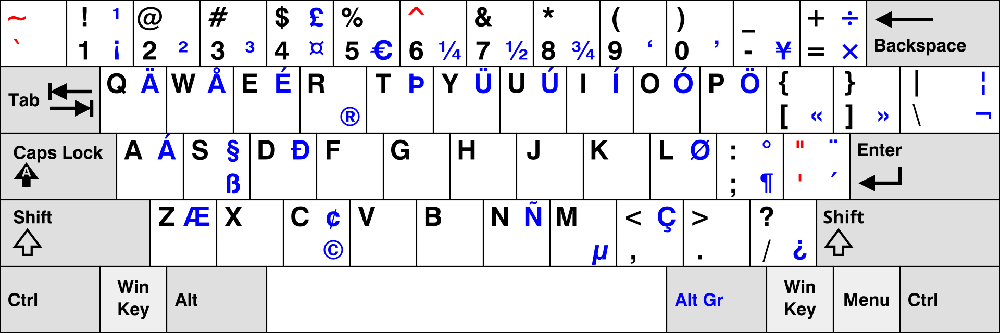
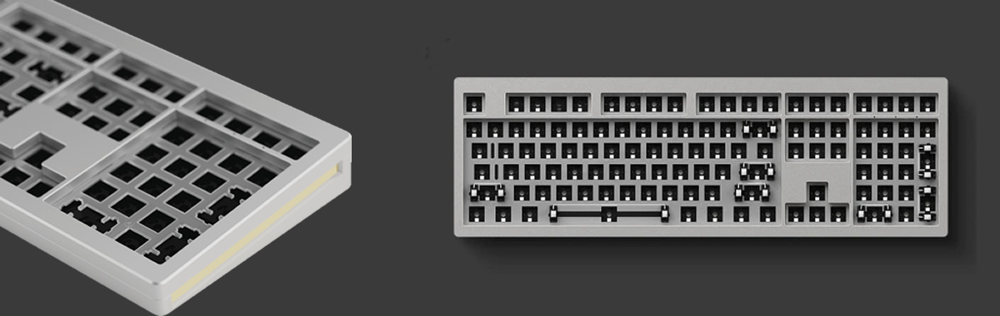
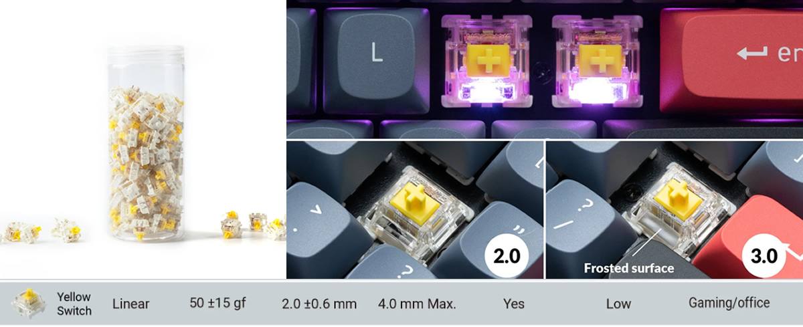
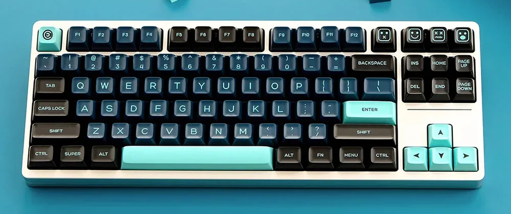
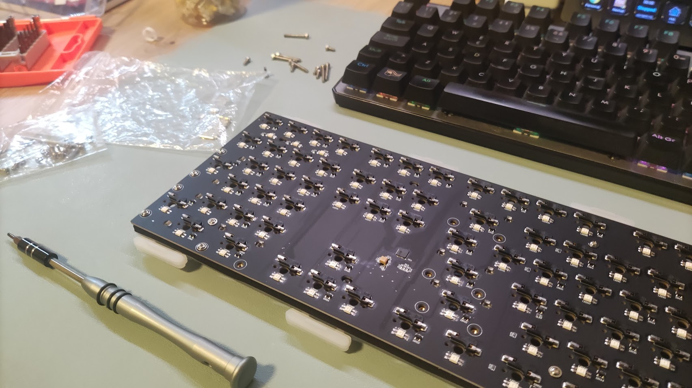
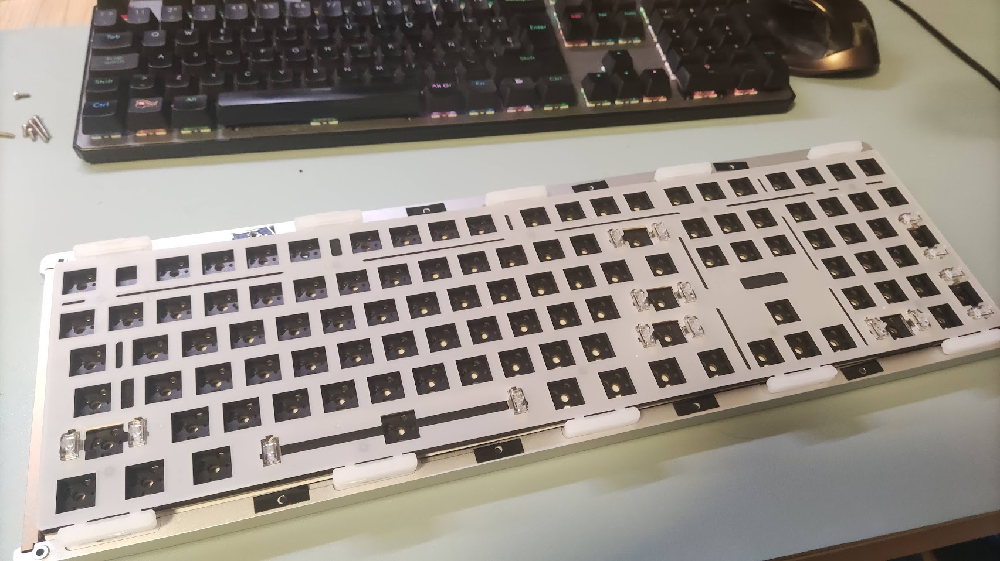
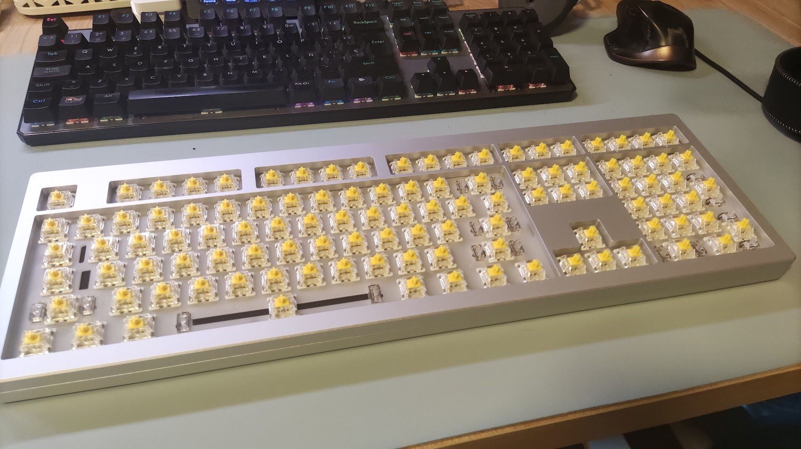
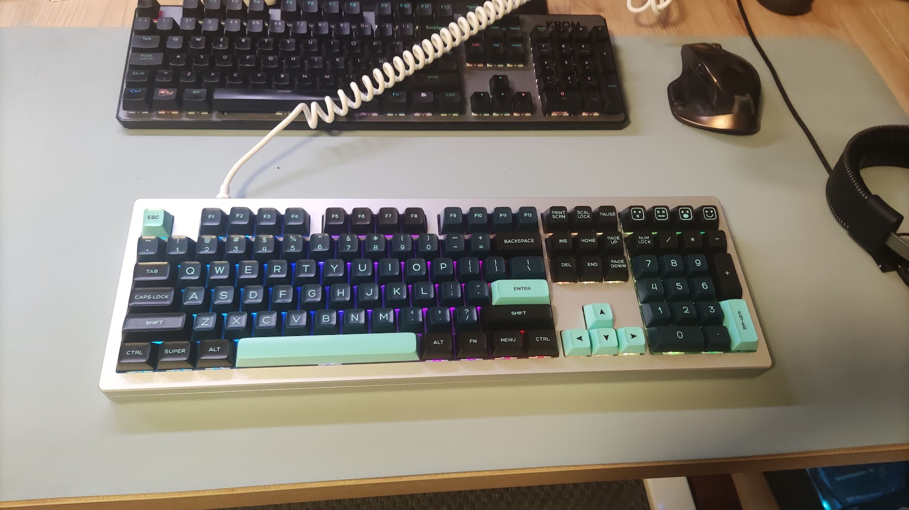

5 years ago I bought my [first mechanical keyboard](), a cheap and simply one, the Krom Kernel, a 100% size keyboard with Outemu Red switches with spanish layout. During this time I change the space bar keycap twice because the plastic was not very good and the part that connects with the switch was not very reliable and it broke causing a bad experience pressing it. But was something I could fix, replacing all the keycaps with a better quality ones.

After 5 years, some switches start to fail randonly, so I thought it's time to think in a new keyboard. 

My requiriments, wish list:
* High quality
* 100% or TLK
* Silent (at least more than the previous keyboard) switches
* Hot-Swappable switches (to change the switched if I want to change the switch type or replace a broken one)
* Wired: I don't want to thing in charge battery or having connection issues (is very frustating when a key is not send to the computed randomly)

## The layout

I want to have the possibility of changing the keycaps in the future without replacing the keyboard, but for the Spanish layout the options are limited, so the first drama was to move to an US ANSI layout.

I was not sure I could get used to the new layout, but with the Félix Gómez's advice I configured my previous keyboard with the US international (with dead keys) layout and I tried, and trained, to get used to it, I was not easy because the muscular memory after 30 years using a spanish layout is strong, but with pacience I could get used to it.

### US international layout with dead keys

This layout is the most used one in the US, and it's very similar to the US international layout, but with the addition of the dead keys that allows you to write accents and special characters like the Ñ in a natural way.

For example to write `á` you need to press the `'` (next to the enter), then `a`, like in an Spanish layout keyboard. To write the `ñ` you need to press the `~` key and then the `n` key. 

<cite>Source: https://en.wikipedia.org/wiki/British_and_American_keyboards#/media/File:KB_US-International.svg</cite>

This has a negative counterpart: to write the characters in the *dead keys* you need to use the space, for example to write `'` you must type the `'`  and then the space. This is not direct as just press a key but you can get used to it.

One of the advantages of this layout is "international" so you can write a lot of characters specific of another languages easily.

## The size

I used 100% keyboards all my life, and when I work in a laptop I miss the numeric keypad a lot, also the position of the `PageUp`, `PageDown`, `Home`, and `End` keys are not very comfortable in the laptop keyboards I used. But I was open to explore TLK keyboards, this discards the 75%, 65%, compact ones, etc.

## The choosen one

I saw a lot of different keyboards, I really spend a lot of time on that. But casually I saw a youtube video reviewing a Monsgeek keyboard, and after check its specs and the different size's variants I decided to buy the M5, a 100% keyboard DIY kit.

This is not a complete keyboard, it is a kit to build your own keyboard. I never build a custom keyboard, but I was a challege I want to do.

The kit includes a robust alumium case. In my case (M5, the biggest size), its height is arround 2Kg, it's really heavy, but I like it because the keyboard can not slide on the table when you hit it with your hands.

<cite>Source: Monsgeek</cite>

The kit includes a gasked mount RGB backlit and different foam and plastic layers to improve the keyboard's feel. and reduce the switches' echoes in the case to get a more pure sound. It uses a QMK firmware with VIA support that removes the requirement of a separate software to configure the keyboard, but you can use the VIA configurator (a web page) to configure it.

## The switches

<cite>Source: Gatheron</cite>

Following the Félix's advice I deciced to use the *Gateron G Pro 3.0 Prelubed* switches. Those are linear switches with a nice feeling, low sound level, and oriented to office and gaming. 

The feeling is very good much better than the Outemu Red switches I used in the previous keyboard.

## The keycaps

My first idea was to find a keycap set similar to Amstrad CPC464, but I didn't find anything similar (only custom keycaps set but theit price is too expensive). 

I was looking several keycaps set, but finally I chose this one https://www.aliexpress.com/item/1005005975658627.html

I like the colors' combination, the typography and the shape (QXA profile), very modern and minimalist. I'm very happy with the result.

## Summary

I'm very happy with the result, I really enjoyed the proccess of mounting the key, the switched, stabilizers, the keycaps. It was easier than I thougth.

The keyboard is very solid, the case is very robust, the switches are amazing I love the sound (the sound is similiar to the one in [this video](https://www.youtube.com/watch?v=ZlWMhmBS9zY)) and the touch, and the set created with the keycaps is beautiful.

It was more expensive than I expect, but I think it's a good value. I hope this keyboard will be a good companion for me for long time, maybe I can change the keycaps when I get bored of the current ones. Or I can try another types of switches, maybe I can found ones feel even more comfortable. 

