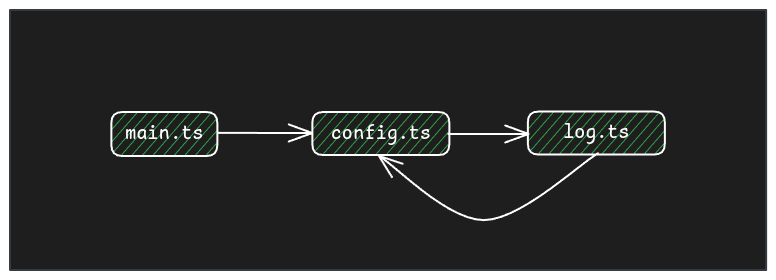
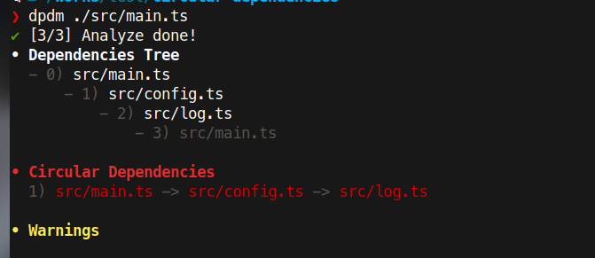
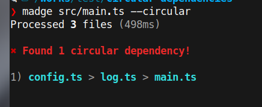

Circular imports (or circular dependencies, or cycle dependencies, but not the same as circular references) are easy to have in your code base, and more when the code grows. It can impact in the bundle generation or cause issues (for example in HMR) and you should avoid them because they are a symptom of an incorrect architecture or code organization and is a big code smell.

## What are circular dependencies

Circular dependencies occur when a package (A) depends on another package (B) and B also depends on A. Circular dependencies can be more complex: A depends on B, B on C, C on D and D on A

### Example
In a Javascript/Typescript project you have several files to organize the code and some of them depend on the const, types, functions, classes, etc. in other files, which is good as it allows us to reuse code and make it more understandable.

Let's see a simple example with 3 files:

```ts
// log.ts
import { verbose } from './config'

export function log (...messages: string[]) {
  if (verbose) {
    console.log(...messages)
  }
}
```

```ts
// config.ts
import { log } from './log'

export const verbose = true

// Try to get config.json file
export let globalConfig = {}

export async function getConfig() {
  try {
    globalConfig = (await fetch('http://myserver.com/config.json')).json()
  } catch (e) {
    log(e) 
  }
}
```

```ts
// main.ts
import { getConfig, globalConfig } from './config'

getConfig()
```

With this code `main.ts` imports `config.ts` and it imports `log.ts` and finally it imports again `config.ts` creating the circular dependencies



Another typical circular dependency cause is when you have a folder (for example a component) with multiple files (ex. the component, the types, subcomponents, etc) and you have an index file that re-export the component and the types, and your component instead of import the types from the types file do it from the `index.ts` file.

## Circular dependency issues

In this situation, you will not get any error, and probably nothing special happens and the code will work.

Bundlers like *Vite*, *Webpack*, etc, Typescript's transpiler, and other tools can handle circular dependencies to avoid infinite recursion generating the dependency tree.

**It doesn't mean everything is solved**. There are a lot of issues related to circular dependencies:

* **Unexpected side effects**: The program can fail randomly depending on which was the first file that imports the package  
* **Webpack and Vite HMR issues**: For example, before Vite 5 any change that involves circular dependencies triggered a full page reload, now it is improved but still having [issues](https://github.com/vitejs/vite/blob/3b8f03d789ec3ef1a099c884759bd4e61b03ce7c/docs/blog/announcing-vite5-1.md?plain=1#L73)
* **Memory leaks**: [Example](https://github.com/nestjs/nest/issues/10548)
* **Build**: It can be slower as the bundler tools need to handle them
* **Code is hard to understand**
* **Is a code smell / anti-pattern**: Having circular dependencies means your code and architecture is not well-defined

> Circular dependencies can happen in other languages, it's not a Javascript/Typescript problem, but for example Golang or Cargo (Rust) don't allow cycle dependencies

## Finding circular dependencies

In the example above detecting a circular dependency is easy as there is just a few files, but in a real project it can be hard as the dependency chain can be big:

```
 A -> B -> C -> D -> E -> F -> A
```

We need a tool to detect them, and fortunately, there are a lot of tools to detect the circular dependencies

### dpdm - https://github.com/acrazing/dpdm

This is my favorite one. This tool only needs an entrypoint or the files to scan, and it will start to analyze the code in order to find circular dependencies. 

To check the example above we can run: `dpdm ./src/main.ts`

The output will be:



It detects the circular dependency and gives information about the dependency tree. `main.ts` imports `config.ts`, `config.ts` imports `log.ts` and (this is not written, but it is implicit) `log.ts` imports again `main.ts`

**dpdm** is very fast even with large code bases and supports CommonJS and ESM, and Javascript and Typescript

We can run the tool in a pre-commit hook and/or in the CI to ensure the code doesn't include circular dependencies.


### Madge - https://github.com/pahen/madge

Madge is a tool for generating a visual graph of the module dependencies, and can also find circular dependencies.

Running it with the default flag will return the dependency tree, and if we add the `--image` flag: `madge src/main.ts --image deptree.svg` we will get a SVG file that represents the dependency tree


Using `madge src/main.ts --circular` we get the circular dependencies in a similar output to the previous tool 




### Bundler plugins

There are plugins available for bundlers like Webpack and Vite to detect the circular dependencies on build time:

* https://www.npmjs.com/package/vite-plugin-circular-dependency
* https://www.npmjs.com/package/circular-dependency-plugin


### Eslint

The [eslint-plugin-import](https://github.com/import-js/eslint-plugin-import/blob/main/docs/rules/no-cycle.md) includes the rule `import/no-cycle` to ban the cycle imports


## Solving circular dependencies

After detecting a circular dependency, there are multiple strategies to solve it, This is something I will write about in a future post, but for the example, it  is as easy as moving the verbose constant to it own file (for example `config-log.ts` or just to the log file.

Did you have issues in the past with circular dependencies? Let me know in the comments

