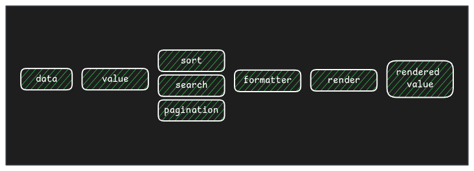

I love creating UI components because they are the fundamental bricks supporting a UI application. When the components are good enough, both User and Developer experience increases, making applications consistent, easy to implement, and easy to scale.

If the UI application shows data in lists, sooner or later, you will need a table. Tables are UI components that can become very complex depending on their features. The goal of this blog post is not to tell you how to program features but to help you understand some typical needs and features tables should implement to give you useful ideas for your custom UI table component's implementation.

I created a custom UI table component for 2 different projects, and I learn a lot from those experiences.

## What is a table
This a fundamental question, but it is also important because we will base the component's implementation on that.

> A table is a set of *normalized* data (the **rows**) organized in columns (**cols**). The rows contain **cells**, that represent the cross between a row element and a column.


"Normalized" is important as in a table the rows share the same structure, that structure is defined by the cols. In other words, if our table cols are: `id`, `name`, and `surname`, the rows (data) should provide those values (or at least most of them)

## Table component's architecture

I think a component should work as a black box, that [gets inputs and returns the DOM to render the components]() so the data and structure of data should be passed to the table component as properties and table must know how to render it based on that (and in extra config props we will discuss later), and the developer should not know the component internals, just how pass the data and config.

This approach has a lot of advantages, for example, consistency, if you implement a change in the table component, you can do it without the need to refactor all the usages, as the input is the same.
For us, that means that a table component should render the rows not delegate it to a child component in the table usage, like in the example bellow.

```tsx
// ❌❌❌ Don´t do that
<MyTable rows={rows}>
  {rows.map(row => <MyTableRow row={row} />)} 
</MyTable>
```
Believe me, I saw that before, and this is a direct attack to the component responsibility.

```tsx
// ✅✅✅ Do that
<MyTable rows={rows} cols={cols} config={config} />  
```

### The data
The first table's input (property) to model is the data. You will get that from an API or generate it on your application (I will tell you more about data pagination, sorting, search, etc. later)

The data input is typically an array, as it represents a list of rows, for example:

```ts
const data = [
  [1, 'Sergio', 'Carracedo', 'Spain'],
  [2, 'Manolito', 'Gafotas', 'Andorra'],
  ...
]
```

But it also can be an array of objects:
```ts
const data = [
    {id: 1, firstName: 'Sergio', lastName:'Carracedo', country: 'Spain'},
    {id: 2, firstName: 'Manolito', lastName:'Gafotas', country: 'Andorra'},
  ...
]
```

Even with nested values (we should bear in mind this cases if we want to create a flexible component):
```ts
const data = [
    {id: 1, names: { firstName: 'Sergio', lastName:'Carracedo' }, country: 'Spain'},
    {id: 2, names: { firstName: 'Manolito', lastName:'Gafotas' } , country: 'Andorra'},
  ...
]
```

There are more cases, but the point I want to highlight is that the data can came in different ways, and the way to get the cell's value can be different

### The cols' definition

The cols are not only the title that we will show in the table header, the cols define a lot related to the data, and there are a lot of behaviors we can model with the cols' definition. Let me give you the ones I think are more relevant and interesting in a table for each col.

#### `id`
We need a way to refer us to a column, so we need an ID for it, that can be just a number or a string.

#### `title`
This will be the value we will render in the header

#### `value`
This will tell our component from where it should get the data to render the col's cell for each row. This field in interesting. Let me tell you more about it, there are more that you can think.

The simplest provider will depend on the data (rows), for the first case I mentioned above (Array of arrays), the provider can be just the index of the row, for example, `1` should get `'Carracedo'` and `'Gafotas'`, and those are the values in the index `1` of each row.

If the data is like the second example (Array of objects), the provider can be the key name to the value, for example, `firstName`, to get the same values. But to cover the third example (Array of objects with nested values), we can allow passing an string with dot notation, for example: `names.firstName`

But there are more providers you can implement, you can allow to pass a function as a value provider, this function gets the row, and the row index as arguments and must return the value for the cell.

It's important to notice that there is no strong correlation between the cols in the table and the cols in the data. The table can show a col that is a derivative value from the original data, for example, the `fullName`, or the `age` (if `birthday` is a field in the data source). You can use that `value` provider function to create derived values on-fly. You could do it before to pass the data to the table, but forces you to implement a loop to create a new structure with the derivative values. I guess the function value provider is simpler and elegant. Let's see it in an example:

```ts
const cols = [
 {
   id: 'identifier',
   value: 'id'
 },
 {
   id: 'fullName',
   value: (row) => `${row.firstName} ${row.lastName}`
 },
 ...
]
```
In the example for the col `identifier` the table will get the value from the property `id` and render it in each row (that is a direct value), but for the col `fullName` the table will call the function in each row to render the cell, and will use that derivative value.

You can use it for a lot of cases:
* Create the year sales average col from the value in the other 12 cols that represents the sales in each month
* If the name contains some letter, you can render the treatment
* etc

> I have not mentioned examples on purpose like converting the name to uppercase, because that is not the goal of this field. Remember it's just a data provider, how the data is formatted should be done in another way.

#### `formatter`
Sometimes the data you will render in a table needs to be transformed (formatted) before rendering it, there are a lot of common cases:
* Date-time: Your data provides the datetime as an integer and you want to show it as a string, for example, 'YYYY-MM-DD'
* Numbers: You want to show them with a specific number of decimal places, thousands separators, or abbreviations
* Not available values: Show `N/A` if the value is undefined
* ...

As I mentioned, the `value` must be just a definition of how to get the data, the pure data, if you need to format it before showing it this field is your answer.

Why we should have 2 fields in the col definition if we could do it in the `value` field using the function provider you mention?

True, you can do the transform and/or the format with the value provider function, but in this case, you are losing useful information, for example, to sort the cols or to find values.

Imagine your table data came from an API has no pagination, or sorting, the table can do the sorting and pagination (I will write about sorting, searching, pagination in a next post).

You have a date-time col as unix epoc (integer value) and you want to display it in 'MM-DD-YYYY' format, if you do the transformation in the value provider the table will sort the col using the formatted values and it will order then for example: ['12-01-2024', '12-01-2010', '11-11-2025'] as ['11-11-2025', '12-01-2010', '12-01-2024'], that is not the expected behavior of sorting.

> We must sort the values before formatting them to allow us to sort or/and search them in the table

#### `render`
The last thing to bear in mind about how the data is displayed in the table is the render.
Not always we want to show the data as a text, maybe we need to render an image, a chip, a progress bar, etc...

How to do that will depend on the UI framework you are using (assuming you are using one):

* In Vue you can use [named slots](https://vuejs.org/guide/components/slots.html#named-slots) to change the way a cell content is rendered
* In React you can pass a component in the render property of the col

In any case, this "render function" will get the value after formatting it and doing the render.

This is the flow of the data in the table component:



Defining this architecture is vital for other functionalities the table can implement like row sorting, pagination, col sorting, col visibility, col resize, fixed cols, search, etc.

In the next post, we will understand the different ways the data can be sorted, and paginated (spoiler: external or internal) and the implications it has in other features.

> If you like this post, please leave a comment to let me know your interest.
