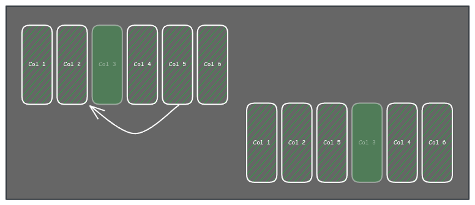
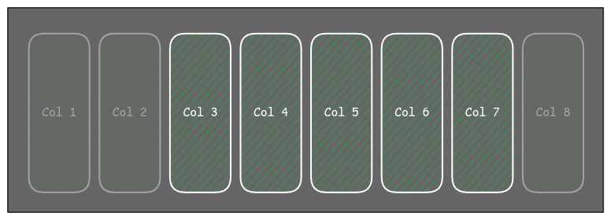

> This post is part of a post series: [First part](), [Second part]()) and an extra related post: [Writing a query builder to filter data]()

I want to use this last post in the series to talk about the col related features, like: col sorting, hidden cols, excluded cols, fixed cols, etc.

## Col sorting
This is about the order of the columns in the table, it very convenient (and common) to render the columns in the same order as they are defined in the definition array, but in some use cases it can be useful let the user to reorder the columns to decide which ones are more relevant.
I used a property in the col definition object, for example `order`. 

I always try to avoid defining all the definitions using a default behavior, in this case, the developer can decide to don't set the order in some columns, the criteria to get the final order I decided to apply is to assign a big number to the cols without an explicit order and then order all the columns by the order field value. If more than one col have the same order value, the first in the array has priority and is before than the orders on the table.

Talking about the UI there are multiple way to let the user deciding the order, for example dragging the cols, with a col's menu action, or using dragging and drop the cols' names in a config section of the table. In any case, we must let the developer blocking some columns in the case it will be necessary, for that we can add a new property to the col's definition: `noSortable`, that is false by default.

One important thing about that is, makes no sense to let to "block" columns in the middle of the table as you could not drag the blocked col but you can move the cols around it, and that is basically the same as allow to sort it.

I decided to only allow to block the columns at the ends of the table, and only the ones between them can be sorted, and obviously, don't letting to move the columns before or after the blocked ones in the left and right respectively.

## Hidden cols

## Excluded cols

## Fixed cols

## More things to bear in mind

* Nested rows
* Row actions
* Toolbar
* Actionbar
* Empty state
* Async loading
* Expandable
