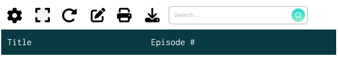
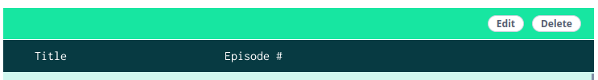

> This post is part of a post series: [First part](), [Second part](), [Third part]()) and an extra related post: [Writing a query builder to filter data]()

As I mentioned in the previous chapters of this series, I prefer to provide the maximum number of features in the table. There are several reasons behind this decision, those are the more relevant ones:

- **Homogeneity**: Same solution to the same problem in different places. If you don't provide a solution for the common or repeated needs, you are taking the risk of having different solutions for the same problem. That is very common in large applications where the teams work on different parts of the application, and they can provide different solutions and different user experiences for similar use cases, this causes duplication of work and a bad user experience.
- **Maintainability**: In general it's easy to maintain the code, if you solve a bug it will be solved in all the places the table's feature is used, or if a feature changes it will change in all the places, this is very related to the previous point. For example if we decide to use a recycle view to render the table rows for a better performance, we only need to do it once, and all the implementation will benefit from that. 
- **Implementation simplicity**: Using a table with a lot of use cases and features (mostly based on configurations or props) makes it very simple to implement the table even for any developer, even if is a new-joiner or junior.
 
The trade-offs of this are:
- **Covering all use cases is not easy**: Finding a common solution to similar problems requires effort and time, and it can be hard in some cases.
- **Find a balance**: It's not always easy to decide which features should be in the table or not 
- **Big component**: Including too many features can make the bundle size for the component big.

## Other features I implemented

### Table settings persistence

As I mentioned in the chapter we allow users to select order of the columns, that is a nice feature, but is not very useful if it needs to set the order every time it loads a page. To solve that we implemented a system to persist and restore the table settings. In our use case, table settings include: column order, column visibility, items per page, and other settings the table implementation can define for the specific use case.

I think the table component shouldn't know anything about how to persist the data, because in that case, we are coupling the table component with the backend, and that limits the reusability of the table. This is an example of the balance I mentioned before.

To solve that and avoid coupling the component to the infra (backend) we use providers, the table component defines an interface for the persistence (read and write), and the page which implements the table can inject that provider via prop to implement the persistence logic. To make the code reusable the provider is a common utility that only needs an ID to identify the table. This provider can store the table settings in the local storage, a backend, etc.

The table should contain the logic to handle the inconsistencies between the settings and the table definition, for example, if a column changes and now is fixed, it should ignore the order in settings for that column, or if we remove or add a new column, the table component contains the logic to set the new column in a default order with the others.

### Nested rows
Another useful feature in our use case was the nested rows. For example, we have a list of "Friends" series episodes, and we want to show them grouped by season and even display some aggregated information like count, total views, etc.

There are other sub-features you can include: The groups, each row with children, can be collapsible or not, the header can be a sticky element (is always on top when the children are visible), etc.

The very beginning though is that this is a simple feature, but there are a lot of tricky parts and nontrivial decisions to be made:

- **How to group the rows when the order changes?**. There are multiple ways to do it, and no correct answer, just what makes sense for your use case.
  - You can sort first the parent rows and then sort children inside each row. This will keep the groups
  - You can sort all children together, and then regroup them. This will create repeats in the parent rows as now the children are mixed. Ex: A contains: 3,4,7 and B contains 1,2,5, The ordered rows with the children to display are: B (1,2), A (3,4), B(5), A(7)
- **How to split pages**: Should parent row count for pagination or only children or both? How to split pages when the parent rows are collapsible? You can recalculate the pagination when a group of children are expanded or not, or just count items even if they are not expanded.

In our use case, we select one of the solutions in each topic, but will not share it with you ;). There are no absolute correct answers here, it depends on what you need.

#### Async loading of nested rows
Another feature related to the nested rows is the async loading. This feature only makes sense when the user can collapse the parent rows (and they are collapsed by default), in this case, the children only are loaded when the user expands a row. This is useful to make the time to show the initial data in the table short and reduces requests to the backend.

This feature requires solving how to load the data, as I mentioned before I think requests should not be part of the table component, so like in the case of the settings persistence, we define a provider interface that will load the data and return it to the table. The table will invoke the provider when the user wants to expand a row and receives the parent row, your implementation will manage that to request the children rows and return it to the table. The table must handle the loading state and, in our case show skeletons for the children rows meanwhile the data is loading.

### Expandable rows
This feature allows expanding a row letting the implementation define the content to display in the expanded space. This feature can seem similar to nested rows but is not (and is not incompatible). In this case, the content is not part of the table, in the case of nested rows, the children must have the same columns as the parent (as the table), in the expended row, we can to another table (with different columns) or any other content, like a form, a chart, etc, anything.

In our case, as the table component was implemented in Vue, we use a feature I love about this framework, the [scoped slots](https://vuejs.org/guide/components/slots#scoped-slots) to allow us to define that content, it can be the same for all the expanded rows or by row

### Row actions
A very common use case (at least for us) is to have actions over the rows, for example, delete the entity the row represents, edit it, execute an action over it, etc. For that, we allow to pass to the table component an action provider that defines the actions for each row (as it is a function the actions can be different or be disabled or not for each row). Those actions are displayed in the table in an [internal column](#user-defined-cols-vs-internal-cols)) using a dropdown menu component (this is a component is part of our UI component library)

### Toolbar
The toolbar is a set of icons, visually over the table header, that represent actions for the table.   

I implemented build-in actions like:

- **Settings**: To open the table settings panel or modal
- **Fullscreen**: To display the table in fullscreen mode
- **Reload**: Dispatch an event to let the implementation the user wants to refresh the data
- **Edit**: To enter in edit mode, this converts the content of the rows in input fields to change the values directly from the table
- **Print**: Prints the table content
- **Download**: Exports the table contents to CSV or XLS implementing all the logic on the frontend side. This is an interesting feature. The build-in feature, only exports the data the table contains, if it is in external mode it only can export the current page content, but we can provide a way to overwrite the button behavior and delegate that in an external implementation can get all the data and download it. In any case, this scenario is a good example of how useful are the formatters, as again, we can render the export data in the correct format.
- **Search box**: Where is where the user can enter the search text I explained in the first chapter

I allow developers to define which build actions want to use, but also allow them to implement their custom actions for a specific use case passing the buttons to render as props and getting an event or callback when the user clicks on that.

### Action bar
This bar only appears when the user selects more than one row and allows it to execute actions over the selected rows, those actions are defined by the user, for example, delete or edit, or any other action.

## Summary
Creating a table component is a challenging and interesting experience, that requires (as any other component) paying attention to the details, understanding, identifying, and defining the concepts involved in the process. 

My goal with this post series was to give you tips and share the solutions and decisions I made (and why I made them). 

My solutions don't are necessarily the correct ones for you, they were the ones that cover my needs, but I expect you to find these posts useful to understand better the different options.

Still have a lot of small things to bear in mind (empty state, items per page selector, no results found state,....) when you implement a table component, but I feel you can handle them.

Please let me know if you liked this post, if you miss something, etc. Thanks for reading
