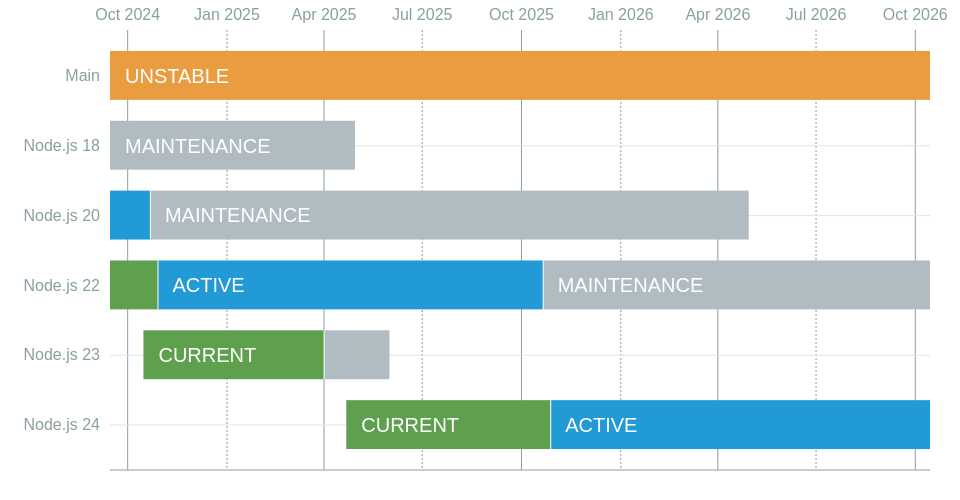

When you face to manage a node.js / javascript project you should set a replicable environment, engine (node) version, package manager, etc.

To manage the node version, you can use [nvm](https://github.com/nvm-sh/nvm) which manages the node version in your system (global and per project). You can also use a `.nvmrc` file to specify the node version you need for that project and use a (shell integration)[https://github.com/nvm-sh/nvm?tab=readme-ov-file#deeper-shell-integration] to automatically switch to the correct version when you enter the project directory.

## But what about the package manager?
In the past (a long time ago), the only package manager was `npm` so the bigger problem was to ensure all the developers are using the same version of `npm` to avoid problems. But now we have `yarn` and `pnpm` (my favourite) that are faster and have some features that `npm` doesn't have. That makes the problem bigger, as you need to ensure all the developers use the same package manager, to avoid issues like having different lock files, different ways the package manager handles the dependencies, etc.

## Corepack
[Corepack](https://nodejs.org/api/corepack.html) is an experimental node.js feature added in v16.9.0 and v14.19.0, so is there in any node version you should use in your projects right now (I guess you are using a node version with [security support](https://nodejs.org/en/about/previous-releases), if not you should!!!!!).



Corepack is manager that allows you to use `yarn`, `pnpm`, or `npm` "without" installing them in your system, and the most important, as nvm, each project can use its own package manager version.

It also defines the project package manager and its version in the `package.json` file, so now package manager is part of the project.

## How to use it
corepack is included in node.js, so you don't need to install it, you just need to enable it: 

```sh
corepack enable
```

The first time for a project you need to define the package manager you want to use and the version, for example, to use `pnpm` version `10.0.0` you should run:

```sh
corepack use pnpm@10.0.0
```

If this version of the package manager is not installed in your system, corepack will download it and use it for the project. It also will update the `package.json` by adding a line to define the package manager and its version for the project:

```json
{
  ...
  "packageManager": "pnpm@10.0.0+sha512.b8fef5494bd3fe4cbd4edabd0745df2ee5be3e4b0b8b08fa643aa3e4c6702ccc0f00d68fa8a8c9858a735a0032485a44990ed2810526c875e416f001b17df12b",
  ...
}
```

Now you must run any package manager command using corepack as proxy. For example `corepack pnpm i` to install the dependencies.

If you try to run another package manager (via corepack) you will get an error:

```sh
❯ corepack yarn i
UsageError: This project is configured to use pnpm because /works/test/corepack/package.json has a "packageManager" field    
}
```

If you call a package manager command without corepack, you will not get an error (except for yarn). You can solve that by adding aliases for the package managers to your shell configuration file (`.bashrc`, `.zshrc`, etc.):

```sh
alias yarn="corepack yarn"
alias yarnpkg="corepack yarnpkg"
alias pnpm="corepack pnpm"
alias pnpx="corepack pnpx"
alias npm="corepack npm"
alias npx="corepack npx"
```

I encourage you to use corepack if you are not using it yet, it's a great out-of-the-box tool to avoid problems with the package manager and to ensure all the developers use the same version of it.


