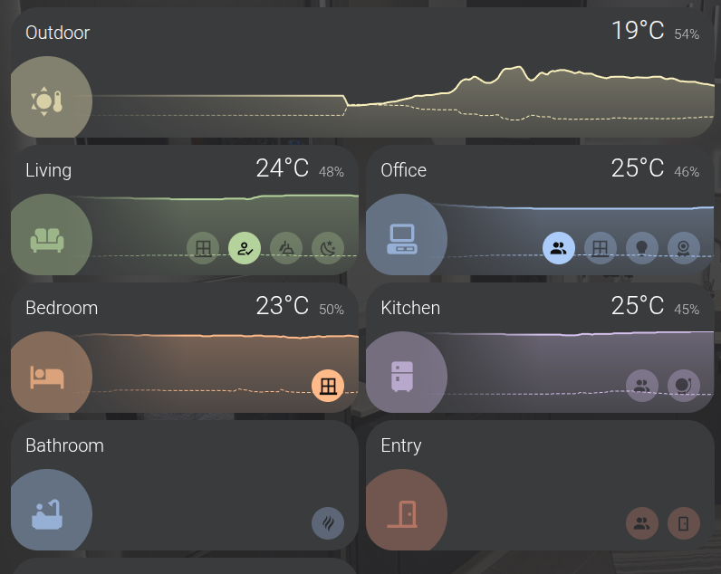
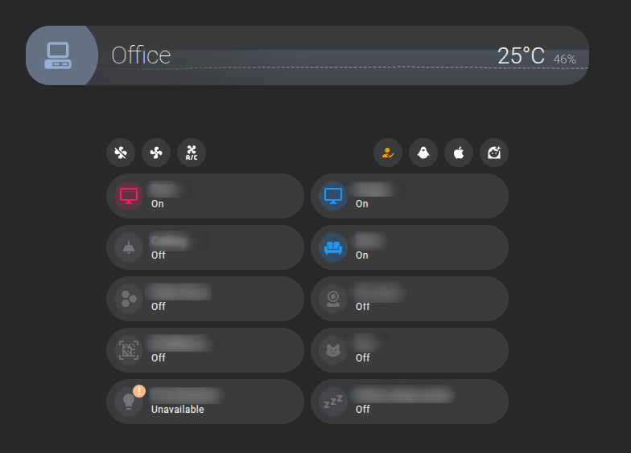

> The goal of this post is to give you a brief introduction to creating custom cards for Home Assistant using Lit
> elements, and I will share with you takeaways from my experience learning how to create custom cards for Home
> Assistant.

Home Assistant is a powerful, open-source, extensible (and much more) platform for home automation. If you are using it,
You probably are a fan of the dashboards, and the cards are one of the most important parts of it.

Even if Home Assistant provides a lot of built-in cards, sometimes you need something more specific or with a graphical
style, because dashboards are not only to display an infinite list of numbers or charts, the information must be
displayed hierarchically.

[HACS](https://hacs.xyz/) (Home Assistant Community Store) provides an easy way to install Home Assistant custom
elements (not only cards, but also integration, themes, etc.) created by the community. If you are looking for a simple
way to customize your
Home Assistant's dashboard, HACS, is the way to go. These cards are usually very configurable, but in some cases or for
certain users, that configuration may not be enough.

For these cases, there is a project in HACS like [button-card](https://github.com/custom-cards/button-card) that allows
you to
add styles, cards in cards, etc, just using a YAML configuration.
That is quite nice, but reusing the cards means you need to copy and paste the card code and change the "variables", but
when you do a change in the style or add a new element, you need to copy the code again manually.

If you are familiar with YAML, maybe you think you could use yaml fragment to reuse parts of the code, but that is not
possible in 'UI controlled' dashboards.

## UI controlled vs YAML dashboards

In Home Assistant, there are two types of dashboards: UI controlled and YAML-controlled. The UI controlled dashboards
are
the default ones, and they are configurable using the Home Assistant UI, you can drag and drop the cards to change the
position, use the interface to edit the configuration of the card, etc.
But even if you can export the configuration to YAML, you cannot use YAML fragments to reuse code. If you do it at Home
Assistant will apply the fragments and flatten the configuration to store it in the internal database, not in a real
file, so the next time you want to edit the dashboard, YAML fragments will not be available.

The YAML-controlled dashboards are more flexible; you can use YAML fragments and templates to reuse the code, but you
lose the simplicity of the UI, also, even using Jinja2 templates, in my opinion, is not flexible enough.

## Custom cards in Home Assistant

### Custom elements

Home Assistant allows you to create custom cards just
using [Web Components](https://developer.mozilla.org/en-US/docs/Web/API/Web_components), a web standard that allows you
to create reusable components using HTML, CSS, and JavaScript.

Defining a custom element is as simple as creating a class that extends the `HTMLElement` class and defining the create
DOM nodes you need

```
class MessageCard extends HTMLElement {
  constructor() {
    super();
    this.message = this.getAttribute("message");
    this.template = document.createElement("template");
    this.template.innerHTML = `      
      <h1 class="message">${this.message}</h1>`;
    this.shadow = this.attachShadow({ mode: "open" });
    this.shadow.appendChild(this.template.content.cloneNode(true));
  }  
}
```

To use it you must register it

```
customElements.define("message-card", MessageCard);
```

And then you can use it in your HTML as a normal HTML element.

```
<message-card message="Hello world"></message-card>
```

### Using a custom element as a custom card in Home Assistant

To use a custom element as a custom card in Home Assistant, you need to register it using a global variable.

```javascript
window.customCards = window.customCards || []
window.customCards.push({
  type: 'message-card', // This is the name you registered the custom element with
  name: 'Message Card',
  description: 'This is my first HA custom card',
})

```

And now we need to make this js code available to Home Assistant, for that, we need to add it as a resource in the
dashboard `Edit dashboard > Manage resources > Add resource` and add the path to the JS file.
You could use external hosting and load the resource from it, e.g. http://mypage/custom-card.js, but don't do it as is
risky in terms of security, and you depend on the internet connection to show the cards.

The best way is to use the `www` folder in your Home Assistant installation, you can find it in the root of your Home
Assistant installation. You can create a folder inside `www` to store your custom cards and store the card file there,
for
example `/www/my-custom-cards/message-card.js`
> Note that the path in the "manage resource" page is relative to the `www` folder, so you need to add `/local/` before
> the path to the file, so in this case you must use `/local/my-custom-cards/message-card.js` as the resource path.

You can also use HACS to distribute and install your custom cards, HACS will take care of adding the resource to the
dashboards, but this is out of the scope of this post.

## Lit elements

Creating custom elements using the `HTMLElement` class is a bit tedious; you need to create the DOM nodes manually, and
handle all the event changes in the status, etc, by yourself.

As Home Assistant custom cards are just a custom element, you can use any framework to create it, for example, Vue,
React (
since v19), Angular, etc., but Home Assistant uses [Lit elements](https://lit.dev/) in the frontend, so it is a good
idea
to use this lightweight library, and nice to create your custom cards.

I should mention before that Home Assistant will try to pass some properties to the custom element and expects some
methods, to pass and get information about your card.

* Whenever the state changes, update the attribute `hass` with an object that includes the state of the Home Assistant
  instance, sensors, areas, etc.
* It will call the function `setConfig(config)` to pass the configuration of the card

There are more properties and methods that Home Assistant will call, but the most important are those two. You can check
the [official documentation](https://developers.home-assistant.io/docs/frontend/custom-ui/custom-card/)

An example of a custom card using Lit elements is the following one, which gets a list of entity IDs from the
configuration and
returns a list of the friendly names of the entities.

```js
class MyCard extends LitElement {
  static get properties () {
    return {
      hass: {},
      config: {},
    };
  }

  render () {
    return html`
      <ha-card title="My Card">
        ${this.config.entities.map((ent) => {
      const stateObj = this.hass.states[ent];
      return stateObj
        ? html`
                <div class="state">
                  ${stateObj.attributes.friendly_name}                  
                </div>
              `
        : html` <div class="not-found">Entity ${ent} not found.</div> `;
    })}
      </ha-card>
    `;
  }
```

### Using custom elements from Home Assistant in your custom cards

In the previous example, you probably noticed that I used the `ha-card` element, which is a custom element provided by
Home Assistant that renders a card container.

Home Assistant provides other custom elements that you can use in your custom cards, for example, `ha-icon`,
`ha-icon-button`, `ha-dialog`, etc.

I think it is a good idea to use the custom elements provided by Home Assistant in your custom cards to create
a consistent card with the rest of the Home Assistant cards.

You can find them in the [frontend repo](https://github.com/home-assistant/frontend/tree/dev/src/components)

Unfortunately, not all the custom elements are loaded by default, but you can use the package
`@kipk/load-ha-components` ([See it on GitHub](https://github.com/KipK/load-ha-components)) to force load the custom
elements you need in your custom card.

## Custom cards helpers

As with any other web project, I recommend you use TypeScript to create your custom cards, and you can use your favorite
tools
to transpile and bundle the code, but in this case, I strongly recommend you to
use [Custom cards helpers](https://github.com/custom-cards/custom-card-helpers), a library that provides some helpers
and a lot of types to create custom cards.

### Resources

There are a lot of resources to learn how to create custom cards for Home Assistant, but they are not always easy to
find. I
want to share with you some links I found, while I was learning how to create custom cards, so that you avoid wasting
that time and investing in more useful things.

- https://github.com/home-assistant-tutorials: A collection of tutorials step by step to understand custom cards, to
  understand what you can do, and how to do it.
- https://github.com/custom-cards/boilerplate-card/ A boilerplate to create custom cards, with a lot of examples
  and a good structure to start your custom card.
- https://developers.home-assistant.io/blog/2023/07/07/action-event-custom-cards/ A blog post that explains how to use
  the new action event in custom cards.

## My first custom card



I want to share with you my first custom card, which I created to show the status of a room in my house. The card shows
the
temperature, humidity, and the summary of the status of the devices in the room by type, for example, the number of
lights on, whether there is a presence or not in the room.
It also allows defining alarm entities, which will be shown as alarms in the card. (e.g a smoke detector)

https://github.com/sergiocarracedo/sc-custom-cards

It can also be used as a header card to show the room name and a summary of the devices in that room is a subdashboard.

