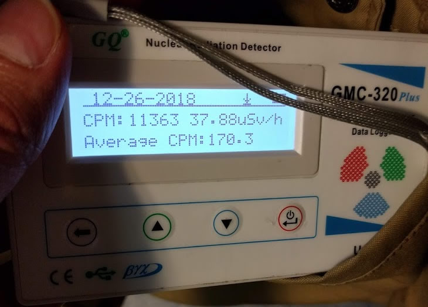
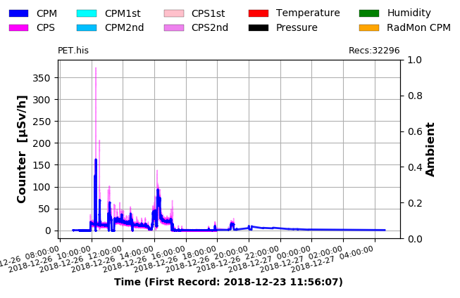
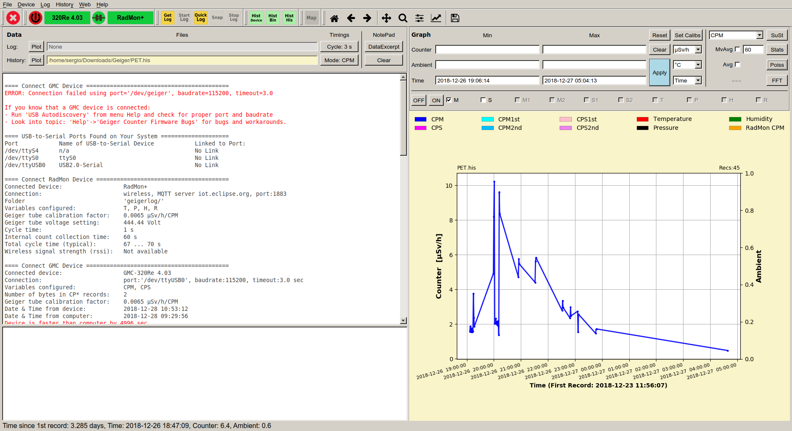

---

Last December 26th, I had a radiological test scheduled to follow up on my lymphoma. This test was a PET-CT, which stands for **[positron emission tomography](https://es.wikipedia.org/wiki/Tomograf%C3%ADa_por_emisi%C3%B3n_de_positrones)**. It is currently one of the most advanced tests for detecting tumor cells and their location in the body.

The test is **non-invasive** and consists of injecting the patient (me) with a *radiopharmaceutical*. Using a detector, doctors observe which parts of the body have a faster metabolism, which indicates where the tumor cells are located.

In a bit more detail, they inject me with [Fluorine-18](https://es.wikipedia.org/wiki/Fl%C3%BAor_18), which is an unstable isotope of Fluorine with a half-life of approximately **2h (109.7 minutes)**. This isotope decays into Oxygen-18, which is stable, emitting a [positron](https://es.wikipedia.org/wiki/Positr%C3%B3n).

Once the fluorine is injected, I wait in a room with lead-lined walls to contain the radiation you start emitting (those positrons) for about 1 hour so the fluorine can distribute throughout the body.

After that time, I go to the machine, which at first glance looks like a common CT scan. In fact, the first "scan" it performs is a CT scan, which gives the radiologist a base image of your body. Then, the same machine begins a new scan, much slower this time, which in my case (due to my height) takes 28 minutes to detect areas with accelerated metabolism.

The detection process is "simple": when one of the positrons emitted by the radiopharmaceutical (Fluorine-18) interacts with an electron in my body, two high-energy photons are emitted, which the machine detects. In areas where there are tumor cells, there will be more of these interactions, and therefore more photon detections, so the image overlaid on the CT scan will have brighter spots.

Obviously, both the detection and data analysis processes are not as simple as I'm describing them, but the idea is to make the process as understandable as possible.

At all times, the process is monitored by a doctor who evaluates whether the resulting image is correct, and if necessary, the detection is repeated.

This is the theory or the "standard" description of the process, but **what happens if you lend a [Geiger counter](https://es.wikipedia.org/wiki/Contador_Geiger) to a geek like me?** :joy:

First of all, I must thank [Luis Miranda](https://www.linkedin.com/in/luis-miranda-acebedo-66491471/), president of [A industriosa](https://intranet.aindustriosa.org/), for lending me the Geiger counter. A industriosa is a non-profit association that manages and promotes a medialab in Vigo, providing makers, tech communities, and companies with technical equipment to carry out all kinds of projects.

I invite you to [visit their website](https://intranet.aindustriosa.org/) and, if you're interested, to become a member.

I assume you know what a Geiger counter is, but just in case, I'll explain it quickly: it's a device that allows measuring the radioactivity emitted by an object or place. You've surely seen it in some movie or documentary, and you'll especially remember it for its characteristic sound.

Getting back to the topic, since I had done this test before and knew how it worked, I wondered how "cool" it would be to be able to analyze the radiation emitted from inside my body during the entire testing process (and the following hours). And thanks to Luis and his Geiger counter, that's exactly what I did.

I arrived at the Hospital do Meixueiro (where the nuclear medicine department is located) a little before 8 in the morning and turned on the counter. The measured radiation was very similar to (even lower than) what I had measured at home in the previous days: **0.25&micro;Sv/h**

I was called and entered the lead-lined waiting room, where they injected the contrast. For about 30 minutes, I waited lying on a stretcher without moving too much so the radiopharmaceutical could spread through my body. Meanwhile, in my jacket pocket, I had the Geiger counter, which at that moment marked **37&micro;Sv/h** (reaching more than **59&micro;Sv/h** at some points).

Finally, due to a technical problem with the detector (the PET), I couldn't perform the test, but I was able to continue with the subsequent radiation analysis.

In this graph extracted from the Geiger counter, you can see the data for the entire day of the 26th (note that the time is incorrect, it is 1 hour ahead); that is, the maximum peak is around 9:00, not 10:00.

They sent me home about 3 and a half hours after the contrast injection, and in the car on the way back, I took the opportunity to activate the sound of the counter (which adds more drama) and recorded this video:

::youtube[]{id="wa5I2d77AjA"}

Once home, I left the counter in the living room to have a measurement of the radiation a few meters away from me and see how it evolved.

In this video (yes, I'm sorry, it's recorded vertically :disappointed:), you can see how the counter initially detects a small amount of particles, and as I get closer to it, the sound of the counts increases, then decreases again as I move away.

::youtube[]{id="3IcJFwIz3JQ"}

During the following hours, I monitored how the maximum radiation level dropped (even with the counter pressed against my body) until approximately 6:00 in the morning, when the radiation was back to normal levels.

It is worth noting that the emitted radiation levels are high (about 200 times "normal" radiation) but are within the values considered safe, although it is true that the recommendation is not to be near pregnant women and/or children during the hours following the test, as they are more vulnerable to radiation.

> For those interested, the Geiger counter management software I used is Free Software and is written in Python: [GeigerLog](https://sourceforge.net/projects/geigerlog/)

