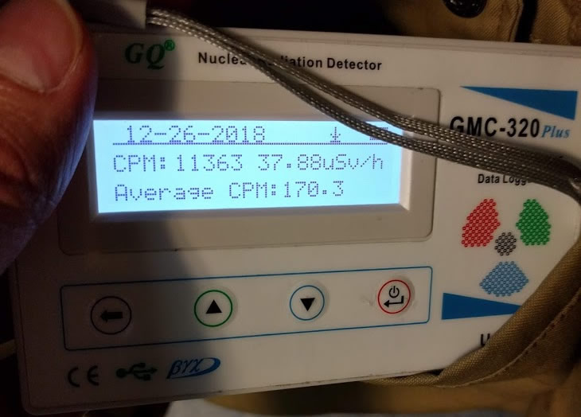
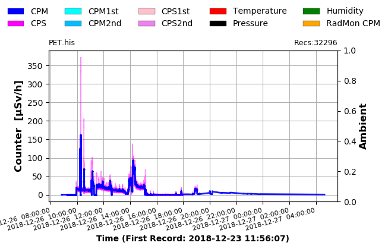
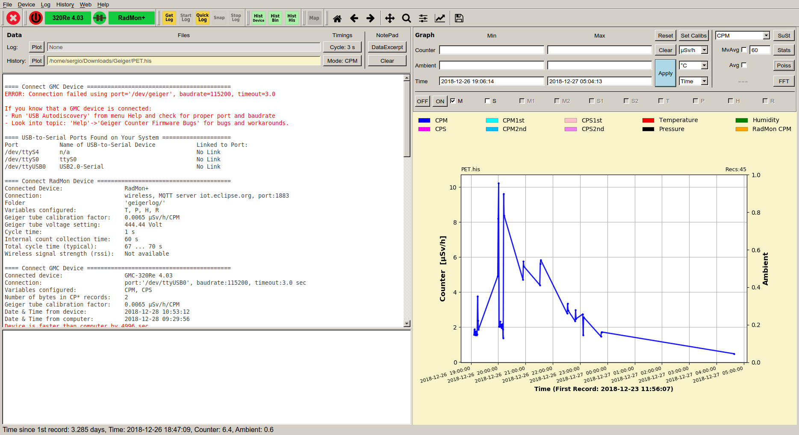

El pasado día 26 de diciembre, tenia programada una prueba radiológica para hacer un seguimiento del linfoma. Esta prueba era un PET-CT, en castellano: **[tomografía por emisión de positrones](https://es.wikipedia.org/wiki/Tomograf%C3%ADa_por_emisi%C3%B3n_de_positrones)** es una de las prueba más avanzadas actualmente para detectar las células tumorales y su ubicación en el cuerpo.

La prueba **no invasiva** y consiste en inyectar al paciente (yo) un _radiofármaco_, y mediante un detector observar que partes del cuerpo tienen un metabolismo más rápido, estas nos indicarán donde están las células tumorales.

Con un poco más de detalle, lo que hacen es inyectarme [Flúor-18](https://es.wikipedia.org/wiki/Fl%C3%BAor_18) que es un isotopo inestable del Flúor cuyo periodo de semidesintegración es de, aproximadamente, **2h (109,7 minutos)**. Este isotopo se decae en Óxigeno-18, que es estable, emitiendo un [positrón](https://es.wikipedia.org/wiki/Positr%C3%B3n).

Una vez inyectado el flúor, espero en una sala con paredes emplomadas para contener la radiación que empiezas a emitir (esos positrones) durante aprox 1h para que el flúor se reparta por el cuerpo.

Pasado ese tiempo paso a la máquina, que a simple vista es como un TAC común, de hecho el primer "barrido" que hace es un TAC, esto da al radiólogo una imagen base de tu cuerpo, luego, la misma máquina comienza un nuevo barrido, ya mucho más lento, que en mi caso (por estatura) tarda 28 minutos, para hacer la detección de las zonas con metabolismo acelerado.

El funcionamiento de la detección es "simple", cuando uno de los positrones emitidos por el radiofármaco (Flúor-18) interactúa con un electrón de mi cuerpo se emiten dos fotones de alta energía, que la máquina detecta. En las zonas donde hay células tumorales habrá más de estas interacciones, y por lo tanto más detecciones de fotones, por lo que la imagen superpuesta al TAC tendrá puntos más brillantes.

Obviamente, tanto los procesos de detección como de análisis de los datos, no son tan simples como los planteo, pero la idea es que se entienda lo máximo el proceso.

En todo momento el proceso esta monitorizado por un médico que evalúa si la imagen resultante es correcta, y si fuese necesario se repite la detección.

Esta es la teoría o la descripción "estándar" del proceso, pero **¿qué pasa si a un friki como yo, le prestas un [Contador Geiger](https://es.wikipedia.org/wiki/Contador_Geiger)?** :joy:

En primer lugar he de agradecer a [Luis Miranda](https://www.linkedin.com/in/luis-miranda-acebedo-66491471/) presidente de [A industriosa](https://intranet.aindustriosa.org/), una asociación sin ánimo de lucro que gestiona y promueve un medialab en Vigo, para que los makers, comunidades tecnológicas y empresas puedan disponer de equipamiento técnico para llevar a cabo proyectos de todo tipo, el préstamo del contador Geiger.

Te invito a [visitar su web](https://intranet.aindustriosa.org/) y si estas interesado a hacerte socio.

Doy por hecho que sabes que es un contador Geiger, pero por si acaso lo explico rápidamente: es un aparato que permite medir la radiactividad emitida por un objeto o lugar. Seguro que lo has visto en alguna película o documental, y sobre todo lo recordarás por su característico sonido.

Volviendo al tema, como esta prueba ya la había hecho anteriormente y conocía el funcionamiento, me pregunté cuando "molaría" poder analizar la radiación emitida desde dentro de mi cuerpo durante todo el proceso de la prueba (y las siguientes horas). Y gracias a Luis y su contador Geiger eso hice.

Llegué al hospital do Meixueiro (donde está el departamento de medicina nuclear), un poco antes de las 8 de la mañana y encendí el contador, la radiación medida era muy similar (incluso más baja) que la que había medido en casa los días anteriores: **0,25&micro;Sv/h**

Me llamaron y entré a la sala de espera emplomada y me inyectaron el contraste, durante unos 30 minutos esperé tumbado en una camilla sin moverme demasiado para que el radiofármaco fuese extendiéndose por el cuerpo.
Mientras en el bolsillo de la cazadora tenia el contador Geiger que en ese momento marcaba **37&micro;Sv/h** (llegando en algunos momentos a más de **59&micro;Sv/h**)

Finalmente por un problema técnico con el detector (el PET) no pude realizar la prueba, pero si que pude continuar con el análisis posterior de radiación.

En esta gráfica extraída del contador Geiger, pueden verse los datos durante todo el dia 26 (notad que la hora no es correcta, esta adelantada 1 hora) es decir el pico máximo es sobre las 9:00, no sobre las 10:00.

Me enviaron a casa unas 3 horas y media después de la inyección del contraste y en el coche de regreso a casa aproveché para activar el sonido del contador (que le da más dramatismo) y grabé este video:

::youtube[]{id="wa5I2d77AjA"}

Ya en casa dejé el contador en el salón para tener una medida de la radiación a unos metros de mi y ver como evolucionaba.

En este video (sí, lo siento, está grabado en vertical :disappointed:) se observa como el contador, al principio detecta poca cantidad de partículas y según me acerco a él, el sonido de los recuentos aumenta, para luego volver a disminuir al alejarlo.

::youtube[]{id="3IcJFwIz3JQ"}

Durante las siguientes horas fui controlando como bajaba el nivel máximo de radiación (incluso con el contador pegado al cuerpo) hasta que aproximadamente a las 6:00 de la mañana la radiación estaba en los niveles normales.

Señalar que los niveles de radiación emitidos son altos (unas 200 veces la radiación "normal") pero están dentro de los valores considerados seguros, si bien es cierto que la recomendación es no estar cerca de embarazadas y/o niños durante las horas siguientes a la prueba, ya que son más vulnerables a la radiación.

> Para los interesados, el software de manejo del contador Geiger que he usado es Software Libre y está escrito en Python: [GeigerLog](https://sourceforge.net/projects/geigerlog/)

