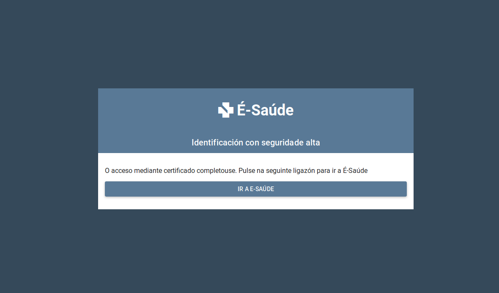
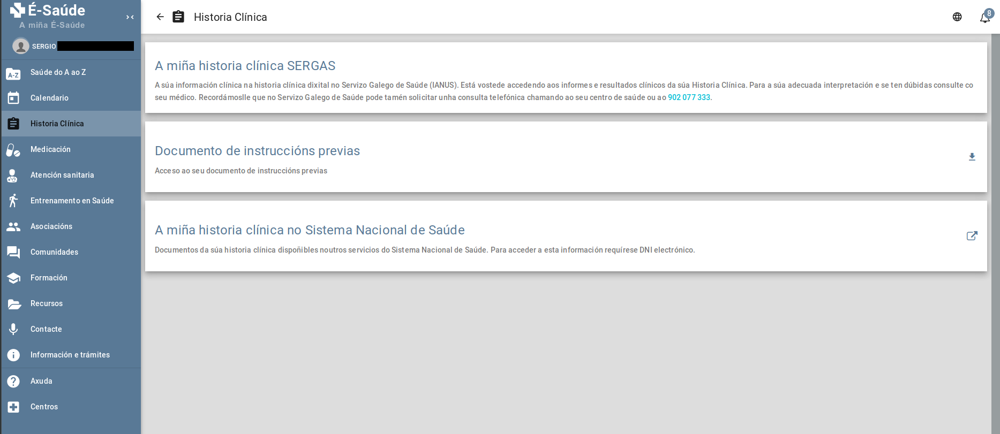
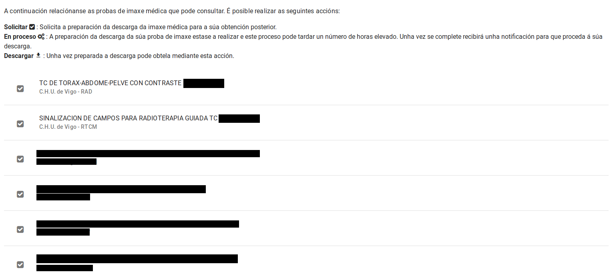
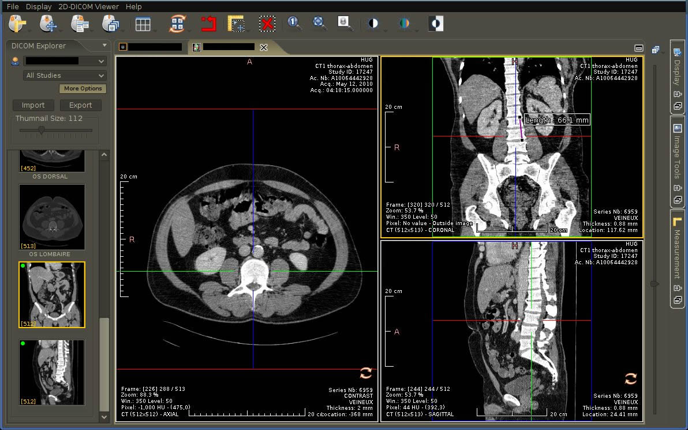

---

Due to my no longer so
:astro-ref[recent illness]{path="blog/2018/Cosas-que-he-aprendido-de-un-cancer"}
, I have spent time accessing the [Sergas](https://www.sergas.es/) (Galician Health Service) website to use a service that was [presented in 2016](https://www.farodevigo.es/gran-vigo/2016/05/11/sergas-lanza-app-consultar-tratamientos/1458511.html), and which since [late 2018](https://www.lavozdegalicia.es/noticia/galicia/2018/12/17/puede-consultar-pruebas-medicas-internet/0003_201812G17P49913.htm) allows access to the function—which I find quite useful—of downloading diagnostic imaging tests: CT scans, MRIs, X-rays, ultrasounds, etc.

To access this tool, it is necessary to have an eDNI, Chave365, or a digital certificate, but in the latter case, it is necessary to visit the Health Center beforehand to authorize said certificate to give us access to our health data—a step I don't fully understand, since to obtain an FNMT certificate, we must already verify our identity.

As a Linux user, I unfortunately always encounter some small (or not so small) snag when accessing government websites and tools. I must say in their defense that this is happening less and less.

In the case of using an eDNI, first we must have a reader and [have it configured](https://www.vidaxp.com/tecnologia/como-configurar-dnie-ubuntu-chrome-firefox/).

We access the _eSaude_ portal either from the banner on the Sergas website or directly at
https://esaude.sergas.es/

We log in using the eDNI and we will be able to access the portal, and what interests us most: Medical history: Diagnostic imaging tests and Reports (there are also other options that I haven't used yet).

First, we have the Reports, which is a list of documents in PDF format; here we will find everything from Hospital Discharge Reports, Blood Tests, Radiology Reports (CT scans, PET scans, etc.), Surgery Reports, and surely other types for which there is no information in my case.

Accessing these reports does not pose any challenge for a Linux user, as they are PDF documents—a standard format—and can be read with any viewer, such as the one included by default in your distro.

The problem arises in the "Diagnostic imaging tests" section; here a list of tests appears—not all of them appear, but I haven't been able to figure out the criteria; in my case
:astro-ref[PET scans]{path="blog/2018/Una-prueba-radiologica-PET-CT-un-friki-Yo-y-un-contador-Geiger"}
do not appear.

On this page, if we want to access the images of one of the tests, we must request a download, which after a certain amount of time (they notify us via email) we will be able to download.

Once the ZIP file is downloaded, we must unzip it. In my case (Ubuntu 18.04.2), the Gnome compressed file manager did not work correctly because it did not respect the internal folder structure when unzipping, so I had to do it using the command line: `unzip [filename.zip]` and that's it.

And here we find a _Windows_ application that gives us access to the test images; there are no JPG files or anything similar to access.

In a first attempt, I tried to run the viewer with [Wine](https://www.winehq.org/), but after spending a few hours without results, I decided to tackle it from another angle.

Looking at the files that made up the download, there was a reference to something called DICOM, which I initially thought was the name of the viewer itself, but I soon discovered it is a [standard for the exchange of medical images](https://es.wikipedia.org/wiki/DICOM). This standard includes the file format itself, as well as the communication protocol for exchanging data. That is, there is much more information in the format than just the images; for example, there is patient data, medical history number, data from the device that performs the imaging, etc.

Knowing this, I set out to find some open-source tool with Linux support that I could use to open and view the tests.

After trying several, the one I liked most for its features and ease of use out of the box was:
[WEASIS](https://nroduit.github.io/en/), with its [repo on Github](https://github.com/nroduit/Weasis). It is written in Java and is compatible with Linux, OSX, and Windows.

The application seems quite complete, but it is beyond my knowledge to know if it is powerful enough for a specialist, but it has a feature that caught my attention:

A CT scan is stored as multiple images (400-500) that each represent the cross-sections of the body that the CT scan performs (image slices, obviously); this application allows, from those slices on one axis, to generate the slices on the other two, generating 3 views of the inside of the body, as shown in the image taken from the Weasis website, where there are [many more example images](https://nroduit.github.io/en/)

_CT scan image taken from the Weasis website_

Obviously, I am not a doctor, nor a radiologist, nor anything like that, but what I am is curious, and these tools allow me to visualize the tests and try to form a mental image of what the doctor is telling me.