---

I don't know if it's a professional habit or just a personal quirk, but I've always been quite picky about peripherals, both keyboards and mice. After all, I spend at least 8 hours a day using them, and it's important to feel comfortable with them.

I mainly work on a desktop computer, and until recently, I was using an Apple keyboard, like the one shown in the photo (but with a Spanish layout)—not the "modern" wireless one, but the previous wired version.

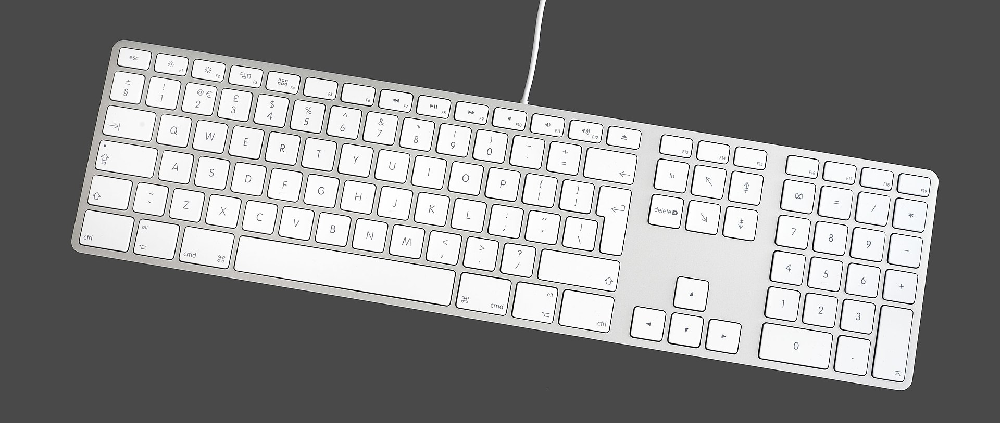
<small>Photo: [Wikimedia](https://commons.wikimedia.org/wiki/File:Apple_Keyboard_with_Numeric_Keyboard_9612.jpg)</small>

We could start a debate about cables; I've tried both types (wired and wireless) and, from my point of view and for my use case, a keyboard should be wired for several reasons:

- Not having to rely on batteries. Running out of battery while you're doing something is very annoying, and having it plugged in to charge is basically the same as it being wired.
- Response: no matter how well a wireless one works (and they do nowadays), a wired one does it better.

This keyboard has been with me for 10 years with few problems. The only issue is that the "¡¿" key broke, but in terms of performance and aesthetics, I was very happy.

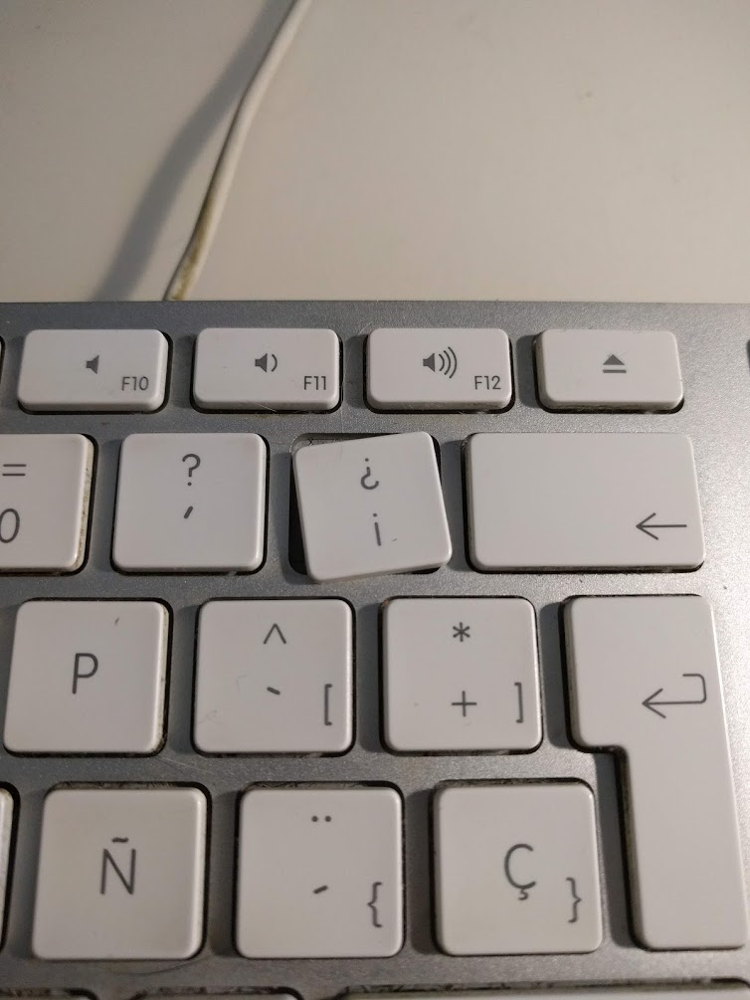

You might wonder why I decided to change it; mainly because of the broken key and for the sake of change itself.

Many programmers I know were using mechanical keyboards, and I wanted to see if it was really as advantageous and comfortable as they said.

As I usually do when buying something I expect to last a while, I did a bit of research into different keyboard technologies. To put it simply, there are the classic ones (like the Apple one I had until now) and *mechanical* ones. There are also optical and capacitive switches, but I don't want to get lost in the details, as I intend for this to be more of an experience review than a technical breakdown.

So, after looking at many keyboards and reviews, since I wasn't entirely sure at the time if the switch to mechanical would be permanent, I opted for a keyboard with a reasonable price and a good quality-to-price ratio.

# The "chosen one": [Krom Kernel](https://amzn.to/2W4H0Xb)

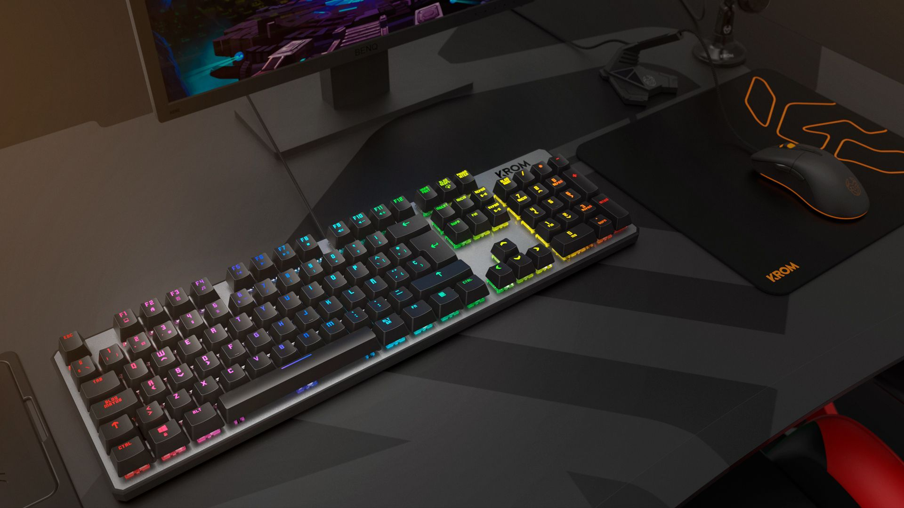
<small>Photo: kromgaming.com</small>

Finally, the one I chose is the one you see in the photo above: the Krom Kernel. It's a mechanical keyboard with *Outemu Red* switches (clones of the *Cherry MX Red*) and RGB lighting configurable from the keyboard itself (no external software required). It currently costs about €55 on [Amazon](https://amzn.to/2W4H0Xb), and there's also a [version without a numeric keypad](https://amzn.to/2WnkesR) (the so-called *TKL*, TenKeyLess) for a bit less (€50).

In the month I've been using it, the adaptation has been very fast. From the start, it felt comfortable for typing without needing excessive force on the keys (in fact, it seems like less than the Apple keyboard). I initially saw the lighting as something "superfluous," though visually nice, but it's something you can actually take advantage of. For example, I've configured a layout (you can set up several with quick switching) "imitating"—within reason—the legendary CPC464 keyboard.

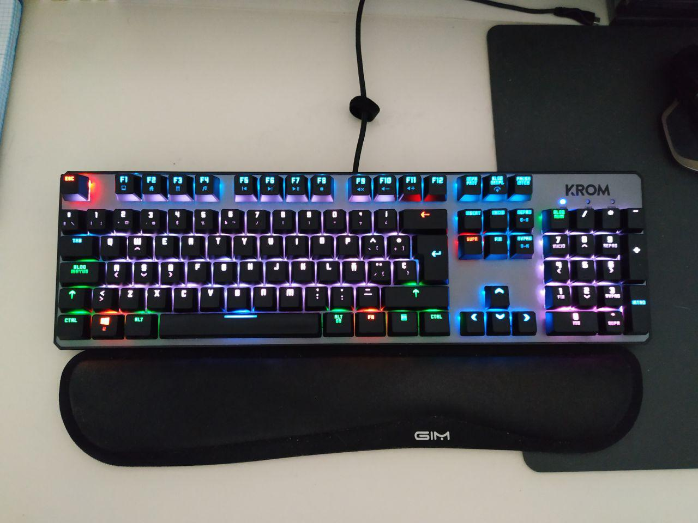

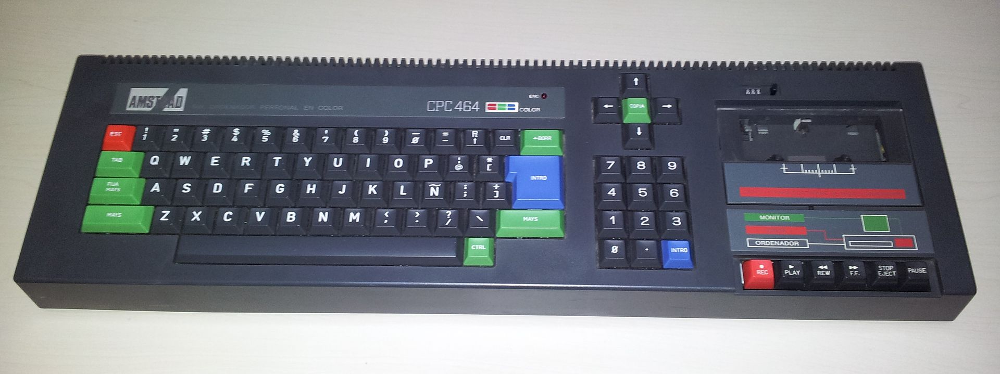
<small>Photo: [Wikimedia](https://commons.wikimedia.org/wiki/File:Amstrad_CPC464_keyboard.jpg)</small>

In this video from the brand itself, you can see all the lighting modes (I really like one that's very *Ghost in the Shell* style, which lights up the entire row starting from the key pressed, [minute 3:30](https://youtu.be/ahmdj3OPBB8?t=210)).

::youtube[]{id="ahmdj3OPBB8"}

Those lighting modes are, honestly, *very spectacular*, but realistically, *they are not very useful in actual use*.

To point out some downsides, the lighting, as seen in the photos, "leaks" from under the keys, though it's not as exaggerated as it appears in the pictures. It's also worth mentioning that it's not uniform; for example, on "large" keys like *backspace*, the color isn't as bright as on the other keys. I've also noticed that the white on the "0" and "." keys of the numeric keypad doesn't look completely white in the configuration I use, although it does when the entire keyboard is set to white.

Regarding the sound, it's true that, like almost all mechanical keyboards, it's noisier, but it's not a sound that bothers me—on the contrary. And from what I've been told, in a video call, it doesn't sound much louder than the old membrane keyboard I had.

Ultimately, for its price, this keyboard performs perfectly. If it lasts as long as the previous one (10 years), it would be amazing. Seeing how comfortable I feel after a month of use, I think I've made a purchase that, at least for now, I don't regret.

Here are a few photos with different layouts:

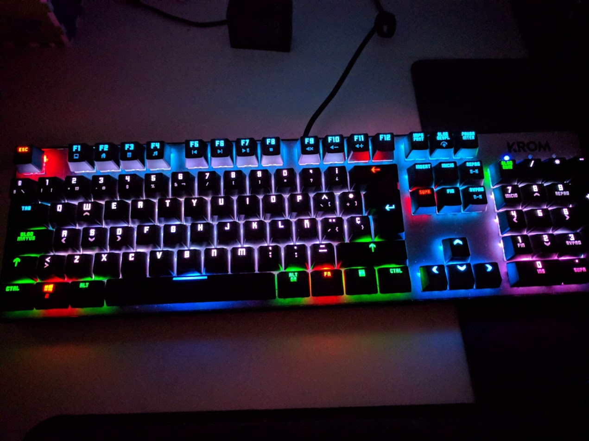

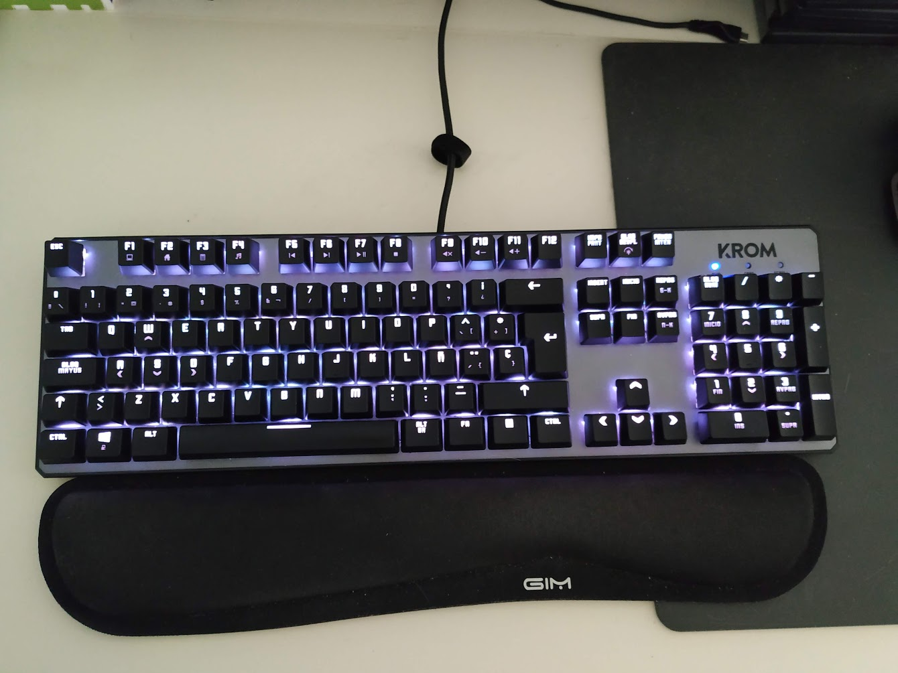

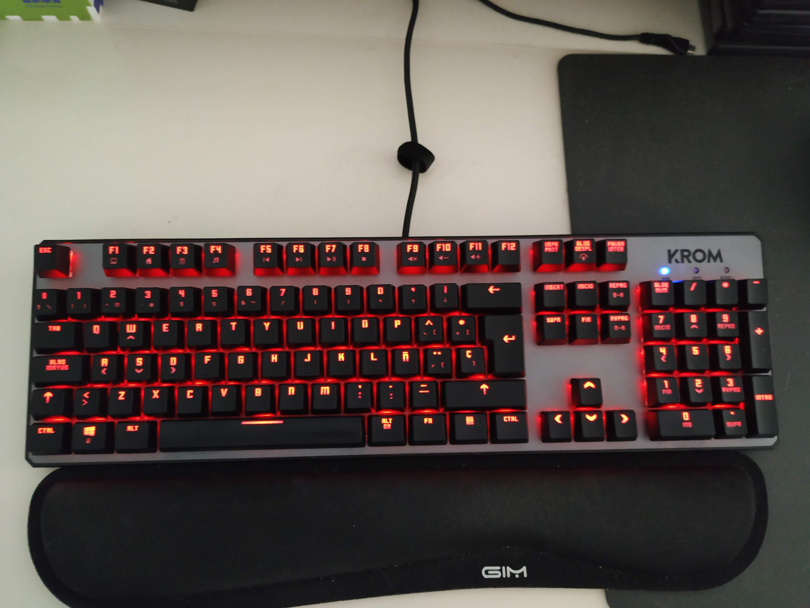

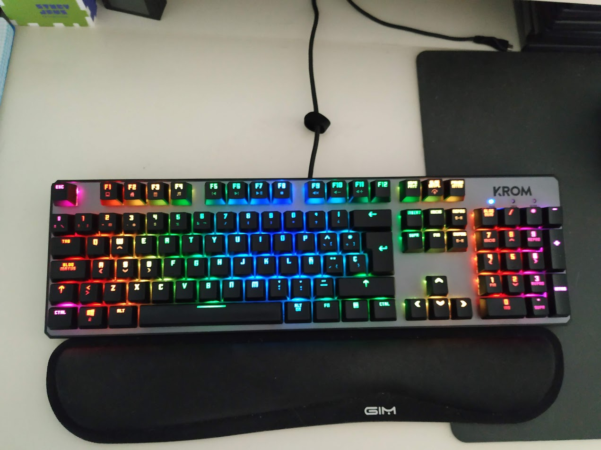

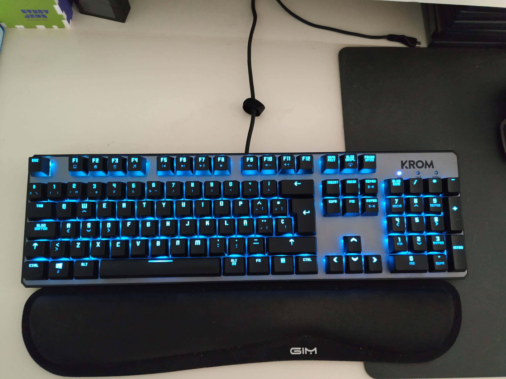

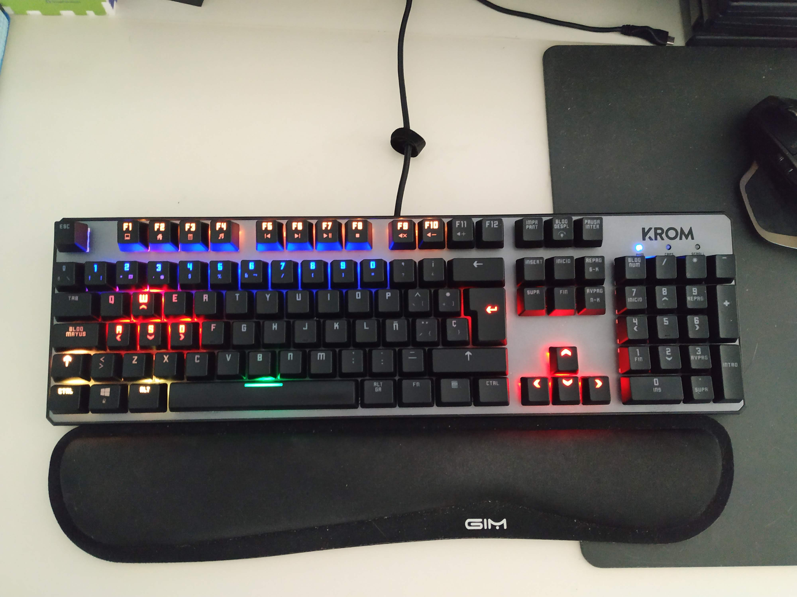