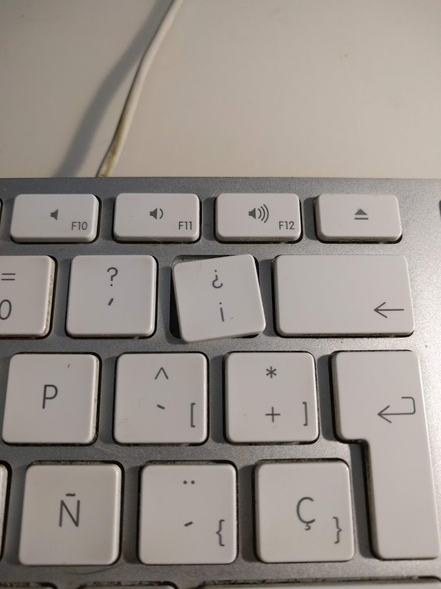

Ya no se si como deformación profesional o como "tara mental" propia, siempre he sido bastante quisquilloso con los periféricos, tanto teclado como ratón, porque al fin y al cabo paso al menos 8 horas diarias usándolos y es importante sentirse cómodo con ellos.

Yo trabajo principalmente en un equipo de sobremesa y hasta hace poco estaba usando el teclado de Apple, como el que se muestra en la foto (pero con layout en Español), no el "moderno" inalámbrico, sino el anterior, con cable.

<small>Foto : [Wikimedia](https://commons.wikimedia.org/wiki/File:Apple_Keyboard_with_Numeric_Keyboard_9612.jpg)</small>

Sobre el cable podemos abrir un debate, he probado de los 2 tipos (con cable e inalámbrico) y bajo mi punto de vista, para el uso que yo le doy, un teclado debe ser cableado por varios motivos:

- No tener que depender de pilas, baterías, etc.
  Quedarte sin pilas o batería mientras estas haciendo algo es muy molesto, y tenerlo enchufado para que cargue es básicamente lo mismo que que sea cableado.
- Respuesta: por muy bien que funcione un inalámbrico (que actualmente lo hacen), uno cableado lo hace mejor.

Este teclado lleva conmigo 10 años, y con pocos problemas, el único es que la tecla "¡¿" se ha roto, pero en cuanto a funcionamiento y estética estaba muy contento.

Te preguntarás por que me he decidido a cambiarlo, pues principalmente, por el tema de la tecla rota y por el mero hecho de cambiar.

Muchos programadores que conozco estaban usando teclados mecánicos y me quería probar si realmente era tan ventajoso y cómodo como comentaban.

Como casi siempre que hago una compra de algo que espero que me dure cierto tiempo, hice una pequeña investigación de las distintas tecnologías de los teclados y simplificándolo mucho están los clásicos (como el de Apple que tenía hasta el momento) y los _mecánicos_, los hay también de accionamiento óptico y capacitivo, pero no quiero perderme en los detalles ya que pretendo que esto sea más una valoración de la experiencia que un desglose técnico.

Así tras ver muchos teclados y _reviews_ de los mismos, como, en ese momento, no estaba completamente seguro de que el paso al mecánico fuese definitivo me decanté por un teclado con un precio contenido, y buena relación calidad precio.

# El "escogido": [Krom Kernel](https://amzn.to/2W4H0Xb)

<small>Foto: kromgaming.com</small>

Finalmente el escogido ha sido el que ves en la foto superior, el Krom Kernel un teclado mecánico con _switches_ _Outemu Red_, unos clones de los _Cherry Mx Red_ y con iluminación RGB configurable desde el propio teclado (sin software externo) que cuesta actualmente unos 55€ en [Amazon](https://amzn.to/2W4H0Xb) y del que además tienes una [versión sin teclado numérico](https://amzn.to/2WnkesR) (las llamadas _TLK_, Ten Key Less) por un poco menos (50€)

En este mes de uso que llevo con él, la adaptación ha sido muy rápida, desde el primer momento me ha parecido cómodo al escribir sin necesidad de hacer una fuerza excesiva en las teclas (de hecho parece que menos que el con teclado de Apple), la iluminación que la veía como algo "superfluo" aunque visualmente bonito, es algo a lo que se le puede sacar partido, por ejemplo, yo he configurado un layout (se pueden configurar varios con cambio rápido entre ellos) "imitando", salvando las distancias, al mítico teclado del CPC464.

<small>Foto : [Wikimedia](https://commons.wikimedia.org/wiki/File:Amstrad_CPC464_keyboard.jpg)</small>

En este video de la propia marca se pueden ver todos los modos de iluminación (me gusta mucho uno muy al estilo _Ghost in the shell_ que ilumina toda la línea a partir de la tecla pulsada, [minuto 3:30](https://youtu.be/ahmdj3OPBB8?t=210))

::youtube[]{id="ahmdj3OPBB8"}

Esos modos de iluminación, la verdad es que son _muy espectaculares_, pero siendo realistas, _son muy poco útiles en un uso real_.

Por ponerle algunas pegas al teclado, la iluminación, como se ve en las fotos, se "fuga" por debajo de las teclas, no es tan exagerado como se ve en las fotos. También hay que decir que no es homogénea, por ejemplo en las teclas "grandes", como el _backspace_ el color no es igual de luminoso que en las otras teclas, y me ha sucedido que el blanco de las teclas "0" y "." del teclado numérico no se ve blanco del todo en la configuración que uso, pero si cuando se coloca todo el teclado en blanco.

En cuanto a la sonoridad, es cierto que como casi todos los teclados mecánicos es más ruidoso, pero no es un sonido que me moleste, al contrario, y por lo que me han comentado, en una video llamada, no suena mucho más que el antiguo teclado de membrana que tenia.

En definitiva, por el precio que tiene este teclado cumple perfectamente, si dura como el anterior (10 años) ya sería la bomba, y viendo lo cómodo que me siento tras un mes de uso, creo que he hecho una compra de la que, al menos de momento, no me arrepiento.

Aquí dejo unas cuantas fotos con distintos layouts:

