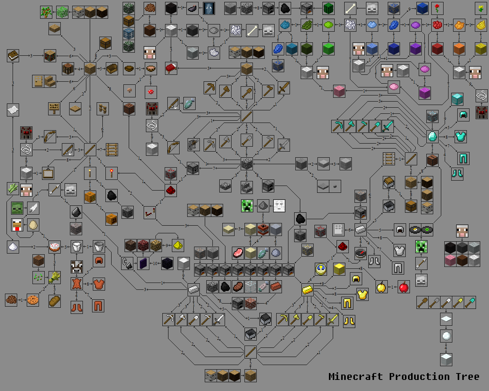
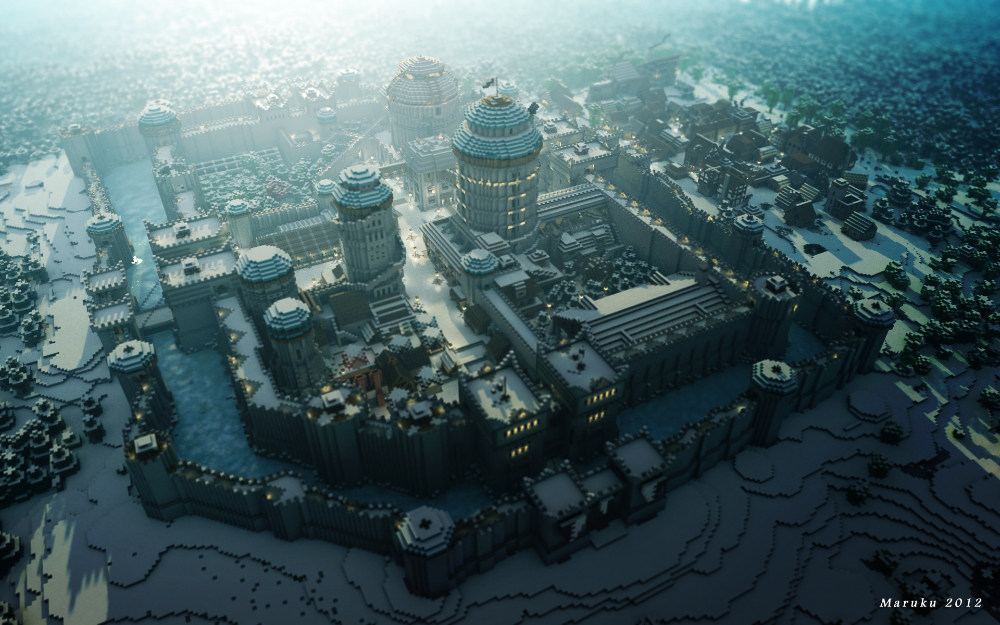
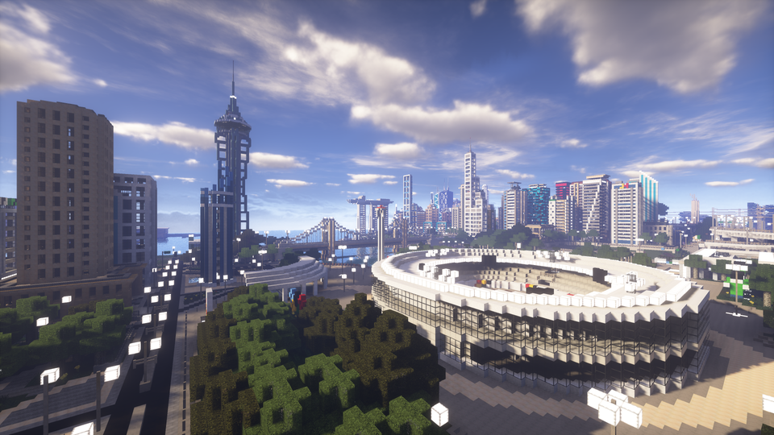
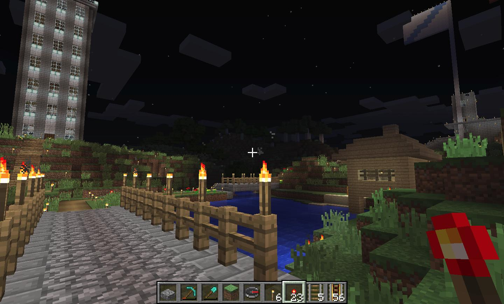
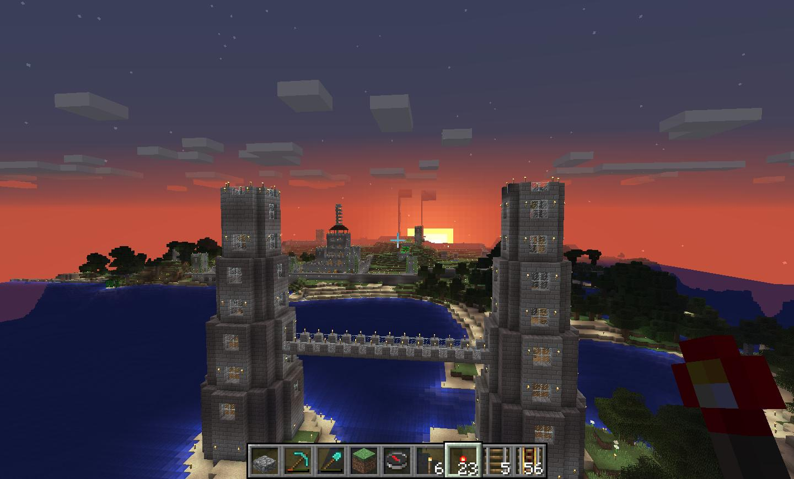
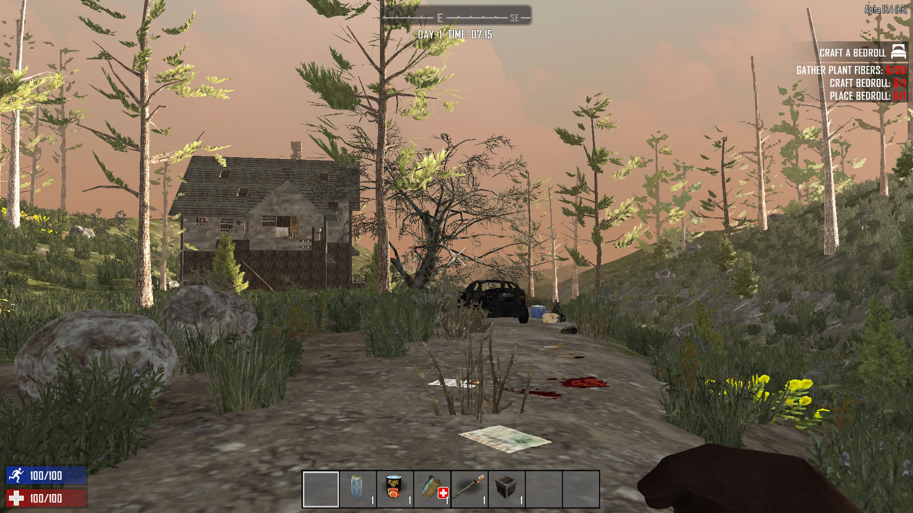
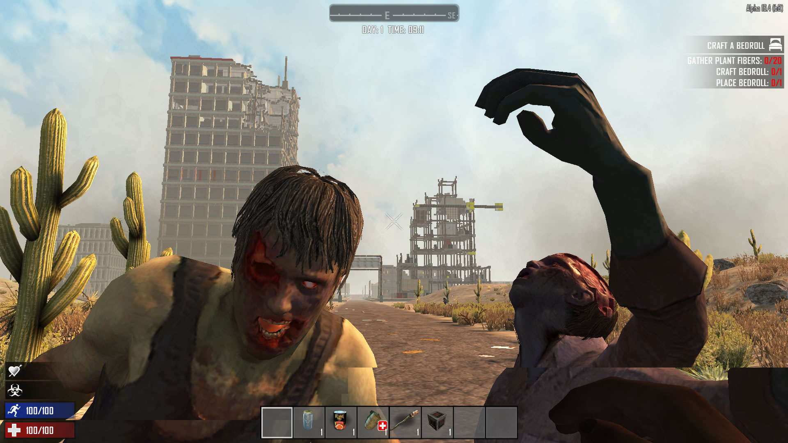
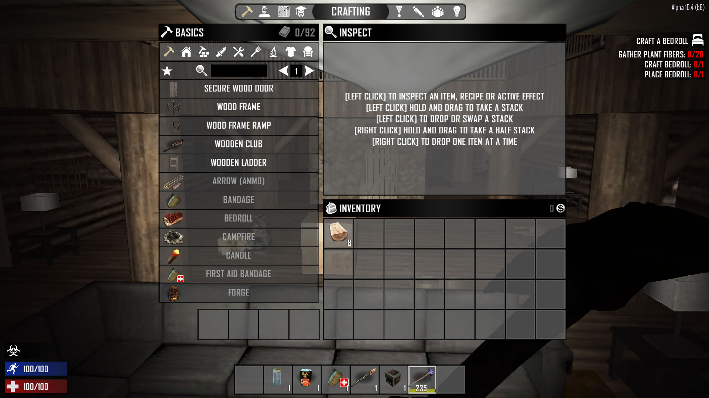

---

I've always loved video games since my **Amstrad CPC464** days.

Like everyone else, I have my favorite genres, and one of them is Sandbox or open-world games. For those who don't know them, they are games where the player's path isn't defined by the story or the programmer; that is, you can move throughout the game world with no limitation other than the "map borders" and you can *do whatever you want* (within the limit of the actions programmed in the game).

There are many examples of this type: _Fallout_, _GTA V_, _No Man's Sky_, _The Forest_, _Red Dead Redemption_, _Rust_, etc... you just have to look at [Steam's Sandbox tag](https://store.steampowered.com/tags/en/Sandbox/#p=0&tab=TopSellers) to get an idea.

In that list, I haven't mentioned the two that are the subject of this _post_: **Minecraft** and **7 Days to Die**. Both have something different from the rest, which is that the virtual world is completely modifiable.

# Minecraft

Let's start with **Minecraft**, a video game that might seem _childish_ but has a lot of potential for developing imagination and building "worlds."

In _Minecraft_, there is no objective as such; the world is composed of 1x1x1m blocks of different types: from the most basic ones like stone, dirt, wood, water, sand, etc., to furnaces, rails, lights, doors, etc.

<small>Simplified crafting chart available in Minecraft - Via: [Reddit](https://www.reddit.com/r/Minecraft/comments/gigmx/minecraft_production_tree_v3/)</small>

The player can obtain resources from these blocks to create tools (which allow them to extract new resources or the same ones more efficiently) or other blocks. For example: with wood, we can create sticks, and with these sticks and stone, we can create a stone pickaxe, which in turn allows us to mine iron ore blocks to make other tools.

This simple concept of _crafting_ generates a powerful gameplay mechanism and teaches the user to optimize resources and the effort required to obtain a certain object.

The level of construction freedom is such that you can find games online where people have built true virtual wonders: large buildings, cities, etc. For example, this online server that recreates the world of **[Game of Thrones](https://westeroscraft.com/)**. And all without forgetting that these "sets" are fully playable and visitable.

<small>Via: [https://westeroscraft.com](https://westeroscraft.com/chronicle/the-north/winterfell)</small>

<small>Via: [Reddit](https://www.reddit.com/r/Minecraft/comments/8v9tjb/i_play_this_game_like_cities_skylines_for_some/)</small>

<small>Screenshot from my game</small>

<small>Screenshot from my game</small>

# 7 Days to Die

**[7 Days to Die](https://store.steampowered.com/app/251570/7_Days_to_Die/)** is, for many, a _Minecraft_ for adults, adding survival and horror elements to the _sandbox_ genre.

It starts from the same base of a completely "breakable" world and obtaining resources for construction with an objective: to survive in an apocalyptic world full of zombies ([or infected](https://youtu.be/CH_6IjP4aoU?t=122)) whose goal is to finish us off. To make it even more complicated, every 7 days we will receive a visit from a zombie _horde_ that will tear down whatever is in its path.

In this game, we start with a can of food, a glass of water (yes, we'll have to worry a lot about getting food and drink), a torch... Not much, and we'll have to search for everything in the world, either by mining _Minecraft_-style or by looting trash bags, house furniture, broken-down cars, etc.

In this game, there are items that are not craftable (meaning we cannot build them from others) and can only be obtained by _looting_, which forces the player to explore a world that includes cities and towns.

It also adds a gameplay concept over _Minecraft_: _perks_ (or skills) that allow us to improve the player's profile, for example, by dealing more damage to zombies with a certain type of weapon or being able to carry more items without slowing down.

Another concept that adds difficulty and maturity to the game is _stamina_, which prevents us from running indefinitely (at least at the start of the game) or performing "physical" tasks without limit.

We have stealth to try to go unnoticed by the zombies.

Other elements I won't go into detail about are vehicles, firearms, armor (protection), and tool and weapon modifiers.

In my case, this game is capable of immersing me in that apocalyptic atmosphere full of dangers, where you have to gather resources to build your base with the main goal of defending yourself from zombies, especially the hordes that arrive every 7 days (as the title of the game says) and which become increasingly difficult to survive.

If you're more interested in the game, I'll leave you with this video from a YouTuber ([BuckFernandez](https://www.youtube.com/channel/UCWktmlIWDDxOYSmV7gRV9gw)) which is part of a series where he plays the latest version of the game.

::youtube[]{id="1rJxex9pbms"}

# Linux for gaming

As a technical note, I should mention that both games are cross-platform and run natively on Linux (which is what I primarily use), as well as on Windows and Mac (and in _Minecraft_'s case, on consoles, mobile, etc.).

And as a final curiosity, **7 Days to Die** is in _Early Access_, which means it's an unfinished game in the sense that, although it's fully playable, every so often the developers add new features. For example, as of today, it's in Alpha 17, and in the transition from Alpha 16 to 17, new weapons, mods, zombies, and buildings were added. For me, this is a plus, as you pay for a game that gradually improves, and you know that with your purchase, you're helping the developers create an even better game.