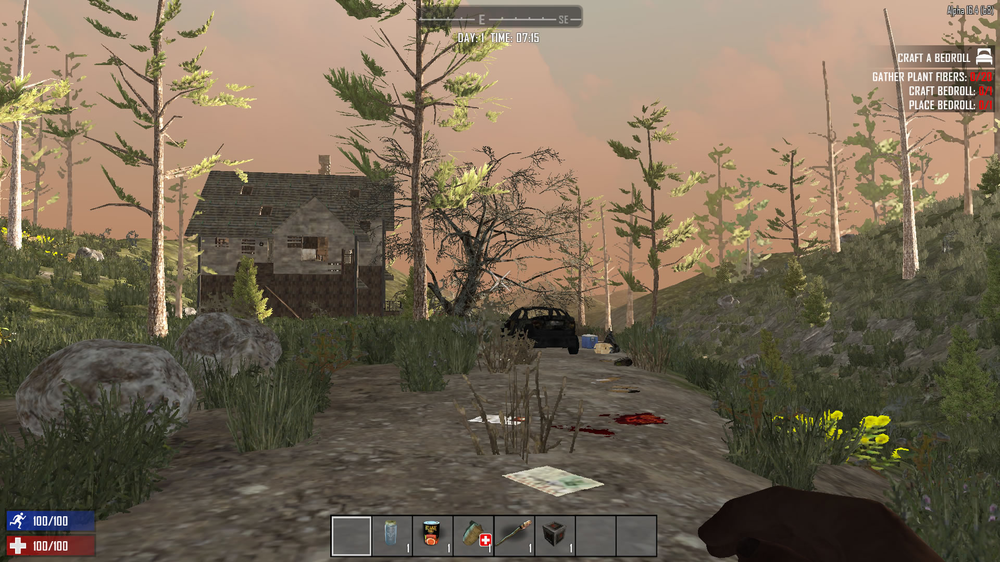

Siempre me han gustado los videojuegos desde mi época del **Amstrad CPC464**.

Como todo el mundo tengo mis géneros favoritos, y uno de ellos son los juegos de tipo _Sandbox_ o mundo abierto, para quien no los conozca son juegos en los que el camino del jugador no está definido por la historía, o por el programador, es decir puedes moverte por todo el mundo del juego sin más limitación que los "bordes de mapa" y puedes _hacer lo que quieras_ (son el límite de las acciones programadas en el juego).

Ejemplos de este tipo hay muchos: _Fallout_, _GTA V_, _No man's Sky_, _The Forest_, _Red Dead Redemtion_, _Rust_, etc... solo hay que ver en [Steam lo etiquetado bajo Sandbox](https://store.steampowered.com/tags/en/Sandbox/#p=0&tab=TopSellers) para hacerse una idea.

En esa lista no he mencionado los dos que el objeto de este _post_: **Minecraft** y **7 Days to Die**. Ambos tienen algo distinto al resto y es que el mundo virtual es totalmente modificable.

# Minecraft

Empecemos por **Minecraft** un videojuego que puede parecer _infantil_ pero que tiene mucho potencial para el desarrollo de la imaginación y la construcción de "mundos".

En _Minecraft_ no hay un objetivo como tal, el mundo está compuesto por bloques de 1x1x1m de distintos tipos: Desde los más básicos: piedra, tierra, madera, agua, arena, etc. Hasta hornos, railes, luces, puertas, etc.

<small>Gráfico simplificado de _craftings_ disponible en Minecraft - Via : [Reddit](https://www.reddit.com/r/Minecraft/comments/gigmx/minecraft_production_tree_v3/)</small>

El jugador puede ir obteniendo recursos a partir de esos bloques para ir creando herramientas (que le permitan extraer nuevos recursos o los mismos de forma más eficiente), u otros bloques, por ejemplo: con madera podemos crear palos y estos palos y piedra podemos crear un pico de piedra que a su vez nos permite picar bloques de mineral de hierro con el que podemos hacer otras herramientas.

Este concepto sencillo de _crafting_ genera un potente mecanismo de juego y enseña al usuario a optimizar los recursos y el esfuerzo necesario para obtener un determinado objeto.

El nivel de libertad de construcción es tal que en internet se pueden encontrar partidas de personas que han construido verdaderas maravillas virtuales: grandes edificios, ciudades, etc. Por ejemplo este server online que recrea el mundo de **[Juego de tronos](https://westeroscraft.com/)**. Y todo sin olvidar que estos "decorados" son totalmente jugables y visitables.

<small>Via : [https://westeroscraft.com](https://westeroscraft.com/chronicle/the-north/winterfell)</small>

<small>Via : [Reddit](https://www.reddit.com/r/Minecraft/comments/8v9tjb/i_play_this_game_like_cities_skylines_for_some/)</small>

<small>Screenshot de mi partida</small>

<small>Screenshot de mi partida</small>

# 7 Days to Die

**[7 Days to Die](https://store.steampowered.com/app/251570/7_Days_to_Die/)** es para muchos un _Minecraft_ para adultos, que añade al genero _sandbox_ el de _supervivencia_ y _terror_.

Parte de la misma base de mundo totalmente "rompible" y de la obtención de recursos para la construcción con un objetivo, y este es sobrevivir en un mundo apocalíptico lleno de zombis ([o infectados](https://youtu.be/CH_6IjP4aoU?t=122)) cuyo objetivo es acabar con nosotros y que para complicarlo más cada 7 días recibiremos la visita de una _horda_ de zombis que arrasarán lo que se ponga a su paso.

En este juego comenzamos con una lata de comida, un vaso de agua (si tendremos que preocuparnos mucho de obtener comida y bebida), una antorcha, ... Poca cosa y tendremos que buscar todo en el mundo ya sea minando al estilo _Minecraft_ o saqueando bolsas de basura, en los muebles de las casas, los coches averiados, etc.

En este juego hay objetos que no son crafteables (es decir no podemos construirlos a partir de otros) y que solo se pueden conseguir _looteando_ (saqueando), lo que obliga al jugador a explorar un mundo en el que tenemos ciudades y pueblos.

También añade un concepto de juego sobre _Minecraft_ que son los _perks_ (o habilidades) que nos permiten ir mejorando el perfil del jugador, por ejemplo haciendo más daño con un tipo de arma a los zombis, o pudiendo cargar más objetos sin ir más lento.

Otro concepto que añade dificultad y madurez al juego es el de _stamina_, que impide podamos correr indefinidamente (al menos el principio del juego) o hacer tareas "físicas" sin limite.

Tenemos sigilo para intentar pasar desapercibidos de los zombis.

Otros elementos sobre los que no voy a entrar en detalle son los vehículos, armas de fuego, armaduras (protección), modificadores de herramientas y armas.

En mi caso este juego es capaz de meterme en esa atmósfera de mundo apocalíptico lleno de peligros, en el que tienes que ir consiguiendo recursos para construir tu base con el principal objetivo de defenderte de los zombis y en especial de las hordas que llegan cada 7 días (como dice el título del juego) y que cada vez con más complicadas de pasar.

Si tenéis más interés en el juego, os dejo este video de un Youtuber ([BuckFernandez](https://www.youtube.com/channel/UCWktmlIWDDxOYSmV7gRV9gw)) que forma parte de una de las series en las que juega a la última versión del juego.

::youtube[]{id="1rJxex9pbms"}

# Linux for gamming

Como pincelada técnica he de mencionar que ambos juegos son multiplataforma, y funcionan en Linux de forma nativa (que es la que yo uso principalmente), también en Windows y Max (y en el caso de Minecraft en consolas, móviles, etc.)

Y como curiosidad final decir que **7 Days to Die**, está en _Early Access_ lo que quiere decir que es un juego inacabado en el sentido de que, aunque es totalmente jugable, cada X tiempo, los desarrolladores van añadiendo nuevas funcionalidades al juego, como ejemplo, a día de hoy está en el Alpha 17 y en el paso del Alpha 16 al 17 se añadieron nuevas armas, mods, zombis, nuevos edificios, etc. Para mí esto es un plus, ya que pagas por un juego que va mejorando poco a poco y sabes que con tu compra estas ayudando a los desarrolladores a crear un juego aún mejor.
