---

This week I decided to "retire" my mobile phone and replace it with a newer one, which made me think about all the phones I've had and how long they "lasted" me, leading me to write this post.

> I must note how much of an "old man" it made me feel to remember long-forgotten concepts like *prepaid*, *SMS*, ringtones, etc.

# The first mobile phone

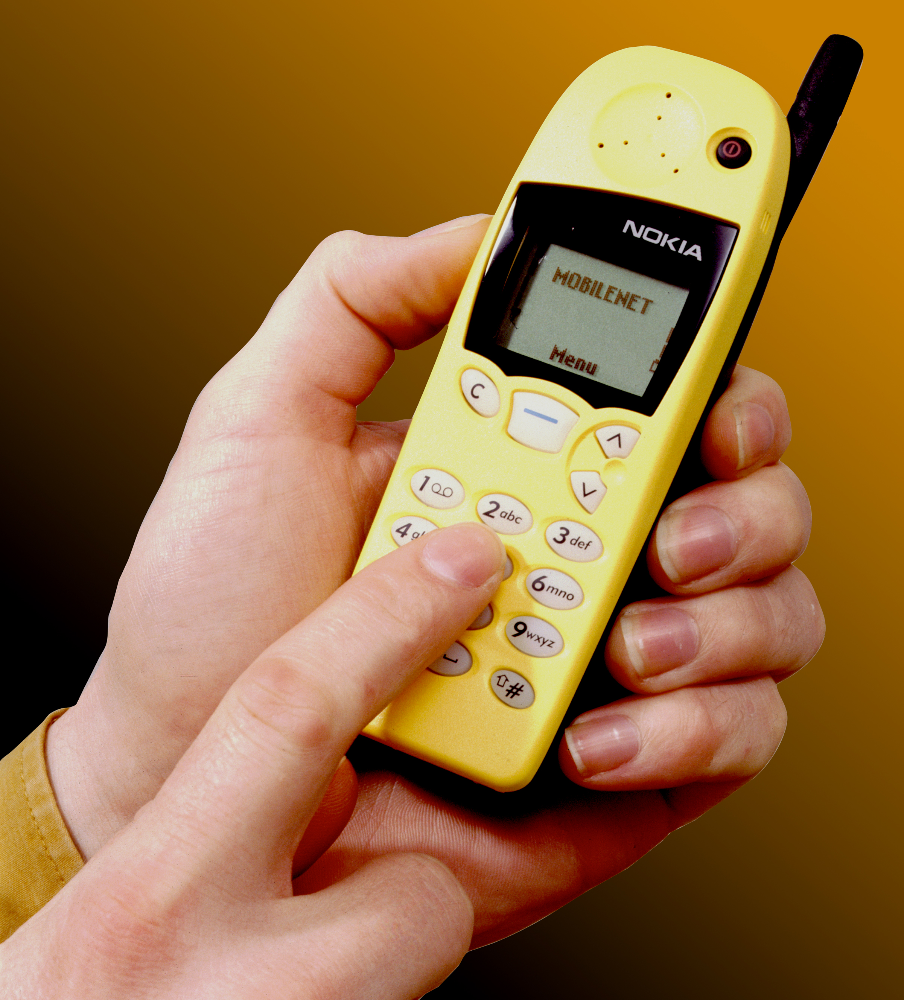
(Photo: [Wikimedia](https://commons.wikimedia.org/wiki/File:CSIRO_ScienceImage_2936_Nokia_mobile_phone.jpg))

My first mobile phone arrived back in *1999*, a brand new [Nokia 5510](https://es.wikipedia.org/wiki/Nokia_5110), a phone whose main feature was its interchangeable covers.

The advertisement featuring two guys swapping covers using a clothesline was very memorable at the time (everything in the ad was very nineties).

::youtube[]{id="Ji-_3To9p68"}

Unfortunately, this phone—which was second-hand—didn't last long with me because it only supported the 900MHz band. As soon as the operator I had at the time, [Amena](https://es.wikipedia.org/wiki/Amena) (the original Amena), started providing service on the 1800MHz band, the phone stopped being useful.

Feeling like a very "old man," I remembered how embarrassed we used to feel when a mobile phone rang in a public place, and how common it was for all of them to sound the same ("Ring Ring") so no one knew whose phone was ringing (back then, vibration was not a standard feature at all).

# [Motorola M3688](https://www.moviles.com/motorola/m3688/caracteristicas-detalle)

(Photo: https://www.milanuncios.com/moviles-motorola/motorola-m3688-296180854.htm)

From this one, I especially remember the flip cover, yet it was still necessary to lock the keypad (done by pressing a key for 2-3 seconds) to avoid accidental calls.

It's worth noting that at that time, a call could cost nearly €1 per minute + connection fee. :scream:

# [Erisson A1018s](https://www.gsmarena.com/ericsson_a1018s-114.php)

Photo: https://www.milanuncios.com/otros-moviles/movil-antiguo-247647249.htm

I think it was around the year 2000-2001 when I bought this phone.

The one I had was exactly like the one in the image, with the "cover" screen-printed with the Amena mascot, although it came with another bluer one if I remember correctly.

I remember this purchase very well; it was a pack called "Dúo" (an operator offer) where they "gave" you two identical phones with two consecutive phone numbers. This is the number I still keep today.

I also remember it was particularly resistant, as I dropped it quite a few times and the only thing that happened was that it would break apart into 3 pieces: the cover, the battery, and the phone body. You just had to put it back together and it would work.

# [Nokia 3210](https://es.wikipedia.org/wiki/Nokia_3210)

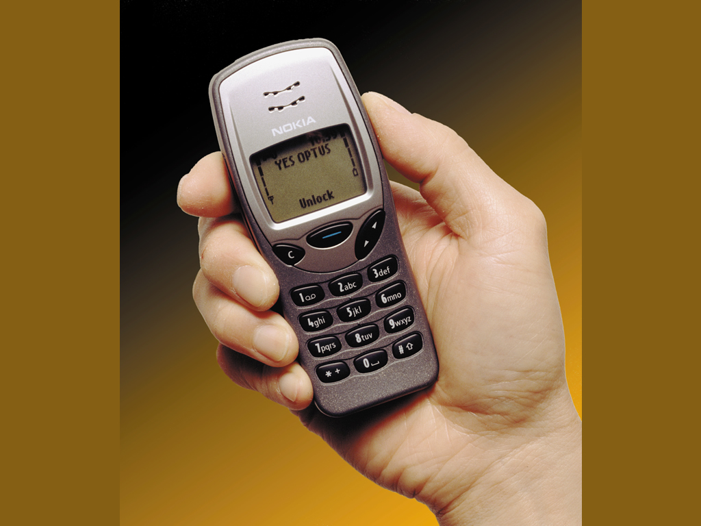
(Photo: [Wikimedia](https://commons.wikimedia.org/wiki/File:CSIRO_ScienceImage_2935_Nokia_mobile_phone.jpg))

Yes friends, I had one of those phones that memes remember as an indestructible phone, and the truth is that it was.

It had advanced things for its time, like phonebook management, being able to connect it to a computer (via cable) to change the operator logo, and "polyphonic ringtones."

# [Alcatel One Touch Easy](https://hipertextual.com/archivo/2013/05/alcatel-one-touch-easy/)

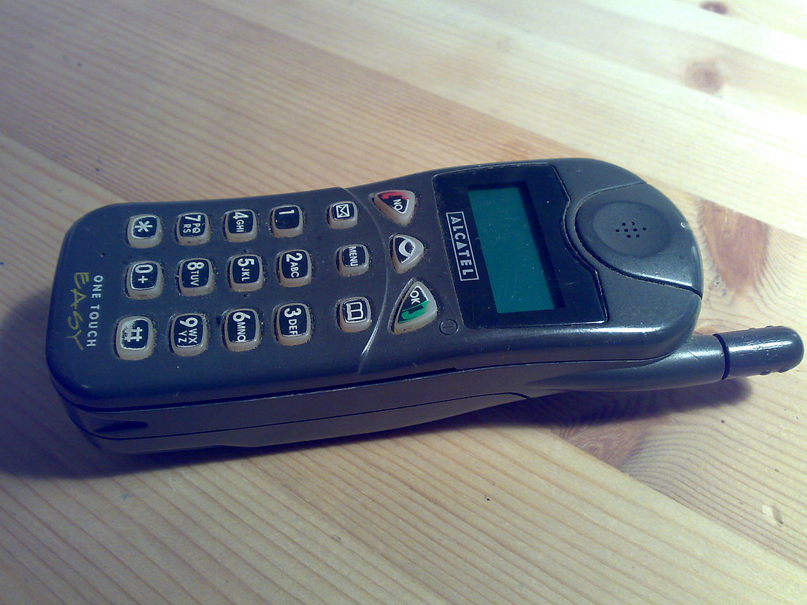
(Photo: [Wikimedia](https://commons.wikimedia.org/wiki/File:Alcatel04.jpg))

This was undoubtedly one of the worst phones I've ever had. I remember it being very slow, it would freeze and not notify you of calls; I remember that sometimes when I sat down, the battery would shift and it would turn off. It was a "wannabe" that couldn't quite make it.

# [Nokia 6210](https://en.wikipedia.org/wiki/Nokia_6210)

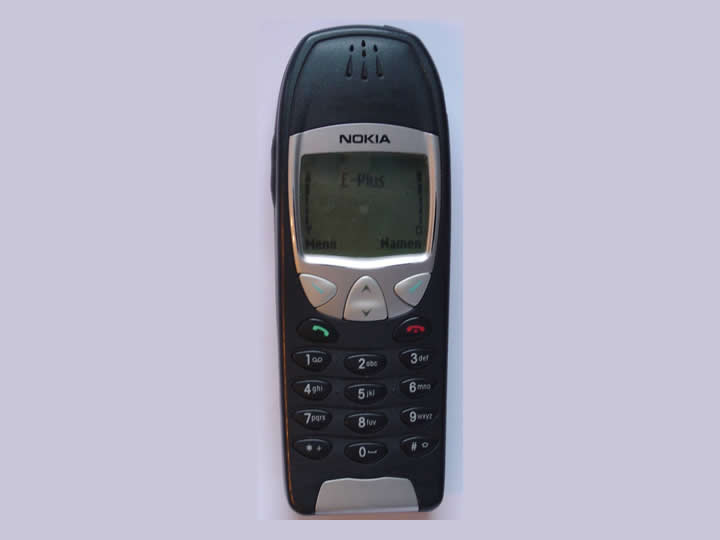
(Photo: [Wikimedia](https://commons.wikimedia.org/wiki/File:Nokia_6210.jpg))

Year 2002. This was the opposite case, one of the best phones I've ever had. It was from Nokia's "professional" range. It had spectacular phonebook management for its time, allowing multiple numbers for the same contact—something most phones of the era didn't even dream of. The screen was large for its time, and the battery lasted almost a week (while in use).

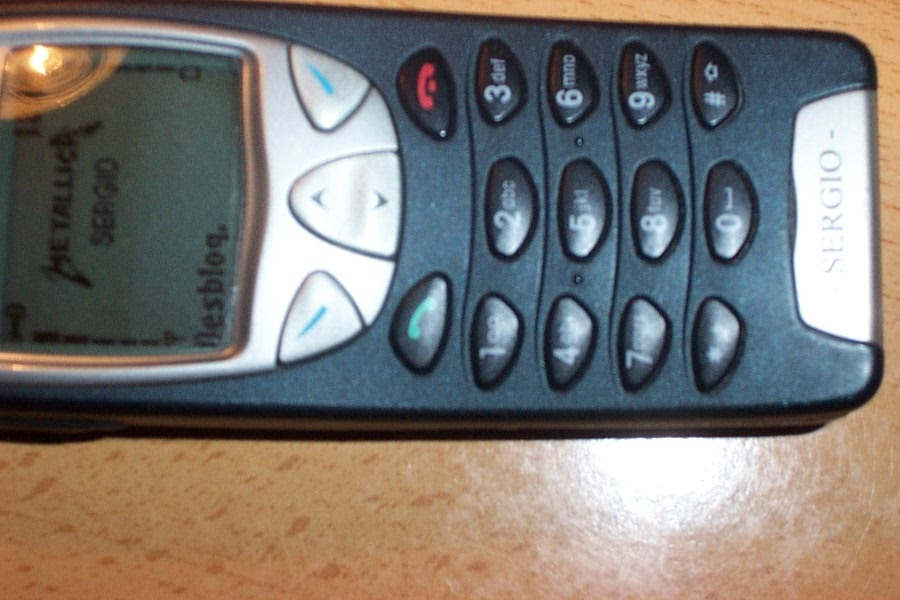
It had an infrared port to upload polyphonic ringtones, manage the phonebook (and back it up), and as seen in the following image (of my own phone), upload images as an operator logo.

I was very sad to have sold it to acquire the next phone; I would have liked to keep it, because as seen in the image, the bottom badge could be personalized and in fact, it was :joy:.

# [Nokia 6610](https://es.gsmchoice.com/es/catalogo/nokia/6610/Nokia-6610.html)

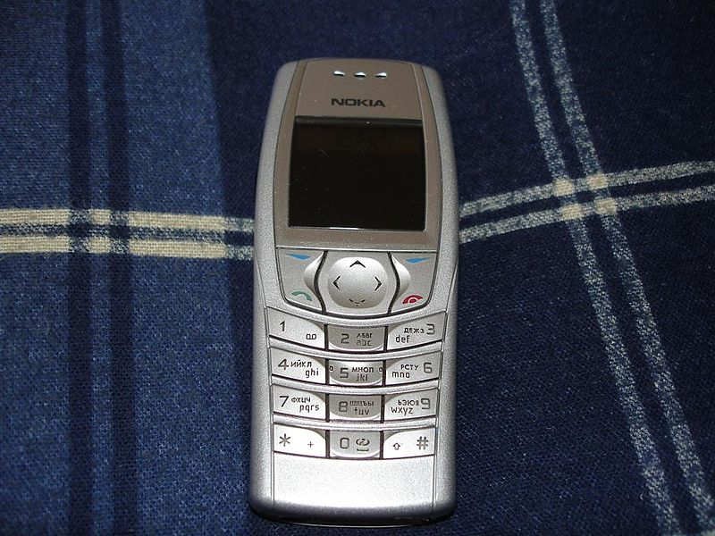
(Photo: [Wikimedia](https://commons.wikimedia.org/wiki/File:Nokia_6610i_silver.jpg))

Year 2003. My first color phone with a *camera*, although the camera was an [external peripheral](https://mobile-review.com/review/nokia-hsc1-en.shtml) :joy: and had a resolution of 640x480px, meaning 0.3 Megapixels. In the following photo, you can already see that the quality wasn't particularly good.

# [Nokia 3650](https://es.wikipedia.org/wiki/Nokia_3650)

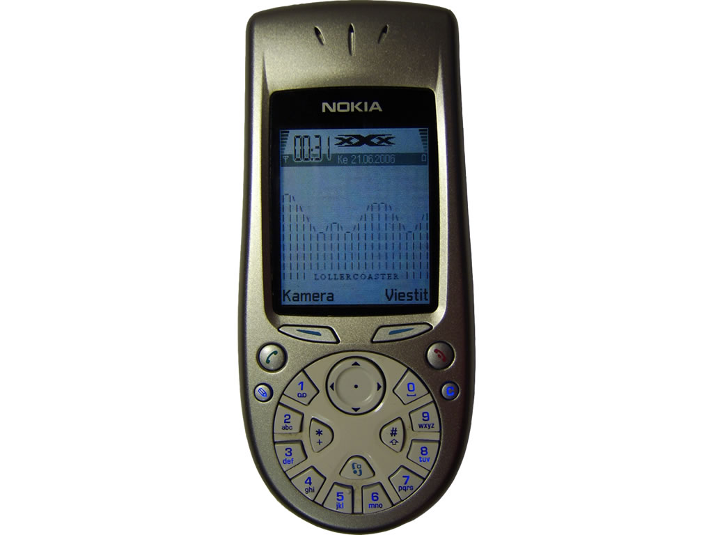
(Photo: [Wikimedia](https://commons.wikimedia.org/wiki/File:Nokia3650cutout.png))
Year 2003-2004. This curious phone, which I affectionately called "the washing machine" because of the shape of the keypad—which, despite what it might seem, was easy and fast to use—was my first *smartphone*.

It was a phone with [Symbian OS](https://es.wikipedia.org/wiki/Symbian), specifically version 6.1, which allowed installing applications, games, and communication with a very powerful phone management suite via PC. It already had an integrated camera. Everything was very primitive compared to the mobiles that would follow. The speed was quite fast for what was available at the time, though it marked the trend that would follow: the battery life was at best 1 day of use.

# [Qtek S100](https://en.wikipedia.org/wiki/HTC_Magician)

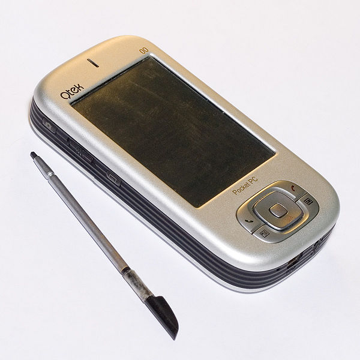
(Photo: [Wikimedia](https://commons.wikimedia.org/wiki/File:Qtek-S100.jpg))

Year 2005. This *Smartphone* or rather PDA with a phone, which was actually an HTC Magician, was another leap forward by having a (resistive) touchscreen operated with a stylus, although if you got used to it, you could manage it with your fingers. It was also my first phone with Wi-Fi, but I never really used it much.

Despite being a good device overall, the Windows Mobile 2003 operating system was terrible—continuous crashes and app errors led me to take a step back and go for the simplest phone possible.

# [Samsung L760v](https://pl.wikipedia.org/wiki/Samsung_SGH-L760)

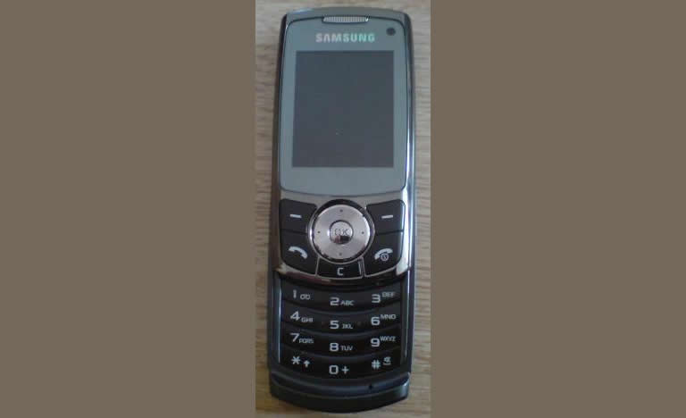
(Photo: [Wikimedia](https://commons.wikimedia.org/wiki/File:Samsung.JPG))

Year 2006. This was a step back in terms of being "smart," but it was a step forward in terms of battery life, lightness, speed, and comfort for carrying in a pocket.

A phone that I still keep and whose battery remained charged for several years while turned off.

# [HTC Touch 3g](https://en.wikipedia.org/wiki/HTC_Touch_3G)

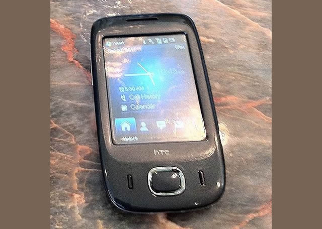
(Photo: [Wikimedia](https://commons.wikimedia.org/wiki/File:HTC_Windows_device_and_iPod.1owner.Egypt.jpg))

This one, back in 2007, was a return to *smartphones* again with Windows Mobile, but with an HTC skin (very cool, by the way) that allowed it to be easily managed by hand (without needing the stylus).

With this phone, I took the opportunity to sign up for my first data plan, understanding that it was the most logical way to use a *smartphone*.

# [HTC Magic](https://en.wikipedia.org/wiki/HTC_Magic)

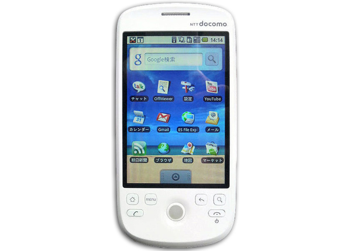
(Photo: [Wikimedia](https://commons.wikimedia.org/wiki/File:NTT_docomo_HT-03A_front.jpg))

It's been 10 years already (2009) since this phone; it was my first foray into the Android world. With Android version 1.5 (later updated to 1.6, which by the way made the phone run terribly slow), it was a step forward compared to the previous *smartphones* I had: multitasking, designed completely for finger use, included app store, and a decent web browser.

I really liked the "little ball," which besides serving as a notification light was a trackball, allowing you to move the cursor through text very comfortably.

# [HTC Desire](https://es.wikipedia.org/wiki/HTC_Desire)

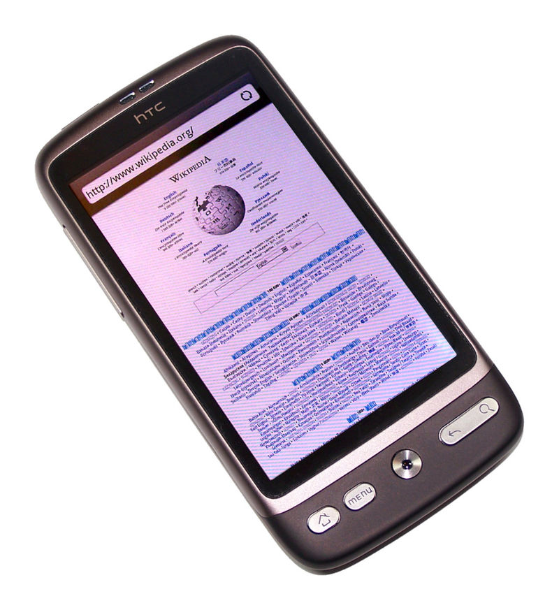
(Photo: [Wikimedia](https://commons.wikimedia.org/wiki/File:Htc-desire-2.jpg))

Year 2012. It was a leap in performance compared to the HTC Magic, with a good processor and memory for its time, and a good camera capable of recording video in 720p.

It maintained cursor management via an optical "trackball," which for my taste wasn't as good in terms of control as the physical ball.

With this phone, when HTC stopped releasing updates, I introduced myself to the world of *Rooting*, *flashing*, and installing Custom ROMs, mainly using [CyanogenMod](https://es.wikipedia.org/wiki/CyanogenMod).

# [Nexus 4](https://es.wikipedia.org/wiki/Nexus_4)

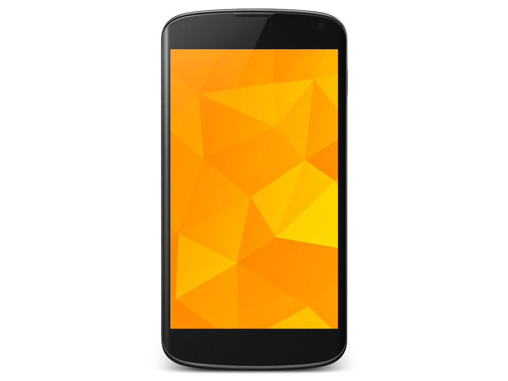
(Photo: [Wikimedia](https://commons.wikimedia.org/wiki/File:Nexus_4.png))

Year 2013. I was already tired of reading that many manufacturers were failing their promises to update the Android version (which they customized), and of seeing the amount of *bloatware* they installed, so I opted for this phone manufactured by LG but sold and maintained by Google.

A total success—a phone with high-quality finishing, quite a few technological innovations like NFC, and which I eventually replaced due to battery wear, but which a friend continued to use for 2 more years without problems.

# [Nexus 5X](https://es.wikipedia.org/wiki/Nexus_5X)

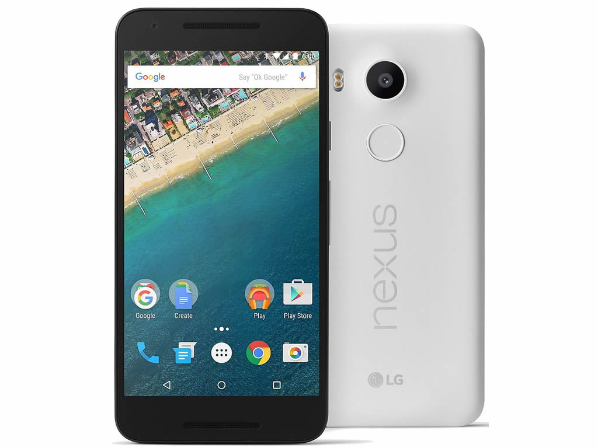
(Photo: [Wikimedia](<https://commons.wikimedia.org/wiki/File:Nexus_5X_(White).jpg>))

Year 2016. And this is the phone I currently have (until the new one arrives).
*A great phone with a major design flaw*. A year after getting it, one day it rebooted and wouldn't start anymore; it would reboot during the reboot process itself. Reading and searching for information, I found it was a design/manufacturing defect: the composition of the solder joints connecting the processor to the board would crack over time (depending mostly on heat) and certain pins would stop making contact, causing these constant reboots.

I called Google support and the service was very good; in a few days, I had another unit of the phone (refurbished) at home.

This happened to me again almost another year later, which led them to replace the phone for me again. That was a little over a year ago, so the warranty would no longer cover it, and that is partly the reason that led me to decide to change mobiles.

# [And now what?](https://amzn.to/2VxbUqF)

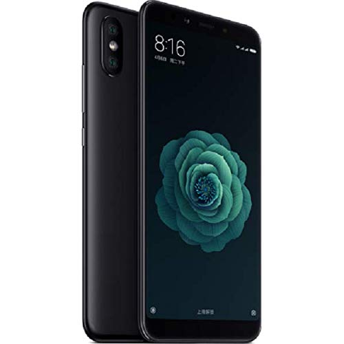

Well, now I have opted (after much evaluating of options) for a [Xiaomi A2](https://amzn.to/2VxbUqF), basically because it has practically everything I need or can use, for the price, because it still runs Android One—which should mean it receives system updates quickly—and because many people who have it recommended it to me.

If it lasts me 2 years, I'll be more than happy.

> Personally, regarding mobiles, I'm in a moment like in 2006, where I took a step back because I saw the market as stagnant, and I see that now, logically, there are no breakthrough features that invite you to change your phone.