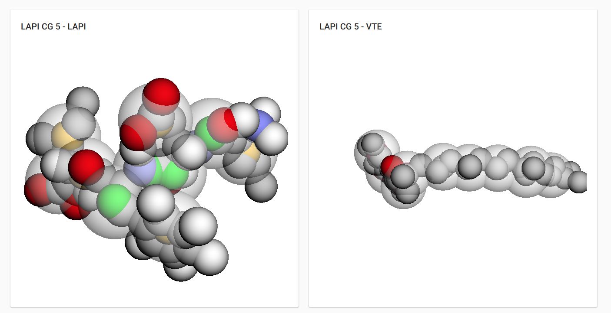

---

In all these years of _"doing things with computers"_, I have learned that sharing knowledge and code is a great way to give back a small part of what I've received, because after all, in my case, 90% of the software I use for development—whether tools, frameworks, libraries, or the language itself—is _Open Source_.

Here is a list of the projects I've released, grouped in a completely arbitrary way.

## Drupal

_Drupal_ is my favorite development CMS, and I have developed several modules for it that, in many cases, covered specific project needs not addressed by other modules:

- **[Commerce Billy Cancel](https://www.drupal.org/project/commerce_billy_cancel)**: Allows generating a specific billing series for canceled invoices.
- **[Follow Font Awesome](https://www.drupal.org/project/follow_fontawesome)**: Complements the Follow module by allowing the use of FontAwesome vector icons instead of images.
- **[SA-CORE-2018-002 Mitigation](https://www.drupal.org/project/sa_core_2018_002)**: Mitigates the exploitation of SA-CORE-2018-002 (https://www.drupal.org/sa-core-2018-002)
- **[Site publish countdown](https://www.drupal.org/project/sitepublishcountdown)**: Redirects anonymous users to a countdown page for the website's publication. Once the countdown ends, the site is published.
- **[3Dmol.js field](https://www.drupal.org/sandbox/sergiocarracedo/2917835)**: Adds a field and its _widget_ to allow displaying molecules using 3Dmol.js
  

- **Others**: [Block WoW](https://www.drupal.org/sandbox/sergiocarracedo/2636362) and [Simplelineicons](https://www.drupal.org/sandbox/sergiocarracedo/2816465)

## Deployer

[Deployer](https://deployer.org/) is my favorite code deployment tool, and for it, I created the recipe for (Drupal 7)[https://github.com/deployphp/deployer/blob/master/recipe/drupal7.php] and [Drupal 8](https://github.com/deployphp/deployer/blob/master/recipe/drupal8.php), recipes that have been improved over time by the community.

## Full project

This category includes full projects such as:

- 
  **[Sireno Grid](http://sirenogrid.com/)**, a lightweight CSS framework based on _CSS Grid Layout_ with _flexbox_ fallback
  <small>Thanks to [Pedro Figueras](https://www.pedrofigueras.com) for the logo design</small>
- **[User Group OBS Background](https://github.com/sergiocarracedo/ug-obs-background)**, an ElectronJS application that allows managing backgrounds for recording events using OBS.

- **[Backup Tasks](https://github.com/sergiocarracedo/backup-tasks)**, a tool for creating backup tasks and checking the integrity of remote files.

- **[Backup tools](https://github.com/sergiocarracedo/backup-tools)**, a simple tool that allows performing backups to git repositories.

## Collaborations

Here I list some of my collaborations on other types of projects: community websites, tools, etc.

- **[Vigotech.org website](https://github.com/sergiocarracedo/vigotech.github.io)**

- **[Vigotech-event-bot](https://github.com/sergiocarracedo/vigotech-event-bot)** bot written in _nodejs_ that is responsible for publishing upcoming events from [VigoTech Alliance](https://vigotech.org) on Twitter.

- **[Widget Made with love in Vigo](https://github.com/VigoTech/vigotech-made-with)**

---