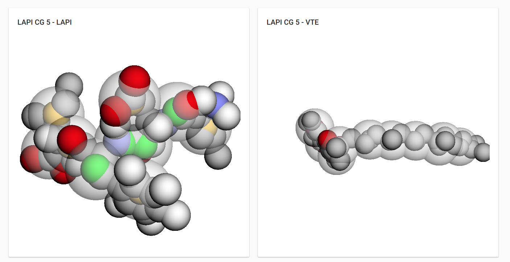

En todos estos años _"haciendo cosas con el ordenador"_, he aprendido que compartir conocimiento y código es una muy buena forma de devolver una pequeña parte de lo recibido, por que al fin y al cabo en mi caso el 90% del software que uso para desarrollar, ya sean herramientas, frameworks, librerias o el propio lenguaje son _Open Source_.

He aquí una lista de los proyectos que liberado agrupados por de una forma totalmente arbitraria.

## Drupal

_Drupal_ es mi CMS de desarrollo favorito, y para el he desarrollado varios módulos que en muchos casos cubrían necesidades específicas de proyectos que no estaban contempladas por otros módulos:

- **[Commerce Billy Cancel](https://www.drupal.org/project/commerce_billy_cancel)**: Permite generar una serie de facturación especifica de facturas anuladas.
- **[Follow Font Awesome](https://www.drupal.org/project/follow_fontawesome)**: Complementa al módulo Follow permitiendo usar iconos vectoriales de FontAwesome en lugar de imágenes.
- **[SA-CORE-2018-002 Mitigation](https://www.drupal.org/project/sa_core_2018_002)**: Mitiga la explotación del SA-CORE-2018-002 (https://www.drupal.org/sa-core-2018-002)
- **[Site publish countdown](https://www.drupal.org/project/sitepublishcountdown)**: Redireciona a los usuarios anónimos a una página de cuenta atrás para la publicación del sitio web. Una vez finalizada esa cuenta atrás se publica el sitio.
- **[3Dmol.js field](https://www.drupal.org/sandbox/sergiocarracedo/2917835)**: Añade un campo y su _widget_ para permitir mostrar moléculas usando 3Dmol.js
  

- **Otros**: [Block WoW](https://www.drupal.org/sandbox/sergiocarracedo/2636362) y [Simplelineicons](https://www.drupal.org/sandbox/sergiocarracedo/2816465)

## Deployer

[Deployer](https://deployer.org/) es mi herramienta de despliegue de código favorita, y para ella he creado la receta de (Drupal 7)[https://github.com/deployphp/deployer/blob/master/recipe/drupal7.php] y [Drupal 8](https://github.com/deployphp/deployer/blob/master/recipe/drupal8.php), receta que ha sido mejorada con el tiempo por la comunidad

## Full project

En esta categoría entran los proyectos completos como:

- 
  **[Sireno Grid](http://sirenogrid.com/)**, un framework CSS ligero basado en _CSS Grid Layout_ con _fallback_ a _flexbox_
  <small>Gracias a [Pedro Figueras](https://www.pedrofigueras.com) por el diseño del logo</small>
- **[User Group OBS Background](https://github.com/sergiocarracedo/ug-obs-background)**, una aplicación ElectronJS, que permite gestionar fondos para la grabación de eventos usando OBS.

- **[Backup Tasks](https://github.com/sergiocarracedo/backup-tasks)**, una herramienta de creación de tareas de backup y checkeo de integridad de ficheros remotos.

- **[Backup tools](https://github.com/sergiocarracedo/backup-tools)**, una simple herramienta que permite realizar backups contra repositorios git

## Colaboraciones

Aquí listo algunas de las colaboraciones en proyectos de otro tipo: websites de la comunidad, herramientas, etc.

- **[Sitio web Vigotech.org](https://github.com/sergiocarracedo/vigotech.github.io)**

- **[Vigotech-event-bot](https://github.com/sergiocarracedo/vigotech-event-bot)** bot escrito en _nodejs_ que se encarga de publicar los eventos próximos de [VigoTech Alliance](https://vigotech.org) en Twitter

- **[Widget Made with love in Vigo](https://github.com/VigoTech/vigotech-made-with)**
