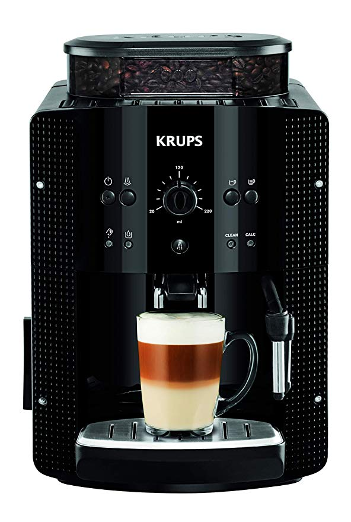

---

Although I can't consider myself a big "coffee lover," I do like to have breakfast with a good coffee in the morning.

Until a few years ago, the options for making coffee weren't many: drip coffee makers, Moka pots (Italian coffee makers), and not much else. (There were a few more options, but I'll focus on the most common ones). But since the appearance of single-dose capsules on the market, they have taken over, whether it's Nespresso, Senseo, Dolce Gusto, Tassimo, etc.

The advantages of capsules are many, but primarily it's the speed of having a freshly made, hot cup of coffee. This advantage over Italian and drip coffee makers is obvious.

The worst part is the price of the capsules, which in some cases brings the cost of a coffee close to that of having it in a coffee shop, and the amount of waste they generate—let's not forget that for every coffee we are throwing away a capsule, which are mostly plastic, in addition to its packaging.

At home, until about 2 years ago, we used a Senseo system, which is perhaps the one where each dose is most economical, but currently we have a [Krups Roma](https://amzn.to/2Puzy0I) automatic coffee maker, and this is where I wanted to explain what led us to this change.

This coffee maker grinds the coffee at the moment of making it, which gives it a freshness and aroma equal to or superior to capsules.

A bag of coffee beans costs from €5/kg to practically whatever you feel like spending, but for €6-7/kg you can have a more than decent coffee.

I have roughly calculated that for each coffee it uses about 10g (the leftover grounds it drops at the end weigh 15g, but they are wet, which increases the weight). This would mean that with a 1kg bag we could make 100 coffees, and for a cost of €7/kg, **each coffee/dose would cost us (approximately) €0.07**.

To compare the costs:

- Nespresso:
  - [Original capsules](https://amzn.to/2GQQfkB) (€123/kg) _€0.58/dose_
  - [Compatible capsules](https://amzn.to/2XOXKxU) (€25/kg) _€0.29/dose_
    &nbsp;
- Dolce Gusto
  - [Original capsules](https://amzn.to/2voNQGW) (€79/kg) _€0.79/dose_
  - [Original capsules](https://amzn.to/2GMFjUK) _€0.26/dose_
  - [Compatible capsules](https://amzn.to/2GLrVAg) _€0.27/dose_
    &nbsp;
- Senseo
  - [Capsules](https://amzn.to/2XLK7zu) _€0.11/dose_
    &nbsp;

These prices will surely vary and compatible capsules can be found at lower prices, but I don't intend to do such an exhaustive study; these are more like home calculations.

In my house, we make a low average of 120 coffees per month, which would mean in costs (I'm going to use the lowest prices per capsule):

- Nespresso: €69.6/month
- Dolce Gusto: €31.2/month
- Senseo: €13.2/month
- Krups: €8.4/month

&nbsp;
Obviously, to make a coffee we need a coffee maker for each capsule system:

- Nespresso: €69
- Dolce Gusto: €44
- Senseo: €59
- Krups: €234
  &nbsp;

Counting the coffee maker as a fixed cost (and removing from the equation the cost of water and electricity, which we assume are very similar among all coffee makers), let's see how long it would take to pay off the most expensive coffee maker. To do this, we'll look at the difference between its cost and that of the coffee maker of the system being compared, as well as the cost of the capsules:

- Krups vs Nespresso:
  - Coffee maker: €234 - €69 = €165
  - Monthly difference: €8.4 - €69.6 = -€61.2
  - **Months to pay off**: €165 / €61.2 = **2.69 months**
    &nbsp;
- Krups vs Dolce Gusto:
  - Coffee maker: €234 - €31.2 = €202.8
  - Monthly difference: €8.4 - €31.2 = -€22.8
  - **Months to pay off**: €202 / €22.8 = **8.86 months**
    &nbsp;
- Krups vs Senseo:
  - Coffee maker: €234 - €59 = €175
  - Monthly difference: €8.4 - €13.2 = -€4.8
  - **Months to pay off**: €175 / €4.8 = **36.46 months**
    &nbsp;

As can be seen, the automatic machine pays for itself, in some cases very quickly; it all depends on the amount of coffee made and the coffee/capsules used.

In the case of the comparison with the one we used until 2 years ago (Senseo), paying off the automatic coffee maker takes longer, but I can assure you that the taste of the coffee (and I repeat that I'm not a huge coffee lover) is better, as is the convenience of use.

> Maybe with a bit more time it would be interesting to add Moka pots, espresso machines, etc., to the analysis. **Anyone up for it?**

---