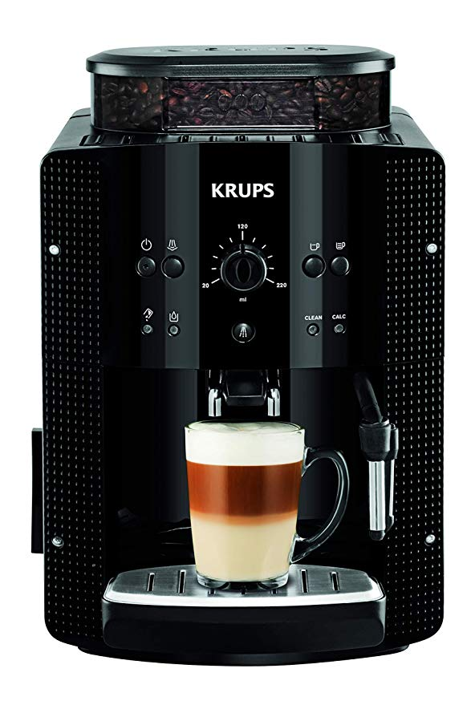

Aunque no me puedo considerar un gran "cafetero", si que me gusta desayunar con un buen café por las mañanas.

Hasta hace unos años las opciones para hacer casé no eran muchas: Cafetera de goteo, cafetera italiana y poco más. (Algunas opciones más tendríamos por eso me centraré en comentar las más habituales). Pero desde la aparición en el mercado de las Cápsulas monodosis, estas han copado el mercado, ya sean Nespresso, Senseo, Dolce Gusto, Tassimo, etc.

Las ventajas de las Cápsulas son muchas, pero principalmente es la rapidez en tener una taza de café recién hecho y caliente. Esta ventaja sobre las italianas y de goteo es obvia.

Lo peor es el precio de las Cápsulas, que en algunos casos acercan el coste de un café al de tomarlo en una cafetería y la cantidad de residuos que generan, no nos olvidemos que por cada café estamos tirando a la basura una capsula, que mayoritariamente son de plástico, además de su embalaje.

En casa hasta hace unos 2 años usamos en casa una de sistema Senseo que quizá es en la que cada dosis es más económica, pero actualmente tenemos una cafetera automática [Krups Roma](https://amzn.to/2Puzy0I), y aquí es donde quería explicar que nos ha llevado a este cambio.

Esta cafetera muele el café en el momento de hacerlo, lo que le hace tener una frescura y aroma igual o superior a las Cápsulas.

Un paquete de café en grano cuesta desde 5€/kg a prácticamente lo que se te ocurra gastar, pero por 6-7€/kg puedes disponer de un café más que decente.

He calculado de forma aproximada que para cada café gasta unos 10gr (el sobrante que suelta al terminar pesa 15gr, pero está mojado lo que aumenta él pero). Esto nos daría con un paquete de 1kg podríamos hacer 100 cafés y para un coste de 7€/kg, **cada café/dosis nos costaría (aproximadamente) 0,07€**

Por comparar los costes:

- Nespresso:
  - [Cápsulas originales](https://amzn.to/2GQQfkB) (123€/kg) _0,58€/dosis_
  - [Cápsulas compatibles](https://amzn.to/2XOXKxU) (25€/kg) _0,29€/dosis_
    &nbsp;
- Dolce Gusto
  - [Cápsulas originales](https://amzn.to/2voNQGW) (79€/kg) _0,79€/dosis_
  - [Cápsulas originales](https://amzn.to/2GMFjUK) _0,26€/dosis_
  - [Cápsulas compatibles](https://amzn.to/2GLrVAg) _0,27€/dosis_
    &nbsp;
- Senseo
  - [Cápsulas](https://amzn.to/2XLK7zu) _0,11€/dosis_
    &nbsp;

Estos precios seguramente varíen y se puedan encontrar cápsulas compatibles a precios inferiores, pero no pretendo hacer un estudio tan exhaustivo, son más unos cálculos caseros.

En mi casa hacemos una media a la baja de 120 cafés al mes, lo que supondría en costes (voy a usar los precios más bajos por cápsula)

- Nespresso: 69,6€/mes
- Dolce gusto: 31,2€/mes
- Senseo: 13,2€/mes
- Krups: 8,4€/mes

&nbsp;
Obviamente para hacer un café necesitamos una cafetera para cada sistema de cápsulas:

- Nespresso: 69€
- Dolce gusto: 44€
- Senseo: 59€
- Krups: 234€
  &nbsp;

Contando la cafetera como coste fijo (y eliminando de la ecuación el coste del agua y electricidad, que suponemos muy similares entre todas las cafeteras), vamos a ver cuanto se tardaría en amortizar la cafetera más cara, y para ello veremos la diferencia entre su coste y el de la cafetera del sistema a comparar y el de las capsulas:

- Krups vs Nespresso:
  - Cafetera: 234€ - 69€ = 165€
  - Diferencia mes: 8,4€ - 69,6€ = −61,2€
  - **Meses para amortizar**: 165€/61,2€ = **2,69 meses**
    &nbsp;
- Krups vs Dolce gusto:
  - Cafetera: 234€ - 31,2€ = 202,8€
  - Diferencia mes: 8,4€ - 31,2€ = -22,8€
  - **Meses para amortizar**: 202€/22,8€ = **8,86 meses**
    &nbsp;
- Krups vs Senseo:
  - Cafetera: 234€ - 59€ = 175€
  - Diferencia mes: 8,4€ - 13,2€ = -4,8€
  - **Meses para amortizar**: 175€/4,8€ = **36,46 meses**
    &nbsp;

Como se observa, la máquina automática se amortiza, en algunos casos de forma muy rápida, todo va a depender la cantidad de café que se haga y del café / cápsulas usadas.

En el caso de la comparativa con la que usábamos hasta hace 2 años (Senseo) el amortizar económicamente la cafetera automática, pero os puedo asegurar que el sabor del café (y repito que no soy muy cafetero) es mejor, lo mismo que la comodidad de uso.

> Quizá con un poco más de tiempo seria interesante añadir el análisis las cafeteras italianas, expreso, etc. **¿Alguien se anima?**
