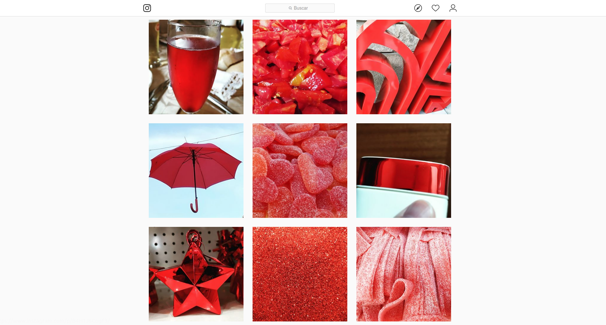
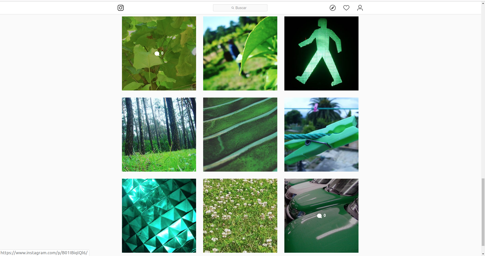
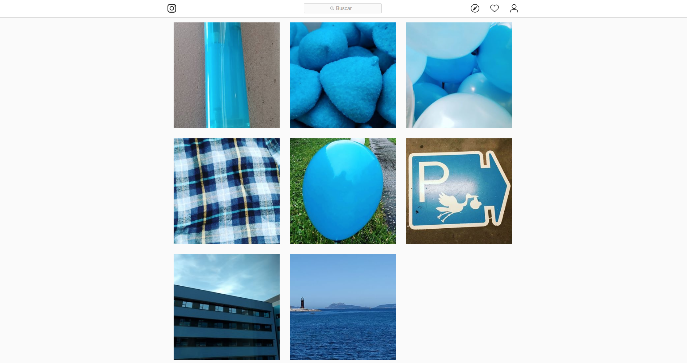

Este es mi primer post en inglés. Me he unido a un equipo cuyo idioma principal es el inglés y necesito mejorarlo :disappointed:

Empezaré escribiendo sobre temas no técnicos, en este caso sobre mis 3 cuentas públicas de Instagram.

### Rojo

Hace unos 3 años, en 2016, decidí crear una cuenta de Instagram solo para fotos de cosas rojas porque pensé en el efecto visual global en la página de perfil de la cuenta. Este es el efecto al que me refiero:

&nbsp;

Esta es la cuenta: https://www.instagram.com/sergiocarracedo.red/

### Verde

En agosto de este año creé otra cuenta con el mismo concepto, pero para cosas verdes: https://www.instagram.com/sergiocarracedogreen/

### Azul

Y unos días después, completé el proyecto RGB creando la de color azul: https://www.instagram.com/sergiocarracedo.blue/

&nbsp;

Al principio pensaba que hacer fotos basadas en un solo color sería fácil, pero me equivocaba. Hacer fotos es complicado; quizás las rojas son las más fáciles y las azules las más difíciles, siempre con la restricción de no repetir temática.

Hay muchas azules si piensas en el mar y el cielo, pero todas esas fotos serían similares.

Si te gusta esta idea (diferentes cuentas de Instagram basadas en colores), por favor síguelas:

- Rojo: https://www.instagram.com/sergiocarracedo.red/
- Verde: https://www.instagram.com/sergiocarracedogreen/
- Azul: https://www.instagram.com/sergiocarracedo.blue/
