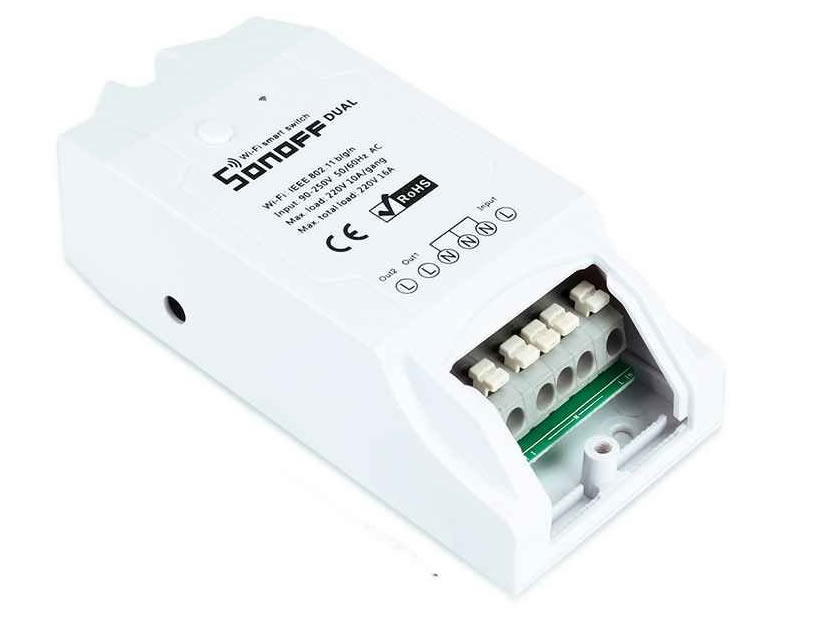
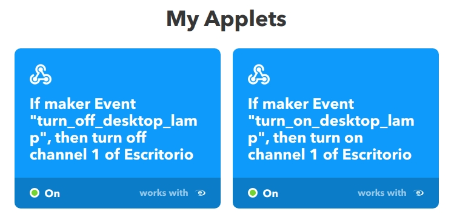

---


A few months ago, I bought [this little gadget](https://amzn.to/2HDOlWM): a Wi-Fi switch, with the intention of trying to "smart-ify" something at home.

This specific model is dual-channel, so it has two switches in the same device, but for this project, a single channel is enough.

Like most of these low-cost devices, it is based on the [chip ESP8266](https://es.wikipedia.org/wiki/ESP8266), originally used to provide Wi-Fi connectivity to Arduinos, but which has proven its reliability when used independently.

Since it was my first test, I didn't want to overcomplicate things and decided not to flash it or anything like that, using the "original" software instead.

After thinking about what to "smart-ify" for a while, I found a candidate. My [desk lamp](https://www.ikea.com/es/es/productos/iluminacion/lamparas-flexo/fors%C3%A5-l%C3%A1mpara-flexo-de-trabajo-niquelado-art-80146763/), **the one I always left on when I got up** from my desk :sweat_smile:.

The installation process for the Wi-Fi switch was very simple: cut the power cable and connect it to the new one.

> :warning: I think it goes without saying that for any wiring manipulation: always keep the lamp unplugged :warning:

Once everything was reconnected, I followed the steps indicated by the [eWeLink](https://sonoff.itead.cc/en/ewelink) app to sync the device, and right away I could turn the lamp on and off from my phone, which isn't practical at all.

My idea was to make the lamp turn on when unlocking the computer and turn off when it entered power-saving mode (monitor off).

While researching, I found a way for [_dbus_ to launch commands when the Gnome screensaver state changes](https://unix.stackexchange.com/questions/28181/run-script-on-screen-lock-unlock).

**lamp.sh**

```
dbus-monitor --session "type='signal',interface='org.gnome.ScreenSaver'" |
  while read x; do
    case "$x" in
      *"boolean true"*) echo "SALVA PANTALLAS ACTIVADO, APAGAR LAMPARA";;
      *"boolean false"*) echo "SALVA PANTALLAS DESACTIVADO, ENCENDER LAMPARA";;
    esac
  done
```

This _lamp.sh_ file must be launched at the start of our session every time we boot the machine, so the simplest way is to add it to the _Gnome_ _Startup applications_ list.

Now I just needed to be able to send those _events_ to the Wi-Fi switch management server, the same way the mobile app does.

What the switch does when we sync it is connect to an external server (this is the part I like the least, but it can be changed) and wait for commands. Using [IFTTT](https://ifttt.com/), we can link an eWeLink (or Sonoff) device with an event; in this case, the event is a _webhook_ that allows us to call a URL to execute the action.

This webhook looks like this: `https://maker.ifttt.com/trigger/[nombre_del_evento]/with/key/[la_key_que_te_da_ifttt]`



Where the **event name** is defined when creating it, and **la_key_que_te_da_ifttt** is provided to you by **IFTTT** when creating the first webhook: https://ifttt.com/maker_webhooks

Now all that's left is to create two _Applets_ in _IFTTT_ (one to turn it on and another to turn it off) linked to the actions provided for eWeLink, and tweak our _lamp.sh_ to call these webhooks.

**lamp.sh**

```
dbus-monitor --session "type='signal',interface='org.gnome.ScreenSaver'" |
  while read x; do
    case "$x" in
      *"boolean true"*) curl -X POST https://maker.ifttt.com/trigger/turn_off_desktop_lamp/with/key/[TU_KEY];;
      *"boolean false"*) curl -X POST https://maker.ifttt.com/trigger/turn_on_desktop_lamp/with/key/[TU_KEY];;
    esac
  done
```

It's not the perfect solution, especially regarding the dependency on an external server for something so simple, but it's a first step to build upon.

I forgot to mention that it's also possible to connect the switch to **Google Home**, **Alexa**, or **HomeKit**; I've tested it with _Google Home_ and it works correctly.
