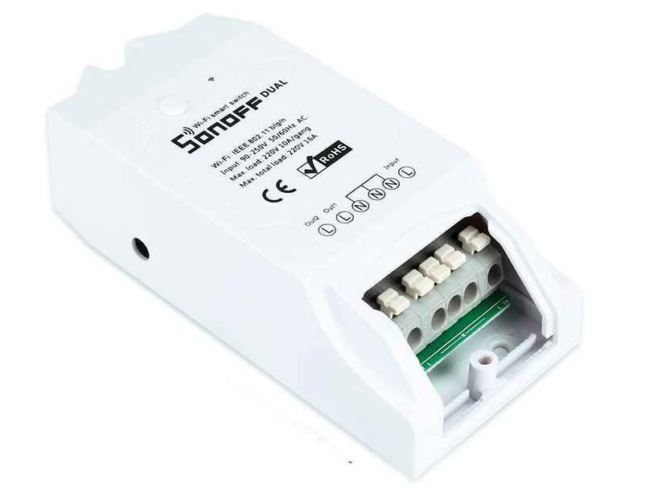
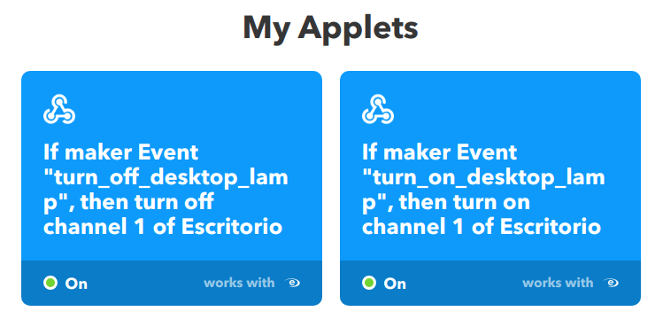

Hace ya unos cuantos meses había comprado [este aparatillo](https://amzn.to/2HDOlWM): un interruptor wifi, con la intención de probar a "domotizar" algo en casa.

Este modelo concreto es de doble canal por lo que lleva dos interruptores en el mismo aparato, pero para este proyecto con un sólo canal es suficiente.

Como la mayoría de estos aparatos de bajo coste están basado en el [chip ESP8266](https://es.wikipedia.org/wiki/ESP8266) usado originalmente para dotar de conectividad wifi a los Arduino, pero que ha demostrado su solvencia usado de forma independiente.

Como era mi primera prueba no quise complicarme mucho y decidí no flashearlo ni nada por el estilo usando el software "original"

Tras darle varias vueltas a que "domotizar" encontré un candidato. Mi [lampara de escritorio](https://www.ikea.com/es/es/productos/iluminacion/lamparas-flexo/fors%C3%A5-l%C3%A1mpara-flexo-de-trabajo-niquelado-art-80146763/), **esa que siempre me dejaba encendida cuando me levantaba** de la mesa de trabajo :sweat_smile:.

El proceso de instalación del interruptor wifi fue muy sencillo, cortar el cable de alimentación y conectarlo al nuevo.

> :warning: Creo que sobra decir que cualquier manipulación de cableado: siempre con la lámpara desenchufada :warning:

Una vez vuelto a conectar todo, seguí los pasos indicados por la app [eWeLink](https://sonoff.itead.cc/en/ewelink) para sincronizar el dispositivo y ya de entrada podía encender y apagar la lámpara desde el móvil, lo que no es nada práctico.

Mi idea era hacer que la lampara se encendiese al desbloquear el ordenador y que se apagase cuando este entrase en modo ahorro de energía (apagado del monitor).

Investigando, encontré la forma de que [_dbus_ lance comandos cuando cambia el estado del salva pantallas](https://unix.stackexchange.com/questions/28181/run-script-on-screen-lock-unlock) de _Gnome_

**lamp.sh**

```
dbus-monitor --session "type='signal',interface='org.gnome.ScreenSaver'" |
  while read x; do
    case "$x" in
      *"boolean true"*) echo "SALVA PANTALLAS ACTIVADO, APAGAR LAMPARA";;
      *"boolean false"*) echo "SALVA PANTALLAS DESACTIVADO, ENCENDER LAMPARA";;
    esac
  done
```

Este fichero _lamp.sh_ debe lanzarse al iniciar nuestra sesión cada vez que arranquemos el equipo, así que lo más simple es añadirlo a la lista de _Startup applications_ de _Gnome_

Ahora sólo me quedaba ser capaz de poder lanzar esos _eventos_ al servidor de gestión del interruptor wifi, de la misma forma que lo hace la app móvil.

Lo que hace el interruptor cuando lo sincronizamos es conectarse a un servidor externo (esta parte es la que menos me gusta, pero puede cambiarse) y esperar comandos. Usando [IFTTT](https://ifttt.com/) podemos enlazar un dispositivo eWeLink (o Sonoff) con un evento, en este caso el evento es un _webhook_ que nos permite llamar a una URL para ejecutar el evento.

Este webhook tiene esta forma: `https://maker.ifttt.com/trigger/[nombre_del_evento]/with/key/[la_key_que_te_da_ifttt]`



Donde el **nombre del evento** lo definimos al crearlo, y **la_key_que_te_da_ifttt** te la proporciona **IFTTT** al crear el primer webhook https://ifttt.com/maker_webhooks

Ya solo queda crear dos _Applets_ en _IFTTT_ (uno para encender y otro para apagar) enlazados a las acciones que nos proporciona respecto a eWeLink y retocar nuestro _lamp.sh_ para que llame a estos webhooks.

**lamp.sh**

```
dbus-monitor --session "type='signal',interface='org.gnome.ScreenSaver'" |
  while read x; do
    case "$x" in
      *"boolean true"*) curl -X POST https://maker.ifttt.com/trigger/turn_off_desktop_lamp/with/key/[TU_KEY];;
      *"boolean false"*) curl -X POST https://maker.ifttt.com/trigger/turn_on_desktop_lamp/with/key/[TU_KEY];;
    esac
  done
```

No es la solución perfecta, sobre todo en lo que respecta a depender de un servidor externo para algo tan simple, pero es un primer paso sobre el que evolucionar.

Olvidaba comentar que también es posible conectar el interruptor a **Google Home**, **Alexa** o **HomeKit**, yo lo he probado con _Google Home_ y funciona correctamente.
