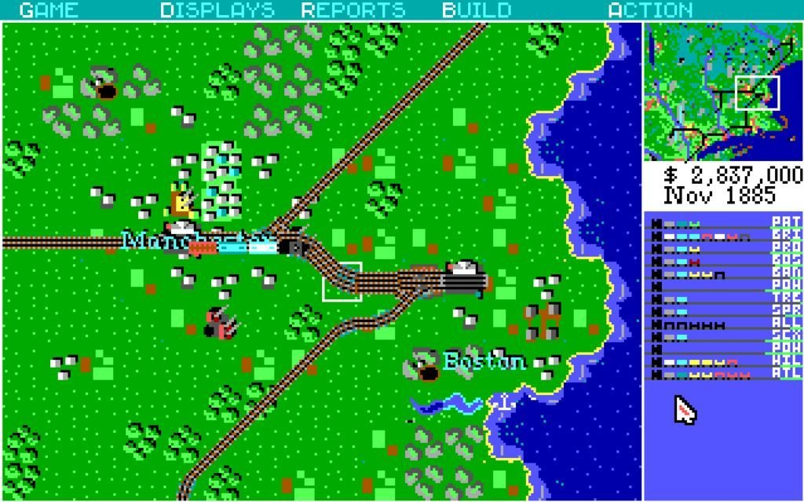
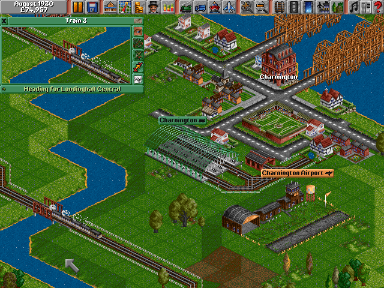
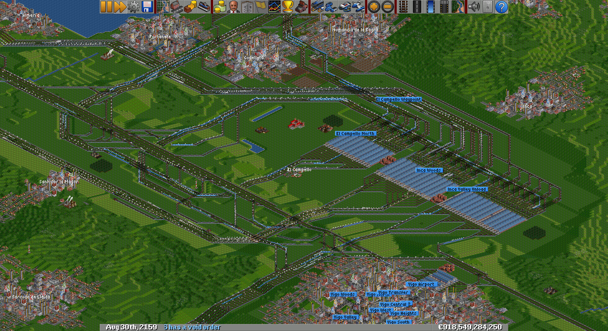

---

It's not always all about work; leisure moments are also important.

When I was little, I had a functional model train layout, which unfortunately, I remember most for the fact that it never worked correctly—problems with the transmission gears that, no matter how many spare parts were ordered, were never resolved.

Over the years, with the development of gaming in computing, "train games" began to appear that more than made up for that childhood trauma.

## Railroad Tycoon

A bit later, an MS-DOS game called [Railroad Tycoon](https://es.wikipedia.org/wiki/Railroad_Tycoon) came my way, which I believe was one of the first "Tycoons." This game consisted of creating a railway network (placing rails, stations, depots, etc., on a 2D map), creating and scheduling trains, etc.

You can [play this game online](https://archive.org/details/railroad_tycoon_1990) on archive.org using Chrome.

## Transport Tycoon

Back in 1994, a game was published that changed everything for me: [Transport Tycoon](https://es.wikipedia.org/wiki/Transport_Tycoon). One of the main differences from Railroad Tycoon is that the setting is a 3D isometric perspective, divided into "squares" where it is possible to place tracks, roads, etc., because this game doesn't just focus on trains—it allows you to manage fleets of road vehicles, planes, and ships in addition to trains.

The level of network control is very powerful, allowing you to design tracks in detail, with signals, tunnels, bridges, etc.

In 1995, a revision of this game called *Transport Tycoon Deluxe* or *TTD* appeared, which among other things, allowed for the creation of one-way signals to manage the network more efficiently.

Such was the success of that game that the community became interested in improving it and adding new features, creating *TTDPatch*, which among other things added Windows XP compatibility to the original game.

## OpenTTD

In 2003, a programmer began coding a TTD clone written in C (based on the disassembly of the original game), and in 2004, released it under the *GPL* license. Since then, the game has continued to grow with all kinds of new features: new terrain generation, different types of signals, and improvements in usability and fleet management.

It also incorporates a plugin manager called newGRF, ranging from new types of vehicles and fleets (for example, trams) to game graphics, music, etc.

The game can be downloaded at https://www.openttd.org/ for Windows, OSX, Linux, and other platforms.

This game is my *favorite train game*. I know there are newer games with "real" 3D graphics, but besides the nostalgia (I'm in love with those 8-bit graphics), I like it because it allows me to do something other games don't: think about optimizing transport lines, designing better junctions (to make them more efficient and faster), better station entries and exits, etc.

I'm leaving one of my latest savegames here—the one I created when I was hospitalized for 45 days, which helped make them a bit more bearable.

[Download savegame](https://my.pcloud.com/publink/show?code=XZN9pO7Z54UfL4jVEqQTX2zE3C5M34nqRohy)

[Download extreme savegame](https://my.pcloud.com/publink/show?code=XZUnpO7Z3fq41Cw61RYslUUnXB2PORyCXNOV)

---