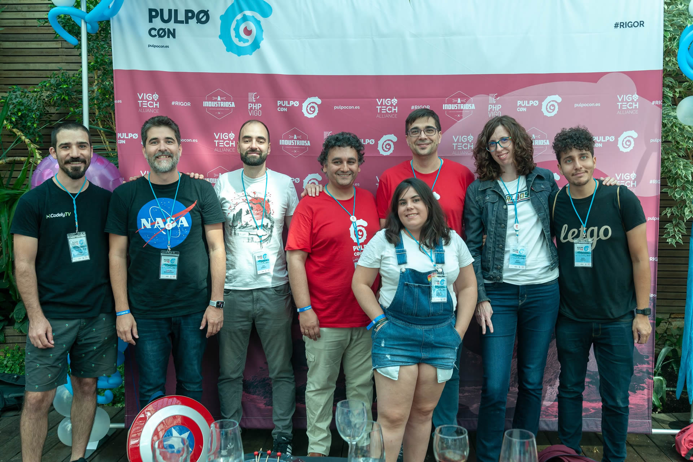
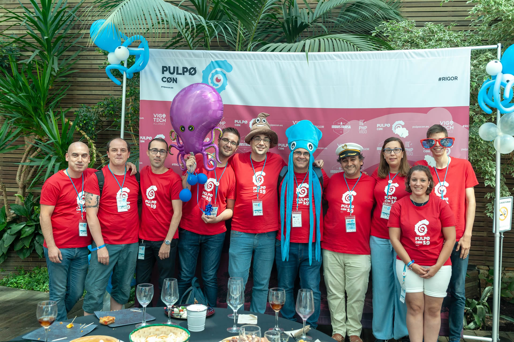
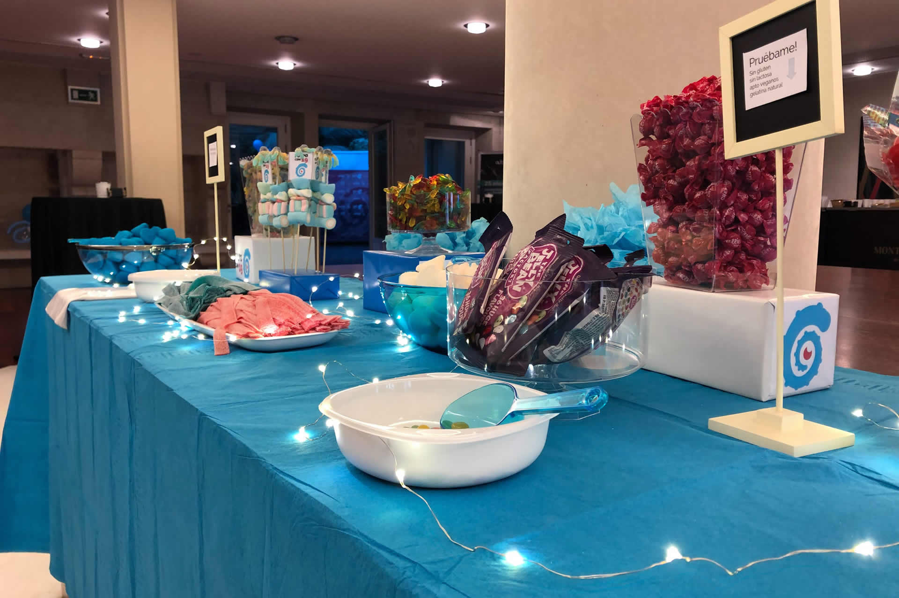
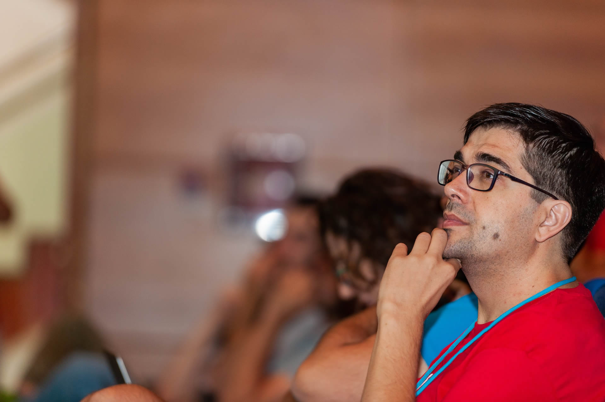

---

On September 7th, the first [PulpoCon](https://2019.pulpocon.es) was held, a conference for developers that I have had the honor of helping to organize.

I can add little to the story of how the event was forged beyond what is described in this _wonderful_ post by Rolando Caldas, which I highly recommend reading ⬇️⬇️⬇️⬇️⬇️

> [The battle of organizing PulpoCon](https://www.linkedin.com/pulse/la-batalla-de-organizar-pulpocon-rolando-caldas-s%C3%A1nchez/)

I can only corroborate everything said there and delve even deeper into the thanks to all the people who helped us put this together.

To add something, I would like to share a bit about my personal experience of what _PulpoCon19_ has meant to me.

Those who know me know that I'm not going through a good time; it has been an especially complicated year regarding my health.

When the idea of organizing an event in Vigo to bring in the greats of this world came up at the beginning of the year, I was
:astro-ref[recovering from lymphoma]{path="blog/2018/Cosas-que-he-aprendido-de-un-cancer"}
and I didn't know how I would feel about participating in "all this," but I was clear that I would try to do whatever was in my power.

And so it was: I did the little that was in my power, all while being aware—and this is **something I want to say loud and clear**—that _PulpoCon19_ would not be possible without the work of [Félix Gómez](https://twitter.com/felixgomezlopez) and [Rolando Caldas](https://twitter.com/rolando_caldas?lang=es), also co-organizers of PHPVigo.

The weeks and months went by preparing things (which Rolando recounts masterfully in his post).

July arrived and I "exploded" mentally with several anxiety attacks, which left me unable to cope with any tension or task involving stress.

I'm telling this to **thank Félix and Rolando again for allowing me to continue "inside" this**, despite the little help I could provide at that time.

This leads me to the next point: the fact that I could continue organizing the event during that "low" moment made me live an uplifting experience from a personal point of view, which I would have otherwise missed.

Despite how intense the previous days were—carrying boxes from one place to another, preparing the _welcome packs_ (I remember my living room full of boxes, t-shirts, bags, etc.), running around, almost out of breath—the memory I will keep is fantastic.

As I said in the title, the experience has been very uplifting; I have been able to learn many things: how an event of this type is organized, how much it costs to balance the accounts, getting sponsorships, how the community gets involved and helps more than imaginable, and the selfless collaboration of other communities.

I have to mention my wife here, **Patricia**, who was in charge of decorating the reception room and the garden. Although that was part of the sponsorship from the company where she works, **PartyFiesta**, her effort and dedication to the event went far beyond the norm, giving us ideas like using one of the octopus balloons to greet the speakers at the airport instead of the typical sign, or using the photocall as a place to take fun photos.

But I keep as a lesson the example that the speakers have been for me: _people who have dedicated a weekend of their lives to sharing their knowledge selflessly with all of us._

Because if you think about it coldly, what need do any of these people, who are leaders in their companies and in the profession, have to come all the way to Vigo to share their knowledge and professional experience? Well, you could tell me it's the octopus :octopus: and that is certainly a great reason :joy:, but for me, that effort is something I value very much.

I should mention how approachable everyone was, their interest in getting to know the city, the small cultural differences between all the places, etc.

Although most had already heard of our _beloved leader_, we told them a bit more, and most importantly, **they were able to take photos with the _Dinoseto_** :joy:

I hope they all liked the city, because part of our goal was to showcase the city in its full context: the tech community, the business landscape, tourism, and gastronomy, which is a must in Galicia.

I take away many small memories and feelings: Like when I drove Javier and Rafa (CodelyTV) and Jose Armesto to the speakers' dinner and hearing them talk felt like I was in one of their videos. Also, the laughs we had over the octopus hat and all the props for taking fun photos at the photocall.

I think that over time I will be able to value **even more** having been a part of the first **PulpoCon**.

Many thanks to everyone: speakers, volunteers, attendees, sponsors, venue staff, catering staff, and everyone who participated in some way in the event.

