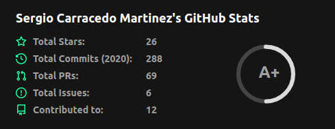

2020 está casi terminado, y fue un año que recordaremos por mucho tiempo. No quiero ser dramático, pero el 2020 dejó una marca profunda en todos nosotros.

# Profesional

En el terreno profesional, en enero comencé un nuevo trabajo como desarrollador frontend puro en una gran empresa. Este trabajo me brindó una gran oportunidad de trabajar con personas increíbles. Este empleo me obliga a hablar en inglés la mayor parte del tiempo, razón por la cual comencé a escribir este blog en inglés. Fue un desafío y lo sigue siendo, pero siempre me alegra enfrentarme a nuevos retos. En noviembre, me cambié a un nuevo trabajo, una oportunidad profesional impresionante, pero sobre todo una gran oportunidad de formar parte de un proyecto cuyo objetivo es ayudar a los demás y construir un mundo mejor y más equitativo.

# Comunidad

Este año fue un mal año para los grupos de desarrolladores. El 27 de febrero realizamos nuestro último evento presencial en PHPVigo, y tuvimos que tomar la difícil (pero correcta) decisión de cancelar la PulpoCon 2020. Sin embargo, tras unos meses de locura, empezamos a trabajar duro para hacer posibles los eventos online, inaugurando el canal de Twitch de PHPVigo. También empecé a ayudar un poco en otros grupos.

# Charlas

A pesar del mal año para las reuniones presenciales, pude dar algunas charlas:

- New features in ES2020 en https://www.youtube.com/watch?v=ziZO5KQM_KU&t=5248s
- Creating your own Vue UI components library: From scratch to NPM: https://www.youtube.com/watch?v=z_K5iuSjCDo

Ambas en español. También di dos charlas internas en mi antigua empresa (también en español).
Uno de mis objetivos para el futuro cercano era dar una charla en inglés, y lo logré en diciembre, en una charla interna de la empresa. Estoy muy orgulloso de ello porque hace un año casi no hablaba inglés.

# Open source

Este año creé 2 nuevos proyectos open-source.

- [OBS stream widgets](https://github.com/sergiocarracedo/obs-stream-widgets), cuando empezamos a dar charlas online, nosotros y otros grupos necesitábamos mostrar información en pantalla (etiquetas, títulos, cuenta atrás, etc.) y realizar el sorteo final para dar a los participantes algunas licencias gratuitas y otros obsequios. Este proyecto, escrito en JS, es un conjunto de herramientas para hacer eso.
- [Gandi-ddns-node](https://github.com/sergiocarracedo/gandi-ddns-node), necesitaba actualizar un subdominio con mi IP local (dinámica), por eso escribí este script que utiliza la API de Gandi.net para actualizar un dominio o subdominio si tu IP local cambia.

También realicé algunos PR a proyectos open-source, corrigiendo errores o añadiendo nuevas funcionalidades; mi pequeña contribución al mundo del código abierto.

# Personal

Aprendí muchas cosas este año: nuevos frameworks, herramientas, etc. También empecé a programar en un nuevo lenguaje con un paradigma diferente a los otros lenguajes que conocía: GoLang.

También hice nuevos compañeros de equipo, amigos y colegas, y volé por segunda vez en mi vida :sweat_smile:

Estoy seguro de que olvido muchas cosas en este resumen de 2020 pero, en términos generales, independientemente de la pandemia, este fue un buen año.

Espero que 2021 sea el año en que olvidemos la pandemia gracias a las vacunas, la ciencia y los grandes profesionales de la salud.

¡Feliz 2021!
