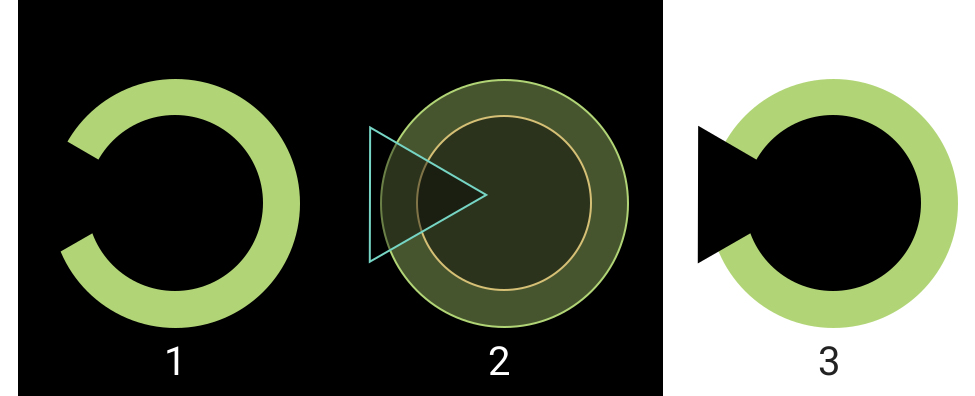

Uno de los gráficos más sencillos que puedes crear es un gráfico circular para representar el porcentaje de completitud de algo.

# Primera aproximación

Podríamos crear un documento SVG para dibujar nuestro donut. SVG nos permite representar elementos gráficos, por ejemplo, círculos, rectángulos, polígonos, etc... usando XML (y por lo tanto accediendo a los elementos a través del DOM). SVG es vectorial y es perfecto para el diseño responsive.



La Figura 1 representa ese tipo de gráfico: si el valor es 100%, el donut está completo; si es 50%, el donut es medio donut, y 0% significa que no hay donut.

Como puedes ver en la figura 2, este gráfico es la suma de 3 elementos: 1 círculo con los colores, un círculo más pequeño para crear la ilusión del centro vacío, y un triángulo para crear la ilusión de la parte que falta del donut por completar (si el valor de completitud es inferior al 50%, necesitarás añadir un rect para ocultar la mitad de los círculos).

Esta aproximación tiene un problema: el círculo pequeño y el triángulo tienen un color; si tu fondo tiene un color diferente o no es un color de fondo sólido, esta aproximación falla (figura 3).

# Segunda aproximación

Para evitar el problema del color de fondo no sólido, podrías usar [SVG Clip Path](https://developer.mozilla.org/en-US/docs/Web/SVG/Element/clipPath), que limita la parte del elemento (o grupo de elementos) que es visible. En este caso, deberías usar el círculo más pequeño y el triángulo como clip path del círculo más grande.

_¡Problema resuelto!_

Espera, los cálculos necesarios para dibujar el clip path pueden ser complejos; existe una forma sencilla de dibujar un donut.

# Usando Stroke

Estábamos dibujando los donuts como la diferencia entre dos círculos, el ancho del donut era la diferencia de radio (R1 - R2). ¿Hay otra forma de dibujar un donut? **Sí, una circunferencia con un stroke grueso.**

::iframe[]{src="https://codesandbox.io/s/interesting-field-ix2b6?fontsize=14&hidenavigation=1&initialpath=%23%2Fsimple-donut&module=/src/views/SimpleDonut.vue&theme=dark" width="100%" height="600"}

Oh, nuestro donut se está dibujando parcialmente fuera del elemento SVG y queda recortado. Eso es porque el stroke crece desde el centro de la línea: si el stroke es de 10px, se dibujarán 5px a un lado de la línea y otros 5px al otro lado. Por lo tanto, necesitamos restar la mitad del ancho del donut al radio de nuestra circunferencia y, en lugar de usar el radio, usaremos el tamaño del svg (en este caso el diámetro).

```js
radius = size / 2 - width / 2;
```

::iframe[]{src="https://codesandbox.io/s/interesting-field-ix2b6?fontsize=14&hidenavigation=1&initialpath=%23%2Fsimple-donut-2&module=/src/views/SimpleDonut02.vue&theme=dark" width="100%" height="600"}

¡Genial! Ya tenemos nuestro donut, ahora debemos eliminar parte de él para representar el porcentaje. En lugar de usar clip path, usaremos el atributo [stroke-dasharray](https://developer.mozilla.org/en-US/docs/Web/SVG/Attribute/stroke-dasharray). Este atributo nos permite definir cómo se dibuja el stroke; por ejemplo, `stroke-dasharray="1 1"` significa que la línea dibujará 1px sólido y 1px transparente (en este contexto, px no es un píxel de pantalla, es un píxel en el contexto del viewbox del SVG). Así que podríamos usar este comportamiento para dibujar un número de píxeles y dejar el resto transparente. Deberíamos calcular los números.

Primero necesitamos saber cuál es la longitud del círculo, esto es matemática básica: 2πR

```
const circumferenceLength = 2 * Math.PI * radius
```

Entonces la parte sólida es `circumferenceLength * percent / 100` y la transparente es `circumferenceLength * (100 - percent) / 100`, y este es el resultado.

::iframe[]{src="https://codesandbox.io/s/interesting-field-ix2b6?fontsize=14&hidenavigation=1&initialpath=%23%2Fsimple-donut-3&module=/src/views/SimpleDonut03.vue&theme=dark" width="100%" height="600"}

Usando esta técnica podríamos crear un componente con las propiedades: width, color, size, percent y podemos crear fácilmente gráficos de círculo de progreso, absolutamente responsive.

Además, puedes animar el dash array para que el cambio sea fluido cuando el valor cambie, o añadir una etiqueta de texto para mostrar el valor, o cualquier cosa que puedas imaginar.

¡Gracias por leer, espero que te guste!
