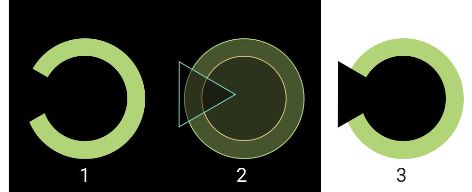

One of more simpler charts you can create is a circular chart to represent the percent of completion of something.

# First approximation

We could create a SVG document to draw our donut. SVG allow us to represent graphical elements, for example, cicles, rectangles, polygons, etc... using XML (and therefore accesing to the elements via DOM). SVG is vertorial and is perfect for responsive.



Figure 1 represent that kind of chart, if the value is 100% the donut is perfect, if is 50% donut is a half donut, and 0% means no donut.

As you can see in the figure 2 this chart is the addition of 3 elements: 1 circle with the colors, a smaller circle to create the illusion of the void center, and a triangle to create the illusion of the missing part of the donut to be completed (If the completion value if less than 50% you will need to add a rect to hide half of circles).

This approximation has an issue, the small circle and triangle have a color if your background has different color or is a non-solid background color, this approximation fails (figure 3)

# Second approximation

To avoid the non solid background color, problem, you could use [SVG Clip Path](https://developer.mozilla.org/en-US/docs/Web/SVG/Element/clipPath) that limits the part of the element (or group of elements) are visible. In this case you should use the smaller circle and the triangle as clip path of the bigger circle.

_Problem solved!_

Wait, calculations necessary to draw the clip path can be complex, there are a simple way to draw a donut.

# Using Stroke

We were drawing the donuts as the difference between to circles, the donut's width was the radius difference (R1 - R2) are there another way to draw a donut? **Yes, a fat stroke circumference.**

::iframe[]{src="https://codesandbox.io/s/interesting-field-ix2b6?fontsize=14&hidenavigation=1&initialpath=%23%2Fsimple-donut&module=/src/views/SimpleDonut.vue&theme=dark" width="100%" height="600"}

Oh, our donut is drawing partially outside SVG element and is cropped. That is because the stroke grows from the center of the line, if the stroke is 10px, 5px will be drawn in a side of the line and other 5px in the other side. So we need to subtract the half of donut width of our circumference radius, and instead of using the radius we will use the svg size (in the case the diameter)

```js
radius = size / 2 - width / 2;
```

::iframe[]{src="https://codesandbox.io/s/interesting-field-ix2b6?fontsize=14&hidenavigation=1&initialpath=%23%2Fsimple-donut-2&module=/src/views/SimpleDonut02.vue&theme=dark" width="100%" height="600"}

Cool! We have our donut, now we must remove part of it to represent the percent. Instead of use clip path we will use [stroke-dasharray](https://developer.mozilla.org/en-US/docs/Web/SVG/Attribute/stroke-dasharray) attribute. This attribute allows us to define how is drawn the stroke, for example `stroke-dasharray="1 1"` means line will draw 1px solid and 1px transparent (in this context px is not a screen pixel, is a pixel in the SVG viewbox context). So we could use this behavior to draw a number of pixels and leave the rest transparent. We should calculate the numbers.

First we need to know what is the circle length, this is basic math: 2πR

```
const circumferenceLength = 2 * Math.PI * radius
```

Then the solid part is `circumferenceLength * percent / 100` and the transparent is `circumferenceLength * (100 - percent) / 100`, and this is the result.

::iframe[]{src="https://codesandbox.io/s/interesting-field-ix2b6?fontsize=14&hidenavigation=1&initialpath=%23%2Fsimple-donut-3&module=/src/views/SimpleDonut03.vue&theme=dark" width="100%" height="600"}

Using this technique we could create a component with the properties: width, color, size, percent and we can create easy progress circle charts, absolutely responsive.

Also, you can animate the dash array to make a fluid change when value changes, or add a text label to show the value, or anything you can imagine.

Thanks for reading I hope you like it!
