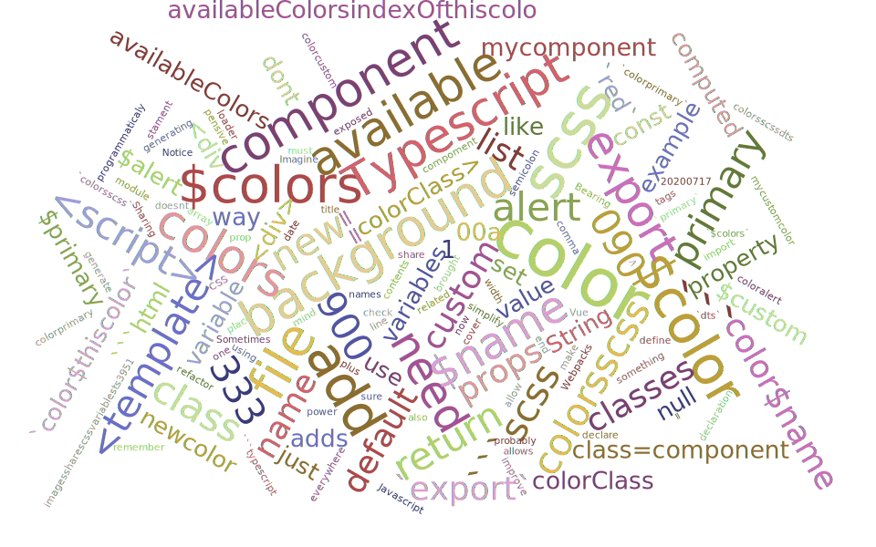
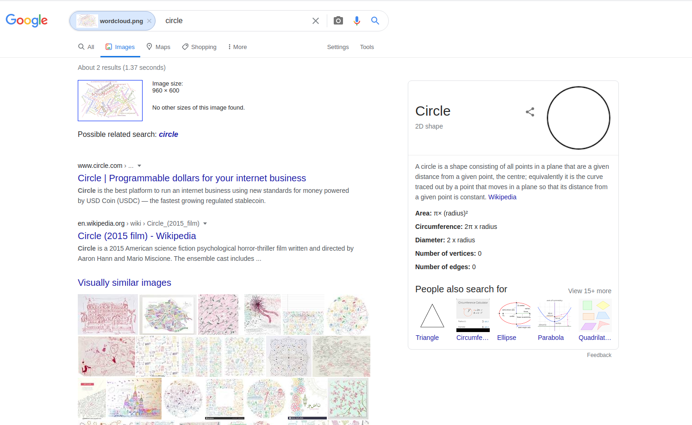
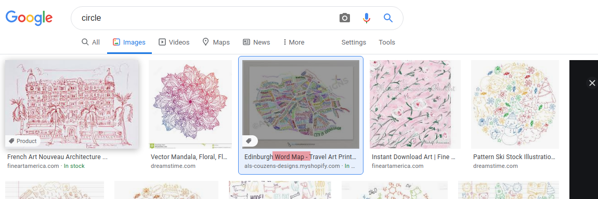

La mayoría de nosotros buscamos en Google todos los días, ya sea buscando un sitio web, noticias, una dirección, una receta de cocina, información sobre un tema que nos interesa, información técnica o cualquier otra cosa.

Todos los desarrolladores que conozco usan Google, otro motor de búsqueda, o buscan en páginas web como [stack overflow](https://stackoverflow.com/) todos los días para encontrar la mejor manera de realizar una tarea.

Entonces, ¿es una habilidad? ¿Deberías saber cómo resolver una tarea sin usar Google u otra fuente de conocimiento?

No lo creo, parte de nuestra habilidad debería ser saber cómo encontrar información sobre la tarea. Esto se ha hecho durante siglos, simplemente hemos actualizado (añadido) las fuentes de conocimiento; en el pasado, las fuentes eran libros físicos, conocimiento oral, etc. Pero ahora tenemos estas fuentes y más, como las fuentes online, y Google y otros motores de búsqueda son la forma de llegar al conocimiento que necesitamos en algún momento.

Imagina que tienes la tarea de crear algo como esto:

¿Sabes cómo hacer eso? Si lo sabes, genial, qué suerte tienes, pero yo no sé cómo hacerlo.

Supongo que el siguiente paso es buscar cómo hacerlo, pero, ¿cómo se llama esta cosa? Si no lo sabes, necesitas encontrar el nombre de la "cosa" que debes desarrollar.

¿Cómo lo haces? En ese caso (supondremos que tienes esta imagen como referencia de la tarea), supongo que una buena idea podría ser usar [Google Image Search](https://www.google.es/imghp).

Si subimos esa imagen, Google interpreta la imagen como un círculo. ¿WTF? Quizás sea porque lee las palabras en la imagen y cree que son atributos de un círculo. Quién sabe ¯\\_(ツ)_/¯

Así que, a simple vista, Google no devuelve información relevante sobre el nombre de esta cosa.

Pero si miras de cerca la sección de "Visually similar images", la mayoría son imágenes bonitas con colores parecidos, pero la tercera es similar a nuestra imagen: también tiene palabras, y si miras aún más de cerca, el título de la imagen es **WordMap**

No entraré en detalles, pero es fácil encontrar la relación con el término **Word Cloud**, que es la "cosa" que debemos crear, y podríamos buscar la teoría y las matemáticas detrás de eso, encontrar una library que haga la tarea o crearla desde cero y finalmente realizar nuestra tarea.

Probablemente estarás de acuerdo en que usar la experiencia de otros es parte del trabajo del desarrollador (es parte de cualquier trabajo), lo estamos haciendo todo el tiempo, y encontrar la manera de llegar a esa experiencia y conocimiento supongo que es una habilidad.

Creo que los empleadores deberían valorarlo como otra habilidad, tal vez sea solo una soft skill, pero si tu empleado no la tiene, podría pasar mucho tiempo simplemente tratando de saber cómo encontrar la manera de hacer alguna tarea o encontrar información y conocimiento.

Algunas personas incluso consideran que saber buscar en Google [es la habilidad más importante que debe tener un desarrollador](https://medium.com/how-i-learned-ruby-rails/why-googling-is-the-most-important-skill-a-developer-must-have-d69b89b22218). Yo no me atrevería a decir tanto, pero creo que es una habilidad importante.

¿Qué piensas? ¿Debería ser una soft o una hard skill?
