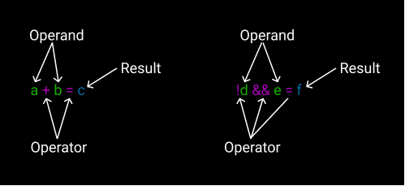

## ¿Qué es un operador?

Un operador es un símbolo que define la operación a realizar entre uno o más operandos.



Usamos muchos operadores: suma (+), resta (-), multiplicación (\*), división (/), and lógico (&&), negación (!),...

## ¿Qué es un operador unario?

Un operador unario es un operador que solo necesita un operando para funcionar.
Por ejemplo:

```javascript
i++;
```

En este ejemplo tenemos un operando (`i`) y un operador (`++`), no necesitamos nada más para incrementar el valor de la variable `i`.

## Operadores unarios en Javascript

Aquí tienes una lista con los operadores unarios más comunes en Javascript:

- `++` **Incremento**. Incrementa el valor del operando en una unidad.
- `--` **Decremento**. Decrementa el valor del operando en una unidad.
- `!` **Not lógico**. Niega el valor booleano del operando.
- `-` **Negación**. Niega el valor numérico del operando.
- `typeof` Devuelve el tipo del operando en una cadena de texto (string).
- `delete` Elimina el índice de un array o una propiedad de un objeto.

## Hackeando el sistema

Hay otro operador unario del que no he hablado, la **suma unaria** (`+`).

```javascript
let a = 10;
console.log(+a);
```

¿Cuál crees que será el resultado? Probablemente tengas razón: `10`.

Entonces, ¿para qué sirve este operador si devuelve el mismo valor? Aquí tienes otro ejemplo.

```javascript
let a = '10';
console.log(+a);
```

En este, ¿cuál crees que será el resultado? Sí, es `10`, pero no el mismo `10` que teníamos. **¿Qué?**

Repitamos, pero ahora miremos los tipos:

```javascript
let a = 10;
console.log(type + a);

let b = '10';
console.log(type + a);
```

Ambos resultados son `number`. Aquí está el punto: este operador (intenta) convertir el valor a número. Así que podemos usarlo para convertir (cast) valores a `number`.

```javascript
console.log(+'10a'); // NaN
console.log(+'0x10'); // 16
console.log(+'0o10'); // 8
console.log(+'0.1'); // 0.1
console.log(+'1e12'); // 1000000000000
console.log(+'Infinity'); // Infinity
console.log(+undefined); // NaN
console.log(+true); // 1
console.log(+[]); // 0
console.log(+[2]); // 2
console.log(+[2, 3]); // NaN
console.log(+{}); // NaN
console.log(+null); // 0 <= Take care
```

Ten cuidado con el último resultado porque es menos obvio.

El menos unario hace lo mismo, pero niega el resultado.

El operador `!` se comporta de forma similar: intenta convertir el valor a `boolean`, pero niega el resultado de la conversión. Sin embargo, si negamos doblemente el valor, encontramos una forma de convertir valores a `boolean`.

```javascript
console.log(!!'10a'); // true
console.log(!!''); // false
console.log(!!0); // false
console.log(!!0); // false
console.log(!!null); // false
console.log(!!undefined); // false
console.log(!!NaN); // false
console.log(!!Infinity); // true
console.log(!!{}); // true <= Take care
console.log(!![]); // true <= Take care
console.log(!!'0'); // false <= Take care
```

He marcado los resultados que para mí son contraintuitivos.

Estos dos operadores unarios, `+` y `!`, usándolo como `!!`, son muy útiles para convertir a número y booleano respectivamente.

¡Disfrútalos! :wink:
