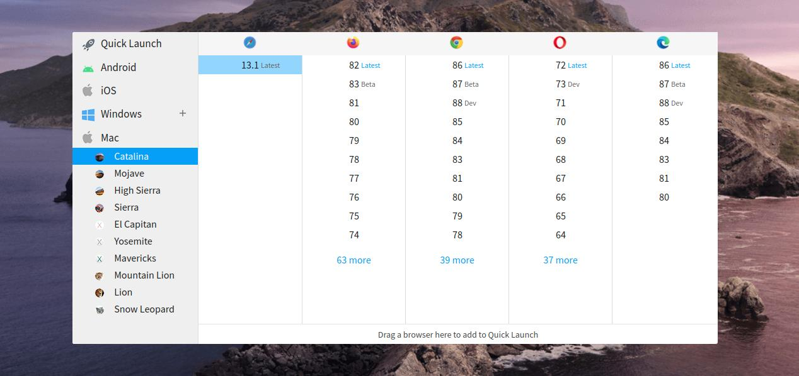
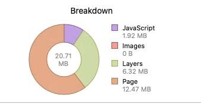

## El contexto

Hace unas semanas estaba desarrollando un sitio web usando [NuxtJs](https://nuxtjs.org/) (lo cual no es importante para el problema pero es el contexto :wink: ). Era un sitio web que necesitaba usar algunas imágenes como bloques de construcción, el típico separador de secciones con una forma diferente a una simple línea; en este caso, el separador de la sección tenía 2 colores y una sombra.

Decidí usar imágenes SVG por varias razones, por ejemplo, las imágenes tenían que adaptarse a diferentes anchos de pantalla, y las imágenes eran sencillas (más complejas que una línea pero simples, eran similares a 2 ondas con 2 colores). Los archivos SVG son muy útiles en estos casos de uso, porque el tamaño del archivo es pequeño y puedes escalarlos infinitamente sin perder definición.  
Un detalle importante en este problema, como veremos más adelante, es que esta imagen tenía una sombra.

## El problema

Bueno, casi había terminado de maquetar el sitio web y empezamos a probarlo en diferentes navegadores y plataformas, y todo iba bien, excepto porque los usuarios de Safari se quejaban de que el navegador mostraba un aviso:

> Esta página web está consumiendo mucha memoria. Cerrarla podría mejorar la capacidad de respuesta de tu Mac.

Como efecto secundario, las animaciones del sitio web no eran fluidas.

## Reproduciendo el problema y solucionándolo

Necesitaba probar el sitio web por mí mismo para encontrar la razón de este problema. No tengo un ordenador Mac, pero tengo una cuenta de [BrowserStack](https://www.browserstack.com/).

[BrowserStack](https://www.browserstack.com/) es un SaaS que te permite conectarte, usando tu navegador, a dispositivos remotos con otros navegadores / sistemas operativos. Incluso puedes seleccionar versiones antiguas de navegadores, un dispositivo móvil (como iPhones, etc.).

> **Off-Topic**: BrowserStack apoya mi proyecto de código abierto [SirenoGrid](https://sirenogrid.com/)

Así que, con mi cuenta de BrowserStack, pude intentar reproducir el problema. Abrí una instancia de Safari 13.1 (la versión más reciente) en MacOS Catalina, abrí el sitio web y, usando las devtools, obtuve información sobre el uso de memoria, ¡y **era de más de 1.4 GB!!!!**
Y si recargabas el sitio web, el uso de memoria crecía hasta que el sistema dejaba de responder.

Lo primero que pensé fue que el problema eran las animaciones. Las quité: _Nada cambia_.

Quité el javascript: _Nada_ :confused:

Seguí quitando cosas y probando otras para entender el problema. _Sin resultados_ :open_mouth:

Después de mucho tiempo, ya un poco desesperado, desactivé todos los bloques de contenido del sitio web y me di cuenta de que cuando había un bloque con una imagen SVG en la pantalla, el uso de memoria era alto.

Probé lo mismo con un bloque con una imagen png y la memoria seguía normal.

¿¿WTF?? Tenían que ser las imágenes SVG.

Entonces, reemplacé todas las imágenes SVG por versiones PNG y el sitio web funcionó con un uso de memoria razonable :tada:

## Aislando el problema

Después de solucionar el problema y con más tiempo, quise saber por qué los archivos SVG estaban causando este alto consumo de memoria.

Busqué en Google información sobre problemas en Safari y SVG y no encontré nada que encajara con mi problema, solo algunas referencias difusas.

Creé un sandbox para aislar el problema, no entraré en detalles, pero después de algunas iteraciones de prueba y error me di cuenta de que el problema estaba relacionado con los SVG Filters.

Con esta información, repetí la búsqueda en Google y encontré información relativa a problemas de Safari, SVG y filtros [1](https://bugs.webkit.org/show_bug.cgi?id=78814), [2](https://bugs.chromium.org/p/chromium/issues/detail?id=583471) (algunos de ellos son muy antiguos), y el más similar: https://github.com/mapbox/mapbox-gl-js/issues/7476

## El bug

Si abres en Safari una página web normal, por ejemplo: https://apple.com, que es una página con imágenes, javascript, animaciones, vídeo, etc., el inspector Timeline de Safari dice que el uso de memoria es de unos 205MB.

Preparé un codesandbox de demostración del bug, solo con 2 imágenes svg simples:

> https://5emtw.csb.app :heavy_exclamation_mark: Abrir con responsabilidad en Safari :heavy_exclamation_mark:

¡Y en la primera carga el uso de memoria es de unos 600 MB!!!! :exploding_head: Es una locura.

Y si recargas la página unas cuantas veces, la situación empeora.

Después de 3 recargas, el uso de memoria es de 1.26 GB, absolutamente loco.

La misma página, y las mismas imágenes, pero sin filtros:

> https://5emtw.csb.app/nofilters.html

El uso de memoria es de solo 21 MB, que es un uso de memoria muy normal.

Incluso con un filtro simple, como:

`<feFlood flood-opacity="1" result="BackgroundImageFix"/>`

La memoria empieza a subir, no estoy seguro de qué causa el problema, pero en mi opinión es algo relacionado con la composición (composition); supongo que el navegador mantiene en memoria el resultado bruto de aplicar un filtro y después de realizar todas las capas de composición.

Reporté ese error en la página de Bugzilla de Webkit: https://bugs.webkit.org/show_bug.cgi?id=218422
Espero que lo solucionen pronto.
