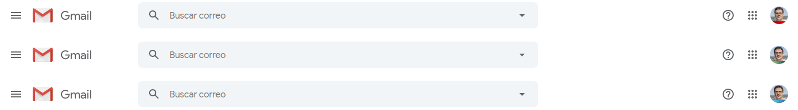

Probably you have several internet services accounts, and some in the same service, for example two _gmail_ accounts, one for work and a personal, or
:astro-ref[multiple Instagram accounts as me]{path="blog/2019/instagram-rbg"}

I like to use same picture as avatar in each account, but the problem is difficult to differentiate the account you are logged in only watching the avatar.

I'm using a simple tip to differentiate them, add a color band at the bottom of the image, the point is to use same color for every single account or role, for example you could use black for work, and green for personal.

So when you are logged in and see the avatar, you will be able to know which account are you logged in.

Next picture shows my avatars in 2015:

Be sure that the color band has height enough when the avatar is a circle.

Using this tip is easier to differentiate the account you are using, in the example below, in _gmail_

If you are using OAuth, for example "Login with Google" button, to login into third party services, the avatar is the same as the source account and this tip still working.

I'm sorry for forcing you to see my face so many times :sweat_smile::sweat_smile::sweat_smile:
