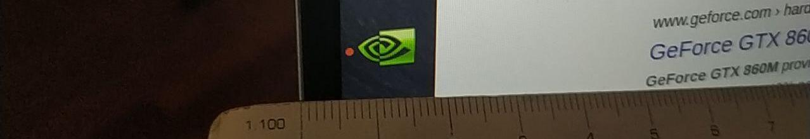
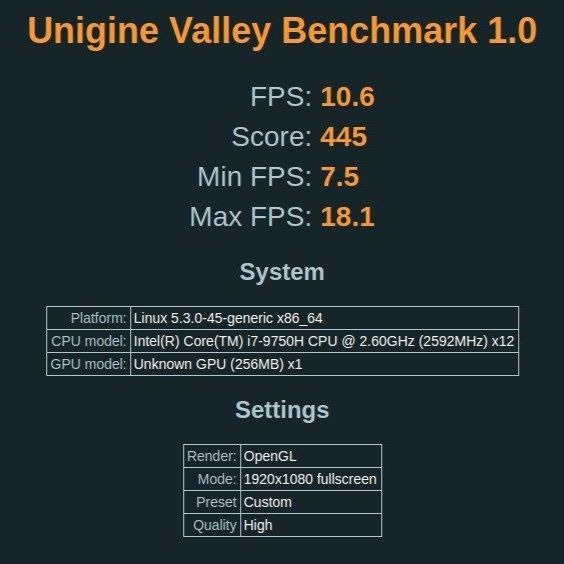
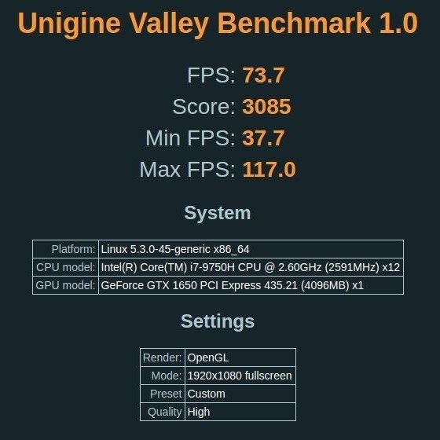
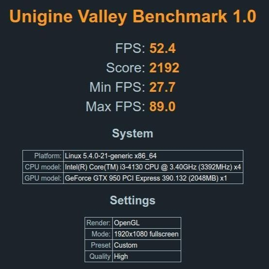
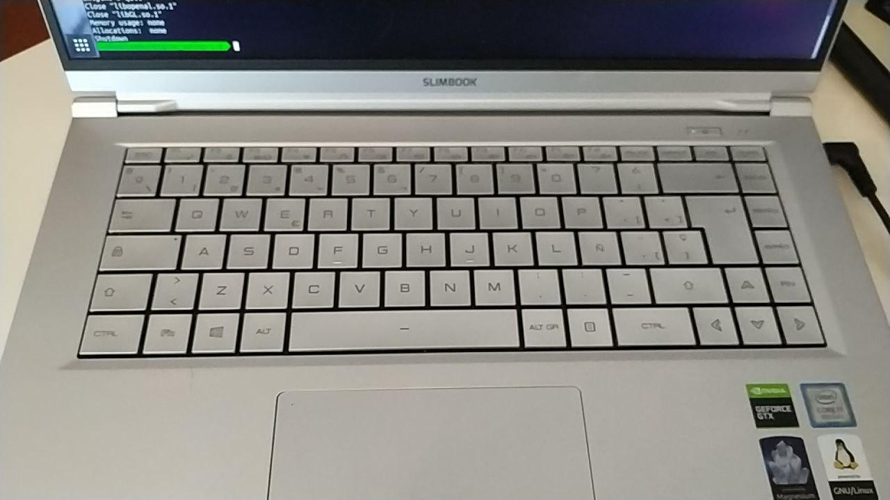
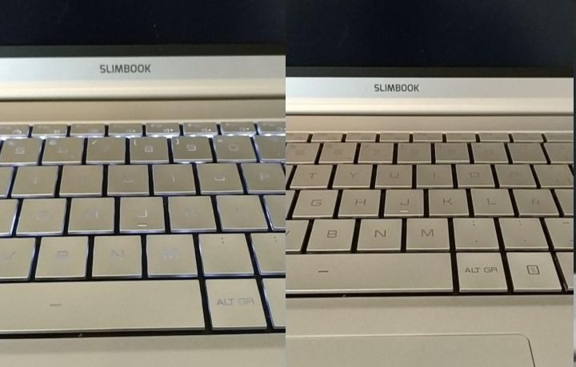
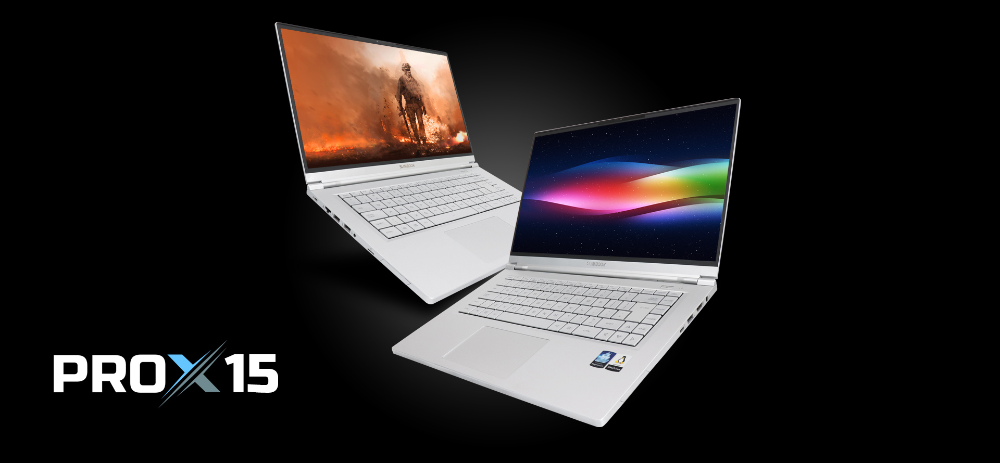
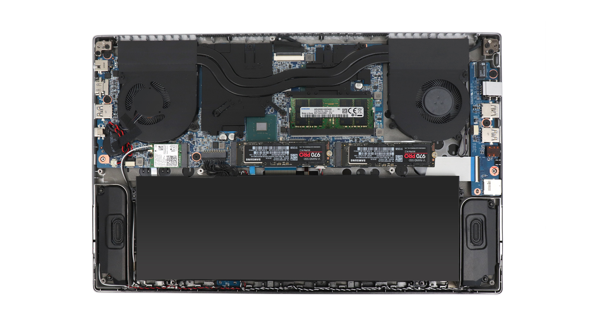
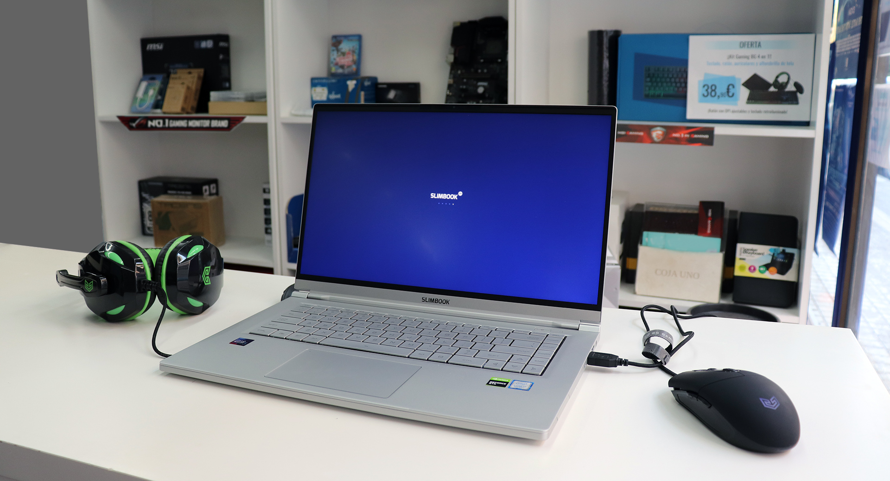

Como probablemente sepas, he empezado un nuevo trabajo este año y mi empresa me ha proporcionado un portátil. Me preguntaron qué portátil me gustaría usar para trabajar; la mayoría de la gente respondería: MacBook Pro o algo parecido, pero no me gusta Apple (lo siento, son mis gustos, quizá tú tengas otros) y prefiero Linux como sistema operativo.

Mi primera opción fue un Dell XPS 15 con 16GB de RAM, pero tras varios retrasos en la entrega, mi empresa y yo nos cansamos de esperar y decidimos pedir otro portátil.

Estaba dándole vueltas a qué modelo elegir y le pregunté a mi amigo Félix, que escribió un post sobre [qué ordenador comprar para trabajar como desarrollador](https://felixgomez.eu/2019/12/01/que-ordenador-me-compro-para-desarrollar-ii/) <small>(Spanish)</small> y me dijo: "[Slimbook PROX](https://slimbook.es/prox)", un potente portátil de 13.3" fabricado por una empresa española especializada en portátiles con Linux.

Era una gran opción, pero la mayor parte del tiempo trabajo en un ordenador de sobremesa y prefiero un portátil con una pantalla más grande. Finalmente, elegí la versión de 15" de ese portátil: [el PROX15](https://slimbook.es/prox15). Pero no solo cambia el tamaño de la pantalla, hay más diferencias con el PROX: el PROX15 es un portátil orientado al alto rendimiento.

Configuré mi pedido con 32GB de RAM, 512GB NVMe SSD y una tarjeta Wifi Intel Dual Band 9560AC.

Una cosa que me gusta de esta empresa es que puedes [configurar tu ordenador](https://slimbook.es/en/store/slimbook-pro-x-15/prox15-comprar): puedes elegir la memoria, 1 o 2 almacenamientos SSD (con RAID 0 o 1, si eliges 2), la tarjeta WIFI, la distribución del teclado y el sistema operativo. Además, los componentes no están soldados a la placa base, lo que significa que puedes actualizar el ordenador en el futuro.

Pero vayamos al grano.

# Especificaciones técnicas

- **Pantalla**: 15.6" FullHD IPS
- **CPU**: Intel i7-9750H (6 núcleos), nada de procesadores de bajo consumo o ultra bajo consumo como la serie U
- **GPU**: NVIDIA Geforce GTX 1650 4GB e Intel® 630 HD Graphics
- **RAM**: 32GB
- **Almacenamiento**: SSD M.2 de 500GB
- **Batería**: ~92 Wh
- **Otros**: Webcam 720 y una cámara infrarroja para reconocimiento facial, Bluetooth, etc...
- **Peso**: 1.5kg - Chasis de magnesio y aluminio

Después de 3-4 semanas usando el portátil (uso no intensivo), estas son mis impresiones.

# Cosas que me encantan

### Tamaño

El tamaño es perfecto para mí. Pantalla grande en un chasis de tamaño contenido. Los bordes de la pantalla son muy estrechos (unos 5mm), por lo que el tamaño del portátil es similar a uno de 14".

### CPU y GPU potentes

La CPU es un [Intel i7-9750](https://www.intel.co.uk/content/www/uk/en/products/processors/core/i7-processors/i7-9750h.html) de 9ª generación, serie H; es un procesador orientado a la movilidad, pero enfocado en el rendimiento. 2.60GHz, 6 núcleos (12 hilos). :heart:
El procesador tiene una gráfica integrada Intel UHD Graphics 630, pero también cuenta con una NVIDIA Geforce GTX 1650 dedicada con 4GB de RAM no compartida. Si tu sistema soporta PRIME, podrás elegir qué tarjeta gráfica usar: Intel para ahorrar batería o NVIDIA para obtener rendimiento.

Hice un benchmark de ambas tarjetas gráficas (Intel y Nvidia) y de mi ordenador de sobremesa (Nvidia GTX 950) usando [Unigine Valley Benchmark](https://benchmark.unigine.com/valley) y estos fueron los resultados.

<small>Usando la tarjeta integrada Intel</small>

<small>Usando la Nvidia GTX1650</small>

<small>Ordenador de sobremesa. Nvidia GTX950</small>

¡Es increíble!

### Peso y materiales del chasis

Es un portátil muy ligero considerando su tamaño, solo 1.5Kg. El chasis está fabricado en una aleación de magnesio y aluminio, muy agradable al tacto; a primera vista podría parecer plástico, pero no lo es, el tacto es muy diferente, no es frío como el aluminio puro.

### Conexiones

Tiene muchas: HDMI (tamaño completo), USB 2.1, USB 3.0, USB-C, RJ45, Jack 3.5mm, MicroSD.
Usando una dock station, puedes conectar el portátil hasta a 3 pantallas externas.

### Teclado

Me encanta la distribución del teclado, las teclas son un poco más grandes que las de mi portátil anterior ([Asus ZenBook UX330UA](https://www.asus.com/es/Laptops/ASUS-ZenBook-UX330UA/)). Las teclas de dirección son completas y tiene teclas de Inicio, Fin, RePág y AvPág.

### Ampliable

Componentes: El almacenamiento (2 ranuras M2) y los bancos de memoria son ampliables. Es una característica que aprecio mucho. Quizás en el futuro añada otro SSD. Es posible hacerlo y no te obliga a elegir componentes sobredimensionados a precio de oro (cof, cof Apple) por si acaso.

### Precio

Este es un ordenador de trabajo y fue comprado por mi empresa. Pero el precio rondaba los 1500€ (IVA incluido). Creo que es un precio bajo considerando las especificaciones.

# Otras consideraciones

### Touchpad

No soy un gran fan de los touchpads en general, me gustan los ratones, pero creo que el touchpad del Slimbook es muy bueno. Más que suficiente para mí.

### Batería

Como dije antes, y debido a la cuarentena, no he usado el portátil de forma intensiva. El fabricante dice que hasta 12h de duración, pero son honestos y hablan de [5-8 con uso de oficina](https://slimbook.es/en/prox15-en#preguntasfreq); obviamente, jugando o usando aplicaciones intensivas de CPU y GPU, la duración de la batería será más corta que usando aplicaciones "normales".

### Refrigeración

Mientras hacía los benchmarks de las gráficas, supongo que los ventiladores estaban a máxima velocidad; son un poco ruidosos, pero a niveles aceptables teniendo en cuenta que la GPU estaba a 80ºC con el máximo rendimiento. Solo sentí la temperatura en un área pequeña del teclado.

# Cosas que no me gustan

### Retroiluminación del teclado

No es muy brillante, incluso subiendo el nivel al máximo.
El problema es que el teclado es gris metálico y, para mí, es difícil ver los símbolos en las teclas.
Es peor con la retroiluminación encendida, porque el contraste entre el color de las teclas y el color del símbolo es muy bajo.
Puedes verlo en la imagen.

### Tecla Windows

Lo sé, es un "estándar", pero no me gusta.

# Resumen

En el futuro, después de usarlo más tiempo, escribiré una reseña más completa, pero ahora mismo creo que tengo un portátil muy bueno, materiales de alta calidad, buena pantalla, componentes potentes que se pueden actualizar y sin problemas para instalar Linux. Estoy muy contento con él.

No puedo olvidar la buena atención de la empresa Slimbook. Cuando he tenido alguna duda sobre el proceso de montaje o cualquier otra cosa, responden muy rápido en Twitter.

<small>Imágenes de Slimbook. CC-BY-SA</small>
