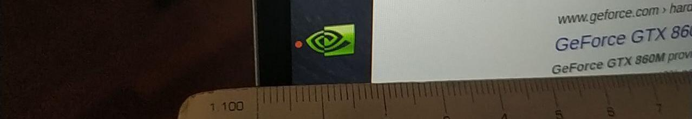
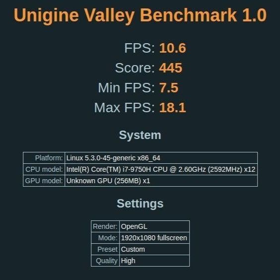
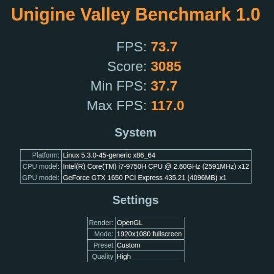
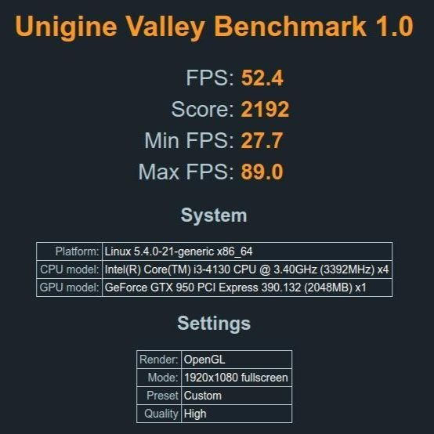
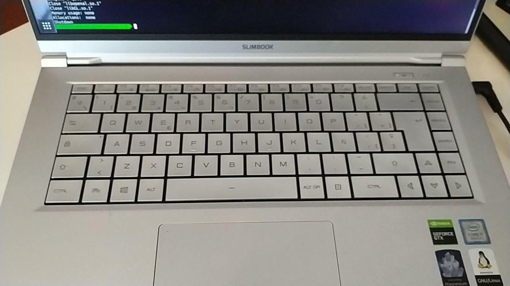
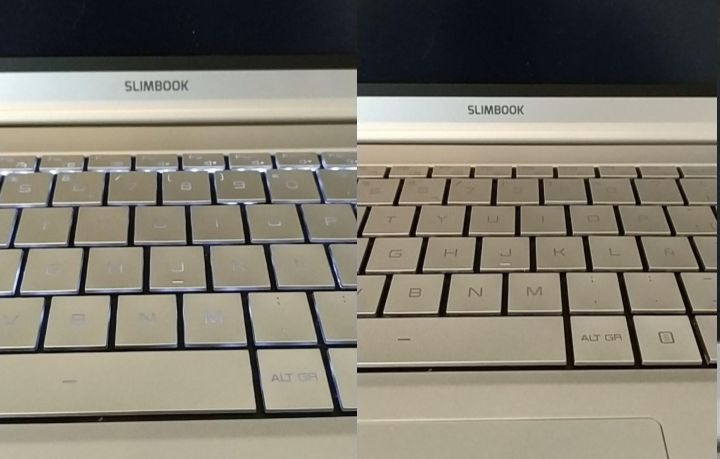
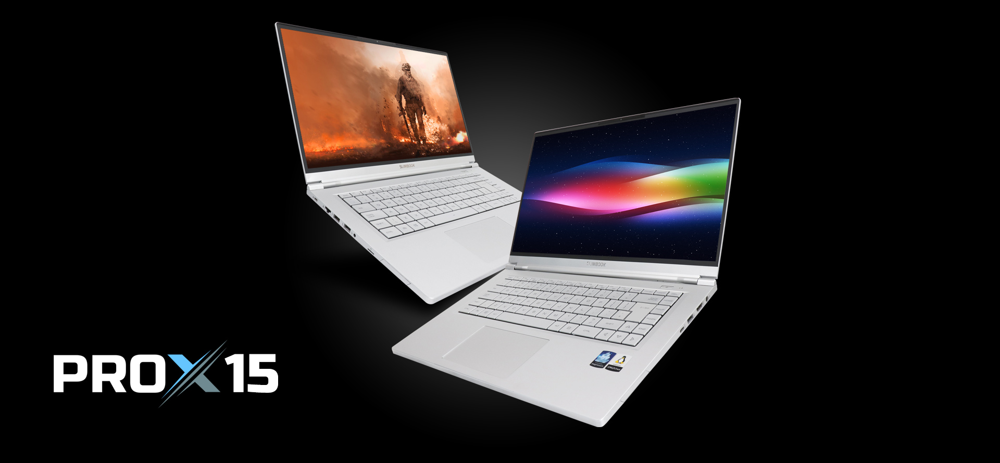
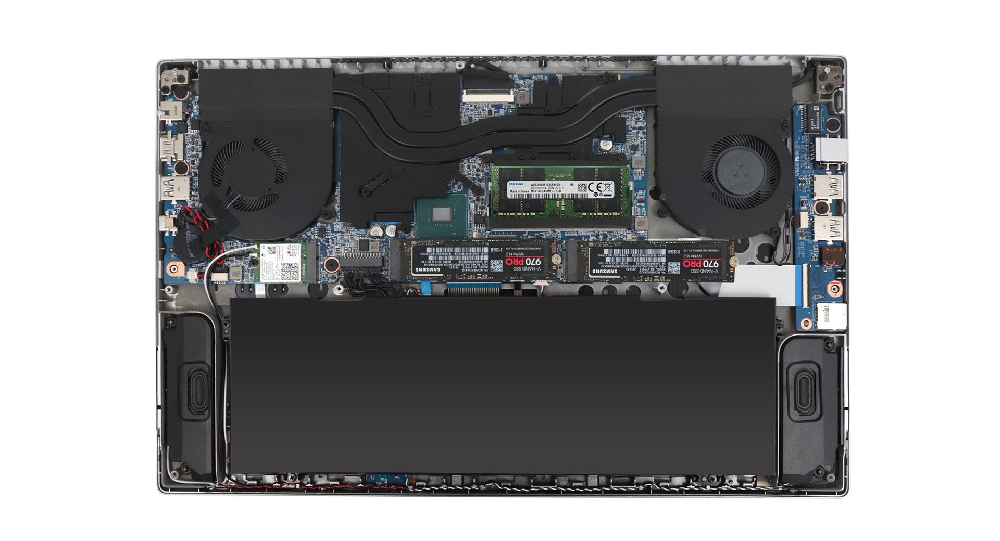
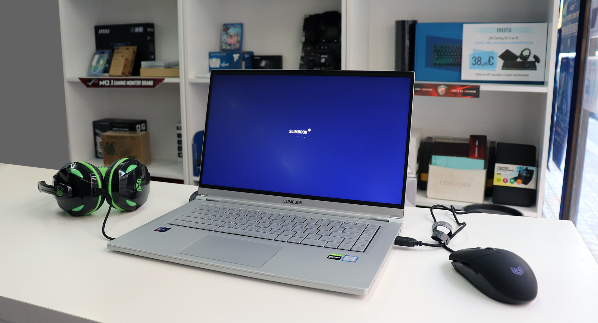

As you probably know, I started a new job this year, and my company provided me a laptop. They asked me which laptop I would like to use to work, most people would answer: MacBook Pro or something like that, but I don't like Apple (sorry, those are my likes, maybe you have different ones), and I prefer Linux as my OS.

My first choice was a Dell XPS 15 with 16GB of RAM, but after several delays in delivery, my company and I were tired of waiting and we decided to order another laptop.

I was mulling over which model to choose, and I asked my friend Félix, who wrote a post about [what laptop you can buy to work as a developer](https://felixgomez.eu/2019/12/01/que-ordenador-me-compro-para-desarrollar-ii/) <small>(Spanish)</small> and he told me: "[Slimbook PROX](https://slimbook.es/prox)" a 13.3" powerful laptop made by a Spanish company specialized in Linux laptops.

It was a great option, but most the time I work on a desktop computer and I prefer a laptop with a larger screen. Finally, I chose the 15" version of that laptop: [the PROX15](https://slimbook.es/prox15). But not just change the screen size, there are more differences from PROX: PROX15 is a high performance oriented laptop.

I configured my order with 32GB of RAM, 512GB NVMe SSD and an Intel Dual Band 9560AC Wifi Card.

One thing I like of that company is that you can [configure your computer](https://slimbook.es/en/store/slimbook-pro-x-15/prox15-comprar): you can choose memory, 1 or 2 SSD storage (with RAID 0 or 1, if you chose 2), WIFI Card, Keyboard layout, and OS. And component are not welded to motherboard, that means you can upgrade the computer in the future.

But let's go to the point.

# Technical Specs

- **Display**: 15.6" FullHD IPS
- **CPU**: Intel i7-9750H (6 Core), no low-power or Ultra-power processor like series U
- **GPU**: NVIDIA Geforce GTX 1650 4GB and Intel® 630 HD Graphics
- **RAM**: 32GB
- **Storage**: SSD M.2 of 500GB
- **Battery**: ~92 Wh
- **Others**: Webcam 720 and an infrared cam to facial recognition, Bluetooth, etc...
- **Weight**: 1.5kg - Magnesium and aluminum case

After 3-4 week using the laptop (non-intensive use), these are my thoughts.

# Things I love

### Size

The size is perfect for me. Big screen in a size contained case. Screen borders are very narrow (about 5mm) so laptop size is similar to 14" one

### Powerful CPU and GPU

CPU it's a 9th generation's [Intel i7-9750](https://www.intel.co.uk/content/www/uk/en/products/processors/core/i7-processors/i7-9750h.html) H series, it's a mobility oriented processor, but focused in performance. 2.60GHz, 6 cores, (12 threads). :heart:
Processor has an integrated Intel UHD Graphics 630, but also has a dedicated NVIDIA Geforce GTX 1650 with 4GB of non-shared RAM. If your system supports PRIME, you be able to choose what graphics card use. Intel to save battery or NVIDIA for performance.

I benchmarked both graphics card (Intel and Nvidia) and my desktop computer (Nvidia GTX 950) using [Unigine Valley Benchmark](https://benchmark.unigine.com/valley) and this were the results.

<small>Using integrated Intel card</small>

<small>Using Nvidia GTX1650</small>

<small>Desktop computer. Nvidia GTX950</small>

It's amazing!

### Weight and case's materials

It's a very light laptop considering its size, only 1.5Kg. The case is made in magnesium-aluminum alloy, very pleasant to the touch, at first view it could look like plastic, but it is not, the touch it's very different, it's not cold like only aluminum.

### Connections

It has many of them: HMDI (full size), USB 2.1, USB 3.0, USB-C, RJ45, Jack 3.5mm, MicroSD.
Using a dock station, you can connect laptop to 3 external displays.

### Keyboard

I love keyboard layout, keys are a bit bigger than my previous laptop ([Asus ZenBook UX330UA](https://www.asus.com/es/Laptops/ASUS-ZenBook-UX330UA/)) Directions keys are complete and have Start, End, PageStart, PageEnd keys

### Upgradable

Components: Storage (2xM2 slots) and memory banks are upgradable. It's a feature that I really appreciate. Maybe in the future, I will add other SSD. It's possible to do this, and it does not force you to choose oversized components at the price of gold (cough, cough Apple) just in case.

### Price

That is work computer, and it was bought by my company. But the price was around 1500€ (VAT included). I think is a low price considering the specifications.

# Other considerations

### Touchpad

I'm not a big fan of the touchpad in general, I like mice, but I think the Slimbook's touchpad is very good. More than enough for me.

### Battery

As I said before, and due to the quarantine, I didn't use the laptop intensively. Maker said up to 12h of life, but they are honest and talk about [5-8 with office use](https://slimbook.es/en/prox15-en#preguntasfreq), obviously, playing games or using CPU and GPU intensive apps, battery life will be short as using "normal" apps

### Refrigeration

While Benchmarking graphics I guess fans were at maximum speed, they are a little noisy, but at acceptable levels bearing in mind that the GPU was at 80ºC with maximum performance. I just felt the temperature in a small area on the keyboard.

# Things that I don't like

### Keyboard backlight

It is not very bright, even raising the level to the maximum.
The problem is that the keyboard is metallic gray, and for me, it is difficult to see the symbols on the keys.
It's worse with backlight on, because the contrast between the keys color and symbol color it is very low.
You can see it in the picture.

### Windows key

I know, it's a "standard" but I don't like it.

# Summary

In the future, after using it longer, I will write a more complete review, but right now I think I have a very good laptop, high quality materials, nice display, powerful components that can be upgraded, no problem to install linux. I'm very happy with it.

I cannot forget good care of the Slimbook company. When I have any doubt about assembly process or something else, they respond very quickly on Twitter.

<small>Images by Slimbook. CC-BY-SA</small>
